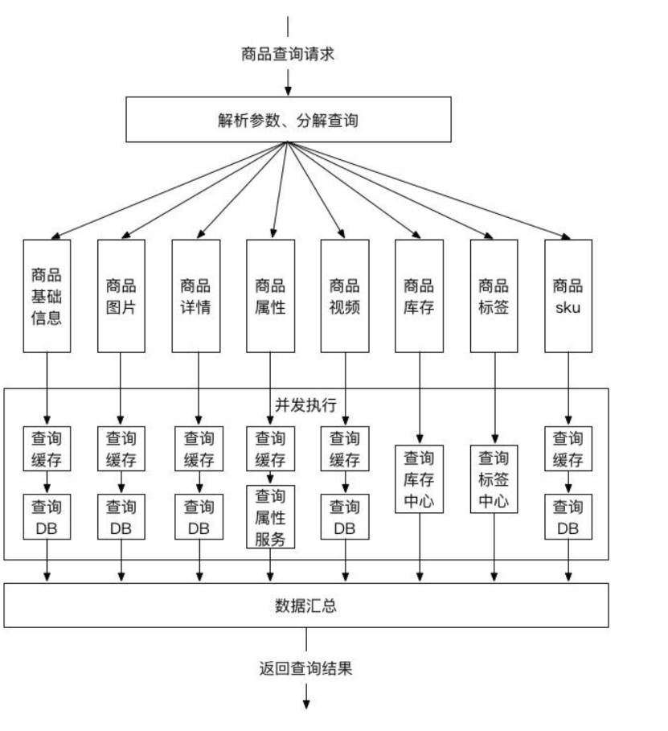

# Java应用性能

**四个方面**

1. **内存占用 | JVM内存** 内存利用率=（1-空闲内存/总内存大小）*100%，一般至少有10%可用内存，内存使用率可接受上限为85%。
2. **CPU使用率**   指用户进程与系统进程消耗的CPU时间百分比，长时间情况下，一般可接受上限不超过85%。
3. **磁盘 I/O** 磁盘主要用于存取数据，因此当说到IO操作的时候，就会存在两种相对应的操作，存数据的时候对应的是写IO操作，取数据的时候对应的是是读IO操作，一般使用% Disk Time（磁盘用于读写操作所占用的时间百分比）度量磁盘读写性能。
4. **网络 I/O**  一般使用计数器Bytes Total/sec来度量，Bytes Total/sec表示为发送和接收字节的速率，包括帧字符在内。判断网络连接速度是否是瓶颈，可以用该计数器的值和目前网络的带宽比较。

## 性能监控 

### CPU负载

 1. **top监控** 

    

    各参数详解

    > * **平均负载**(load average) 
    >
    > * **线程数**  
    >
    > * **cpu**使用情况
    >   * us, user： 运行(未调整优先级的) 用户进程的CPU时间
    >   * sy，system: 运行内核进程的CPU时间
    >   * ni，niced：运行已调整优先级的用户进程的CPU时间
    >   * wa，IO wait: 用于等待IO完成的CPU时间
    >   * hi：处理硬件中断的CPU时间
    >   * si: 处理软件中断的CPU时间
    >   * st：这个虚拟机被hypervisor偷去的CPU时间（译注：如果当前处于一个hypervisor下的vm，实际上hypervisor也是要消耗一部分CPU处理时间的
    >
    > **内存使用情况**
    >
    > ​	第一行是物理内存使用，第二行是虚拟内存使用(交换空间)。
    >
    > ​	物理内存显示如下:
    >
    > ​		全部可用内存、已使用内存、空闲内存、缓冲内存。相似地：交换部分显示的是：全部、已使用、空闲和缓冲交		换空间。
    >
    > **字段和列**
    >
    > 默认上，top显示这些关于进程的属性：
    >
    > * **PID**  进程ID，进程的唯一标识符
    > * **USER**  进程所有者的实际用户名。
    > * **PR**  进程的调度优先级。这个字段的一些值是’rt’。这意味这这些进程运行在实时态。
    > * **NI**  进程的nice值（优先级）。越小的值意味着越高的优先级。
    > * **VIRT**  进程使用的虚拟内存。
    > * **RES**  驻留内存大小。驻留内存是任务使用的非交换物理内存大小。
    > * **SHR**  SHR是进程使用的共享内存。
    > * **S**  这个是进程的状态。它有以下不同的值:
    >   * D – 不可中断的睡眠态。
    >   * R – 运行态
    >   * S – 睡眠态
    >   * T – 被跟踪或已停止
    >   * Z – 僵尸态
    > * **%CPU**  自从上一次更新时到现在任务所使用的CPU时间百分比。
    > * **%MEM**  进程使用的可用物理内存百分比。
    > * **TIME+**  任务启动后到现在所使用的全部CPU时间，精确到百分之一秒。
    > * **COMMAND**  运行进程所使用的命令。
    >
    > 还有许多在默认情况下不会显示的输出，它们可以显示进程的页错误、有效组和组ID和其他更多的信息。

    

2. vmstat监控操作系统，观察进程、内存、I/O和CPU的状态

### 网络负载

 1. Latency 延迟

### 内存负载

 1. **磁盘** I/O  

    1. 磁盘性能指标–IOPS 即每秒的输入输出量(或读写次数)

    2. **TPS 系统吞吐量**

      * **QPS** 每秒钟request/事务 数量

      * **并发数** 系统同时处理的request/事务数

      * **响应时间**
        * 平均响应时间（AVG)反应的是接口的平均处理能力，计算方式是将接口请求所有的响应时间叠加起来，除以总的请求次数

          举个例子：接口A总共发起了8次请求，其中，有1次3ms,3次5ms,4次6ms,此接口的平均响应时间就是（1*3+3*5+4*6）/8=5.25ms

        * 百分位数（TopPercentile)反应的是超过n%的请求都在m时间内返回，一般用TPn=m来描述，比如：TP99=5表示超过99%的请求都能在5ms内返回。计算方式是将接口的响应时间从小到大排列，取特定的百分比耗时。
          举个例子：接口A总共发起了100次请求，响应时间1,2,3,...100 那么TP95就是95ms

         **总结**：百分位数更能反映接口的整体响应情况（长尾请求被低RT平均掉）

         举个例子：接口A有100次请求，其中97次1ms,3次100ms,平均响应时间（97*1+3*100）/100=3.97ms

    

## 性能分析

性能分析的目的是要找出影响性能的关键因素，比如具体那一个方法耗时比较久，哪里产生了内存泄露，哪里线程间竞争比较激烈，哪里产生了死锁，哪里非常消耗cpu等等

 1. jstat-gcutil监控JVM内存使用状况

    jstat命令对堆内存进行统计分析

    ```
     1 查看class加载统计
            jstat -class <进程id>
            jstat -class 11548
            Loaded  Bytes  Unloaded  Bytes     Time
              3886  8367.6        1     0.9       2.19
     2 查看编译统计
            jstat -compiler <进程id>
            jstat -compiler 11516
            Compiled(编译数量) Failed Invalid(不可用的)   Time   FailedType(失败类型) FailedMethod(失败方法)
              2824               0       0              3.77          0
     3 垃圾回收统计
            jstat -gc <进程id>  (打印间隔)  (打印次数)
    ```

 2. sar最为全面的系统性能分析工具之一

 3. 其他 通过 jmap GC log brance arthas jprofile  火焰图 进行性能分析

## 性能优化 

​	**本质**:  时空转换

     		1. 响应时间 - 时间维度
     		2. 并发能力 - 空间维度

时间维度常见优化方式

> * 提升单个请求处理效率
>   1. 提升调用链上各节点的处理速度
>   2. 数据库层面：索引、读写分离、分库分表
>   3. 应用层面：缓存(本地缓存、分布式缓存、两层叠加)复杂查询走ES索引、代码编写考虑高效的算法和数据结构
>   4. 避免重复查询，尽量采用批量查询，上游调用方尽可能使用更合适的下游接口
> * 请求处理异步化
>    请求拆分、CompletableFuture/Future、消息队列

空间维度常见优化方式

> 集群部署
> 负载均衡
> 节点内部采用线程池	

### 主要优化手段

#### 缓存

> 1. 写缓存:    查数据 -> 排序/对象转换等操作 -> 设置缓存
>
>    读缓存:	查缓存 -> 返回数据
>
> 2. 缓存防击穿
>
>    
>
>    **优化方案**
>
>    
>
> 3. 热key问题
>
>    发现热key
>
>    > 1. *预估哪些是热key* 
>    > 2. *在客户端进行收集*     在操作redis之前，加入一行代码进行数据统计,缺点就是对客户端代码造成入侵.  
>    > 3. *用redis自带命令 monitor 或者`redis-faina`工具*       该命令在高并发的条件下，有内存增暴增的隐患，还会降低redis的性能
>    > 4. *自己抓包评估*   开发成本高,难维护
>
>    解决方案
>
>    > 1. 利用二级缓存
>    >
>    >    比如利用`ehcache`，或者一个`HashMap`都可以。在你发现热key以后，把热key加载到系统的JVM中。
>    >    针对这种热key请求，会直接从jvm中取，而不会走到redis层。
>    >
>    > 2. 备份热key
>    >
>    >    不要让key走到同一台redis上不就行了。我们把这个key，在多个redis上都存一份不就好了。接下来，有热key请求进来的时候，我们就在有备份的redis上随机选取一台，进行访问取值，返回数据。
>
>    业内对热key的自动发现与解决方案 
>
>    > ​	分两步  一监控热key  二通知系统做处理
>    >
>    > 1. 监控热key   有赞采用发现热key 的方式二:客户端收集
>    >
>    >    在《有赞透明多级缓存解决方案（TMC）》中有一句话提到
>    >
>    >    > **TMC 对原生jedis包的JedisPool和Jedis类做了改造，在JedisPool初始化过程中集成TMC“热点发现”+“本地缓存”功能Hermes-SDK包的初始化逻辑。**
>    >
>    >    也就说人家改写了jedis原生的jar包，加入了Hermes-SDK包。Hermes-SDK包就是做**热点发现**和**本地缓存**。从监控的角度看，该包对于Jedis-Client的每次key值访问请求，Hermes-SDK 都会通过其通信模块将key访问事件异步上报给Hermes服务端集群，以便其根据上报数据进行“热点探测”
>    >
>    > 2. 通知系统做处理  有赞采用上述方案一:利用二级缓存进行处理
>    >
>    >    有赞在监控到热key后，Hermes服务端集群会通过各种手段通知各业务系统里的Hermes-SDK,将该key缓存在本地，对于后面的请求。Hermes-SDK发现这个是一个热key，直接从本地中拿，而不会去访问集群。
>
> 4. 缓存粒度的选择
>
>    粗粒度or细粒度
>
> 5. 缓存对象的序列化方式
>
>    最不推荐jdk原生的序列化、最推荐            
>
> 6. 缓存的失效or更新策略
>
>    超时被动失效、更新主动失效、更新主动设置缓存、删除缓存而不是更新缓存、缓存和数据库双写一致性
>
> 7. 缓存操作的超时时间
>    设置合适的超时时间，不建议设置的很长，比如几百ms

#### 异步

* 对于调用方不关心的事情，可以异步处理，尽可能早地响应调用方的请求，降低调用方等待时间
* 高峰期系统压力大的时候，可以把一些非关键逻辑异步化，降低系统压力
* 异步处理的时候，同类任务可以合并之后采用批量处理的方式提高处理能力
* 可以根据实际情况决定采用异步线程(CompletableFuture类)、消息队列或定时任务来实现异步处理
* 使用RPC框架的异步调用

#### 并发

1. 识别出处理过程中那些没有依赖关系的任务(如果是一个整体的话需要再细分成独立的子任务),并发地处理这些任务，最终汇总结果



2. 生产环境中`CompletableFuture.suppplyAsync();`使用自定义的线程池,不同场景对线程池进行不同配置
3. 线程池的选择  根据任务的可分解性   选择使用Fork/Join线程池


#### 批量处理

​	批量处理可以降低响应时间，提升吞吐量

* 避免for循环调接口，尽量调用批量接口
* 数据库操作尽可能使用batchInsert和批量update
* 使用redis的mget和mset
* 对于调用方需要的不同信息，尽量在同一个接口中
  返回，避免多次调用