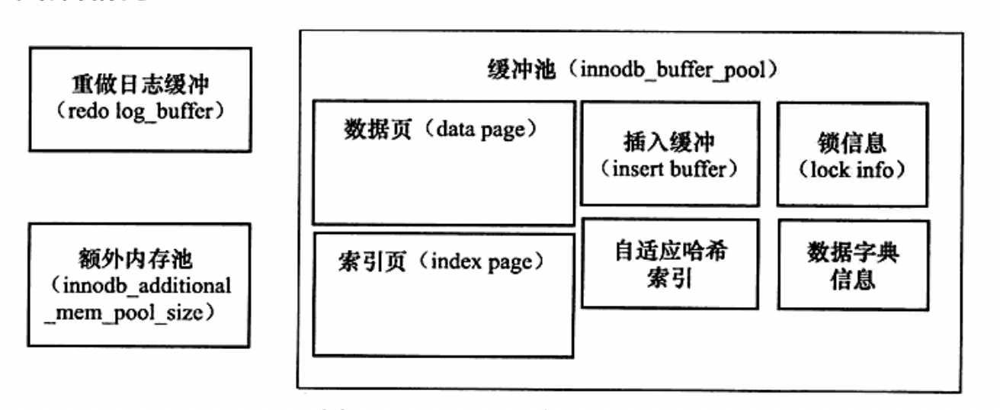

# InnoDB存储引擎

## 概念

### 脏页  

修改后先放在缓冲区、尚未刷新到磁盘,缓冲池的页和磁盘的页不一致.  后续会通过checkpoint机制刷新到磁盘

### Flush List

存放脏页的列表.  用来管理将页刷新回磁盘

## 体系架构

* 后台线程

  * Master Thread
  * IO Thread
  * Purge Thread
  * Page Cleaner Thread

* 内存池

  

  * 缓冲池
    * 缓冲区域内存管理
      * LRU List(新增midpoint 可设置 前边的为热点数据)、Free List、Flush List
  * 重做日志缓冲
  * 额外内存池

