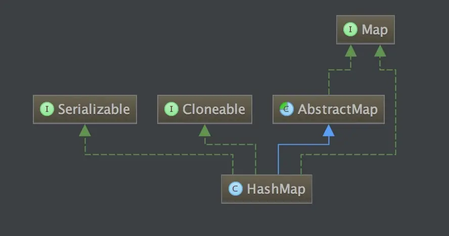

# Java集合	

基本数据结构：数组和链表。数组的特点是：寻址容易，插入和删除困难；而链表的特点是：寻址困难，插入和删除容易。

------

## 数组为什么下标从0开始？

数组采用随机访问的方式，通过**寻址公式** `a[i]_address = base_address + n * data_type_size` 直接获取到对应下标数据的位置，而下标从1开始，则公式变为 `a[i]_address = base_address + (n-1) * data_type_size`  多一次减法操作 。

- base_address: 表示数组的首地址
- n: 表示偏移量
- data_type_size: 表示数组中元素类型的字节数。例如数组中存储的是 int 类型数据，所以 data_type_size 就为 4 个字节

> **随机访问：**数据在内存中都是按顺序存放的，通过下标直接触达到某一个元素存放的位置。
>
> **注意**：想要使用随机访问，一定要满足两个条件: 1、连续的内存空间 2、相同类型的数据
>
> **顺序访问：**链表在内存中不是按顺序存放的，而是通过指针连在一起，访问某一元素，必须从链头开始顺着指针才能找到某一个元素。
>
> **二维数组寻址公式** 
>
> ```undefined
> 对于m * n 的数组，a [i][j] (i<m,j<n)的地址为：a[i][j]_address = base_address + (i * n + j) * data_type_size
> ```

## 集合排序方式

排序有两种方式：自然排序 vs 定制排序

### 自然排序

> 1. 实现Comparable接口
> 2. 重写compareTo方法
> 3. 按照属性进行排序
> 4. 添加元素

### 定制排序

> 1. 创建一个Comparator实现类的对象
> 2. 将Comparator对象传入TreeSet的构造器中
> 3. 重写compare方法
> 4. 按照属性进行排序
> 5. 添加元素

## Collections工具类

Collections 是一个操作 Set、List 和 Map 等集合的工具类，Collections 中提供了一系列静态的方法对集合元素进行排序、查询和修改等操作，还提供了对集合对象设置不可变、对集合对象实现同步控制等方法

### Collection集合与数组间的转换

* 集合 –> 数组 ： toArray()
* 数组 –> 集合 ： Arrays.asList(T...t)

**注意**

**List:使用Collection集合存储数据，要求数据所在的类满足：必须重写equals方法**

**Set:存储元素所在类的要求：要求必须重写hashCode和equals方法**

TreeSet:自然排序的情况下该对象的类必须实现 Comparable 接口，且重写compareTo()方法与equals()方法

### 排序操作（均为static方法）

* reverse(List)：反转 List 中元素的顺序

* shuffle(List)：对 List 集合元素进行随机排序

* sort(List)：根据元素的自然顺序对指定 List 集合元素按升序排序

* sort(List，Comparator)：根据指定的 Comparator 产生的顺序对 List 集合元素进行排序

* swap(List，int， int)：将指定 list 集合中的 i 处元素和 j 处元素进行交换

    

###  查找、替换

*  Object max(Collection)：根据元素的自然顺序，返回给定集合中的最大元素
*  Object max(Collection，Comparator)：根据 Comparator 指定的顺序，返回给定集合中的最大元素
*  Object min(Collection)
*  Object min(Collection，Comparator)
*  int frequency(Collection，Object)：返回指定集合中指定元素的出现次数
*  void copy(List dest,List src)：将src中的内容复制到dest中
*  boolean replaceAll(List list，Object oldVal，Object newVal)：使用新值替换 List 对象的所有旧值

操作数组的工具类：Arrays

操作集合的工具类：Collections


------

## Java集合常用操作

### 集合判空

《阿里巴巴 Java 开发手册》的描述如下：

> **判断所有集合内部的元素是否为空，使用 `isEmpty()` 方法，而不是 `size()==0` 的方式。**

这是因为 `isEmpty()` 方法的可读性更好，并且时间复杂度为 O(1)。

绝大部分我们使用的集合的 `size()` 方法的时间复杂度也是 O(1)，不过，也有很多复杂度不是 O(1) 的，比如 `java.util.concurrent` 包下的某些集合（`ConcurrentLinkedQueue` 、`ConcurrentHashMap`...）。

下面是 `ConcurrentHashMap` 的 `size()` 方法和 `isEmpty()` 方法的源码。

```
public int size() {
    long n = sumCount();
    return ((n < 0L) ? 0 :
            (n > (long)Integer.MAX_VALUE) ? Integer.MAX_VALUE :
            (int)n);
}
final long sumCount() {
    CounterCell[] as = counterCells; CounterCell a;
    long sum = baseCount;
    if (as != null) {
        for (int i = 0; i < as.length; ++i) {
            if ((a = as[i]) != null)
                sum += a.value;
        }
    }
    return sum;
}
public boolean isEmpty() {
    return sumCount() <= 0L; // ignore transient negative values
}
```

### 集合转 Map

《阿里巴巴 Java 开发手册》的描述如下：

> **在使用 `java.util.stream.Collectors` 类的 `toMap()` 方法转为 `Map` 集合时，一定要注意当 value 为 null 时会抛 NPE 异常。**

```
class Person {
    private String name;
    private String phoneNumber;
     // getters and setters
}

List<Person> bookList = new ArrayList<>();
bookList.add(new Person("jack","18163138123"));
bookList.add(new Person("martin",null));
// 空指针异常
bookList.stream().collect(Collectors.toMap(Person::getName, Person::getPhoneNumber));
```

下面我们来解释一下原因。

首先，我们来看 `java.util.stream.Collectors` 类的 `toMap()` 方法 ，可以看到其内部调用了 `Map` 接口的 `merge()` 方法。

```
public static <T, K, U, M extends Map<K, U>>
Collector<T, ?, M> toMap(Function<? super T, ? extends K> keyMapper,
                            Function<? super T, ? extends U> valueMapper,
                            BinaryOperator<U> mergeFunction,
                            Supplier<M> mapSupplier) {
    BiConsumer<M, T> accumulator
            = (map, element) -> map.merge(keyMapper.apply(element),
                                          valueMapper.apply(element), mergeFunction);
    return new CollectorImpl<>(mapSupplier, accumulator, mapMerger(mergeFunction), CH_ID);
}
```

`Map` 接口的 `merge()` 方法如下，这个方法是接口中的默认实现。

> 如果你还不了解 Java 8 新特性的话，请看这篇文章：[《Java8 新特性总结》](https://mp.weixin.qq.com/s?__biz=Mzg2OTA0Njk0OA==&mid=2247499264&idx=1&sn=8615550241b2c555dc093692c9932745&scene=21#wechat_redirect) 。

```
default V merge(K key, V value,
        BiFunction<? super V, ? super V, ? extends V> remappingFunction) {
    Objects.requireNonNull(remappingFunction);
    Objects.requireNonNull(value);
    V oldValue = get(key);
    V newValue = (oldValue == null) ? value :
               remappingFunction.apply(oldValue, value);
    if(newValue == null) {
        remove(key);
    } else {
        put(key, newValue);
    }
    return newValue;
}
```

`merge()` 方法会先调用 `Objects.requireNonNull()` 方法判断 value 是否为空。

```
public static <T> T requireNonNull(T obj) {
    if (obj == null)
        throw new NullPointerException();
    return obj;
}
```

### 集合遍历

《阿里巴巴 Java 开发手册》的描述如下：

> **不要在 foreach 循环里进行元素的 `remove/add` 操作。remove 元素请使用 `Iterator` 方式，如果并发操作，需要对 `Iterator` 对象加锁。**

通过反编译你会发现 foreach 语法糖底层其实还是依赖 `Iterator` 。不过， `remove/add` 操作直接调用的是集合自己的方法，而不是 `Iterator` 的 `remove/add`方法

这就导致 `Iterator` 莫名其妙地发现自己有元素被 `remove/add` ，然后，它就会抛出一个 `ConcurrentModificationException` 来提示用户发生了并发修改异常。这就是单线程状态下产生的 **fail-fast 机制**。

> **fail-fast 机制** ：多个线程对 fail-fast 集合进行修改的时候，可能会抛出`ConcurrentModificationException`。即使是单线程下也有可能会出现这种情况，上面已经提到过。

Java8 开始，可以使用 `Collection#removeIf()`方法删除满足特定条件的元素,如

```
List<Integer> list = new ArrayList<>();
for (int i = 1; i <= 10; ++i) {
    list.add(i);
}
list.removeIf(filter -> filter % 2 == 0); /* 删除list中的所有偶数 */
System.out.println(list); /* [1, 3, 5, 7, 9] */
```

除了上面介绍的直接使用 `Iterator` 进行遍历操作之外，你还可以：

- 使用普通的 for 循环
- 使用 fail-safe 的集合类。`java.util`包下面的所有的集合类都是 fail-fast 的，而`java.util.concurrent`包下面的所有的类都是 fail-safe 的。
- ......

#### 遍历集合时进行操作会怎样？

在遍历集合时 增和删操作会报并发修改异常

解决方案：使用Iterator迭代器自带的remove() 方法 以及`listIterator` 迭代器的add()方法

**注意：list remove() `int`类型数据时 要使用`list.remove`(new Integer(6));方式**

* for循环遍历时进行操作

  > 1. 遍历时add()  结果：无限增加
  > 2. 遍历时remove()  结果：**删除不完整  原因：remove()后，`list.size()`减小 循环次数减少** 
  > 3. 遍历时set() 结果：正常

* `foreach`循环遍历时进行操作

  > 1. add()操作  **结果：`ConcurrentModificationException`并发修改异常**  
  > 2. remove()操作 **结果：`ConcurrentModificationException` 并发修改异常 **
  > 3. set()操作 结果：正常

* iterator迭代器遍历时进行操作

  > 1. add() remove()  **结果：`ConcurrentModificationException`并发修改异常**
  > 2. set()正常

  **具体原因**

  ```
  通过查看源码发现原来检查并抛出异常的是checkForComodification()方法。在ArrayList中modCount是当前集合的版本号，每次修改(增、删)集合都会加1；expectedModCount是当前迭代器的版本号，在迭代器实例化时初始化为modCount。我们看到在checkForComodification()方法中就是在验证modCount的值和expectedModCount的值是否相等，所以当你在调用了ArrayList.add()或者ArrayList.remove()时，只更新了modCount的状态，而迭代器中的expectedModCount未同步，因此才会导致再次调用Iterator.next()方法时抛出异常。但是为什么使用Iterator.remove()就没有问题呢？通过源码的第32行发现，在Iterator的remove()中同步expectedModCount的值，所以当你下次再调用next()的时候，检查不会抛出异常。
  　　使用该机制的主要目的是为了实现ArrayList中的快速失败机制（fail-fast），在Java集合中较大一部分集合是存在快速失败机制的。
  　　快速失败机制产生的条件:当多个线程对Collection进行操作时，若其中某一个线程通过Iterator遍历集合时，该集合的内容被其他线程所改变，则会抛出ConcurrentModificationException异常。
  　　所以要保证在使用Iterator遍历集合的时候不出错误，就应该保证在遍历集合的过程中不会对集合产生结构上的修改。
  ```

   **使用`Foreach`时对集合的结构进行修改会出现异常:**

  　　上面我们说了实现了`Iterable`接口的类就可以通过`Foreach`遍历，那是因为`foreach`要依赖于`Iterable`接口返回的Iterator对象，所以从本质上来讲，`Foreach`其实就是在使用迭代器，在使用`foreach`遍历时对集合的结构进行修改，和在使用Iterator遍历时对集合结构进行修改本质上是一样的。所以同样的也会抛出异常，执行快速失败机制。

  　　`foreach`是JDK1.5新增加的一个循环结构，`foreach`的出现是为了简化我们遍历集合的行为。

   **for循环与迭代器的对比:**

  　　效率上各有各的优势:

  ​			`ArrayList`对随机访问比较快，而for循环中使用的get()方法，采用的即是随机访问的方法，因此在ArrayList里for循环快。

  　　	`LinkedList`则是顺序访问比较快，Iterator中的next()方法采用的是顺序访问方法，因此在LinkedList里使用Iterator较快。

  　　　主要还是要依据集合的数据结构不同的判断。

  

  ```java
  package edu.zsq.jmm;
  
  import java.util.ArrayList;
  import java.util.Iterator;
  import java.util.List;
  import java.util.ListIterator;
  import java.util.concurrent.atomic.AtomicInteger;
  
  /**
   * Atomic保证原子性
   * synchronized 保证原子性
   * @author 张
   */
  public class AtomicDemo {
  
      private static AtomicInteger i = new AtomicInteger(0);
  
      public static void main(String[] args) {
  //        以原子方式将当前值增加一个,相当于i++ i++非原子操作
  //        i.getAndIncrement();
  //        System.out.println(i);
  
          List<Integer> list =new ArrayList<>();
          list.add(1);
          list.add(2);
          list.add(3);
          list.add(4);
          list.add(5);
          list.add(6);
  
  //        删除不完整  原因：remove()后，list.size()减小 循环次数减少
  //        for (int i = 0; i <list.size() ; i++) {
  //            list.remove(i);
  //            System.out.println(list.get(i));
  //        }
  //          无限增加
  //        for (int i = 0; i <list.size() ; i++) {
  //            list.add(i);
  //            System.out.println(i);
  //        }
  //          正常
  // 				list.set(1,7); 用指定元素替换该队列中指定位置的元素	
  //        for (int i = 0; i <list.size() ; i++) {
  //            list.set(1,7);
  //            System.out.println(i); 
  //        }
  
  
  
  //        报错：并发修改异常
  //        for (int l : list) {
  //            list.add(6);
  //            System.out.println(l);
  //        }
  //         报错：ConcurrentModificationException
  //        for (int l : list) {
  //            if (l == 6){
  //                list.remove(5);
  //            }
  //            System.out.println(l);
  //        }
  //            正常
  //        for (int l : list) {
  //            list.set(1,7);
  //            System.out.println(l);
  //        }
          System.out.println(list);
  
  //        使用list的remove()删除数据 ConcurrentModificationException: 并发修改异常
  //        注意：list remove() int类型数据时 要使用list.remove(new Integer(6));方式 删除当前集合中对应的元素6
          Iterator<Integer> iterator = list.iterator();
  //        while(iterator.hasNext()){
  //            Integer next = iterator.next();
  //            if (next ==6){
  //                list.remove(new Integer(6));
  ////                list.add(7);
  //            }
  //        }
  
  //        删除操作正确，无异常
  //        while ( iterator.hasNext()) {
  //            Integer next = iterator.next();
  //            if (next == 6){
  //                iterator.remove();
  //            }
  //        }
  
  //        添加操作  使用listIterator list专用迭代器实现add()方法  普通迭代器不支持add方法
          ListIterator<Integer> listIterator = list.listIterator();
          while(listIterator.hasNext()){
              Integer next = listIterator.next();
              if (next == 6){
                  listIterator.add(7);
              }
          }
          System.out.println(list);
  	
          
          // 迭代器错误操作
          Collection coll = new ArrayList();
          coll.add("aaa");
          coll.add(123); // 装箱
          coll.add(456);
          //        //错误 方式一  ：coll.iterator();因为每次循环底层都创建了一个新的对象，如下图
          //        while(coll.iterator().hasNext()){
          //            System.out.println(coll.iterator().next());
          //        }
  
          System.out.println(coll);
          Iterator iterator = coll.iterator();
          //错误方式二 ： 因为每next一次指针就会下移，一旦没有元素就会报错
          while(iterator.next() != null){
              System.out.println(iterator.next());
          }
      }
  
  }
  ```

### 集合去重

《阿里巴巴 Java 开发手册》的描述如下：

> **可以利用 `Set` 元素唯一的特性，可以快速对一个集合进行去重操作，避免使用 `List` 的 `contains()` 进行遍历去重或者判断包含操作。**

这里我们以 `HashSet` 和 `ArrayList` 为例说明。

```
// Set 去重代码示例
public static <T> Set<T> removeDuplicateBySet(List<T> data) {

    if (CollectionUtils.isEmpty(data)) {
        return new HashSet<>();
    }
    return new HashSet<>(data);
}

// List 去重代码示例
public static <T> List<T> removeDuplicateByList(List<T> data) {

    if (CollectionUtils.isEmpty(data)) {
        return new ArrayList<>();

    }
    List<T> result = new ArrayList<>(data.size());
    for (T current : data) {
        if (!result.contains(current)) {
            result.add(current);
        }
    }
    return result;
}
```

两者的核心差别在于 `contains()` 方法的实现。

`HashSet` 的 `contains()` 方法底部依赖的 `HashMap` 的 `containsKey()` 方法，时间复杂度接近于 O（1）（没有出现哈希冲突的时候为 O（1））。

```
private transient HashMap<E,Object> map;
public boolean contains(Object o) {
    return map.containsKey(o);
}
```

我们有 N 个元素插入进 Set 中，那时间复杂度就接近是 O (n)。

`ArrayList` 的 `contains()` 方法是通过遍历所有元素的方法来做的，时间复杂度接近是 O(n)。

```
public boolean contains(Object o) {
    return indexOf(o) >= 0;
}
public int indexOf(Object o) {
    if (o == null) {
        for (int i = 0; i < size; i++)
            if (elementData[i]==null)
                return i;
    } else {
        for (int i = 0; i < size; i++)
            if (o.equals(elementData[i]))
                return i;
    }
    return -1;
}
```

我们的 `List` 有 N 个元素，那时间复杂度就接近是 O (n^2)。

#### List集合去重5种方法

> 1. 循环list中的所有元素然后删除重复(双重for循环)
>
> 2. 通过HashSet踢除重复元素，
>
>    > **无序**
>    >
>    > ```java
>    > public static List removeDuplicate(List list) {   
>    >     Set s = new HashSet(list);   
>    >     list.clear();   
>    >     list.addAll(s);   
>    >     return list;   
>    > }
>    > ```
>    >
>    > **有序**
>    >
>    > ```java
>    > public static void removeDuplicateWithOrder(List list) {    
>    >     Set set = new HashSet();    
>    >     List newList = new ArrayList();    
>    >     for (Iterator iter = list.iterator(); iter.hasNext();) {    
>    >         Object element = iter.next();    
>    >         if (set.add(element))    
>    >             newList.add(element);    
>    >     }     
>    >     list.clear();    
>    >     list.addAll(newList);    
>    >     System.out.println( " remove duplicate " + list);    
>    > }
>    > ```
>    >
>    > 
>
> 3. 使用`LinkedHashSet` 去重并保持顺序
>
>    > ```java
>    > public static void main(String[] args){
>    >     List<Integer> numbersList = new ArrayList<>(Arrays.asList(1, 1, 2, 3, 3, 3, 4, 5, 6, 6, 6, 7, 8));
>    >     System.out.println(numbersList);
>    >     Set<Integer> hashSet = new LinkedHashSet<>(numbersList);
>    >     ArrayList<Integer> listWithoutDuplicates = new ArrayList<>(hashSet);
>    >     System.out.println(listWithoutDuplicates);
>    > }
>    > ```
>
> 4. 把list里的对象遍历一遍，用`list.contains()`，如果不存在就放入到另外一个list集合中
>
>    > ```java
>    > public static List removeDuplicate(List list){  
>    >  List listTemp = new ArrayList();  
>    >  for(int i=0;i<list.size();i++){  
>    >      if(!listTemp.contains(list.get(i))){  
>    >          listTemp.add(list.get(i));  
>    >      }  
>    >  }  
>    >  return listTemp;  
>    > }
>    > ```
>
> 5. 用JDK1.8 Stream中对List进行去重：list.stream().distinct();
>
>    > ```java
>    > List<String> a = new ArrayList<> ();
>    > a.add("a");
>    > a.add("b");
>    > a.add("b");
>    > List<String> b = new ArrayList<> ();
>    > b.add("a");
>    > b.add("c");
>    > b.add("b");
>    > a.addAll(b);
>    > List list=(List) a.stream().distinct().collect(Collectors.toList());
>    > System.out.println(list);
>    > ```

## 

### 集合转数组

《阿里巴巴 Java 开发手册》的描述如下：

> **使用集合转数组的方法，必须使用集合的 `toArray(T[] array)`，传入的是类型完全一致、长度为 0 的空数组。**

`toArray(T[] array)` 方法的参数是一个泛型数组，如果 `toArray` 方法中没有传递任何参数的话返回的是 `Object`类 型数组。

```
String [] s= new String[]{
    "dog", "lazy", "a", "over", "jumps", "fox", "brown", "quick", "A"
};
List<String> list = Arrays.asList(s);
Collections.reverse(list);
//没有指定类型的话会报错
s=list.toArray(new String[0]);
```

由于 JVM 优化，`new String[0]`作为`Collection.toArray()`方法的参数现在使用更好，`new String[0]`就是起一个模板的作用，指定了返回数组的类型，0 是为了节省空间，因为它只是为了说明返回的类型。详见：https://shipilev.net/blog/2016/arrays-wisdom-ancients/

### 数组转集合

《阿里巴巴 Java 开发手册》的描述如下：

> **使用工具类 `Arrays.asList()` 把数组转换成集合时，不能使用其修改集合相关的方法， 它的 `add/remove/clear` 方法会抛出 `UnsupportedOperationException` 异常。**

我在之前的一个项目中就遇到一个类似的坑。

`Arrays.asList()`在平时开发中还是比较常见的，我们可以使用它将一个数组转换为一个 `List` 集合。

```
String[] myArray = {"Apple", "Banana", "Orange"};
List<String> myList = Arrays.asList(myArray);
//上面两个语句等价于下面一条语句
List<String> myList = Arrays.asList("Apple","Banana", "Orange");
```

JDK 源码对于这个方法的说明：

```
/**
  *返回由指定数组支持的固定大小的列表。此方法作为基于数组和基于集合的API之间的桥梁，
  * 与 Collection.toArray()结合使用。返回的List是可序列化并实现RandomAccess接口。
  */
public static <T> List<T> asList(T... a) {
    return new ArrayList<>(a);
}
```

下面我们来总结一下使用注意事项。

**1、`Arrays.asList()`是泛型方法，传递的数组必须是对象数组，而不是基本类型。**

```
int[] myArray = {1, 2, 3};
List myList = Arrays.asList(myArray);
System.out.println(myList.size());//1
System.out.println(myList.get(0));//数组地址值
System.out.println(myList.get(1));//报错：ArrayIndexOutOfBoundsException
int[] array = (int[]) myList.get(0);
System.out.println(array[0]);//1
```

当传入一个原生数据类型数组时，`Arrays.asList()` 的真正得到的参数就不是数组中的元素，而是数组对象本身！此时 `List` 的唯一元素就是这个数组，这也就解释了上面的代码。

我们使用包装类型数组就可以解决这个问题。

```
Integer[] myArray = {1, 2, 3};
```

**2、使用集合的修改方法: `add()`、`remove()`、`clear()`会抛出异常。**

```
List myList = Arrays.asList(1, 2, 3);
myList.add(4);//运行时报错：UnsupportedOperationException
myList.remove(1);//运行时报错：UnsupportedOperationException
myList.clear();//运行时报错：UnsupportedOperationException
```

`Arrays.asList()` 方法返回的并不是 `java.util.ArrayList` ，而是 `java.util.Arrays` 的一个内部类,这个内部类并没有实现集合的修改方法或者说并没有重写这些方法。

```
List myList = Arrays.asList(1, 2, 3);
System.out.println(myList.getClass());//class java.util.Arrays$ArrayList
```

下图是 `java.util.Arrays$ArrayList` 的简易源码，我们可以看到这个类重写的方法有哪些。

```
  private static class ArrayList<E> extends AbstractList<E>
        implements RandomAccess, java.io.Serializable
    {
        ...

        @Override
        public E get(int index) {
          ...
        }

        @Override
        public E set(int index, E element) {
          ...
        }

        @Override
        public int indexOf(Object o) {
          ...
        }

        @Override
        public boolean contains(Object o) {
           ...
        }

        @Override
        public void forEach(Consumer<? super E> action) {
          ...
        }

        @Override
        public void replaceAll(UnaryOperator<E> operator) {
          ...
        }

        @Override
        public void sort(Comparator<? super E> c) {
          ...
        }
    }
```

我们再看一下`java.util.AbstractList`的 `add/remove/clear` 方法就知道为什么会抛出 `UnsupportedOperationException` 了。

```
public E remove(int index) {
    throw new UnsupportedOperationException();
}
public boolean add(E e) {
    add(size(), e);
    return true;
}
public void add(int index, E element) {
    throw new UnsupportedOperationException();
}

public void clear() {
    removeRange(0, size());
}
protected void removeRange(int fromIndex, int toIndex) {
    ListIterator<E> it = listIterator(fromIndex);
    for (int i=0, n=toIndex-fromIndex; i<n; i++) {
        it.next();
        it.remove();
    }
}
```

**那我们如何正确的将数组转换为 `ArrayList` ?**

1、手动实现工具类

```
//JDK1.5+
static <T> List<T> arrayToList(final T[] array) {
  final List<T> l = new ArrayList<T>(array.length);

  for (final T s : array) {
    l.add(s);
  }
  return l;
}


Integer [] myArray = { 1, 2, 3 };
System.out.println(arrayToList(myArray).getClass());//class java.util.ArrayList
```

2、最简便的方法

```
List list = new ArrayList<>(Arrays.asList("a", "b", "c"))
```

3、使用 Java8 的 `Stream`(推荐)

```
Integer [] myArray = { 1, 2, 3 };
List myList = Arrays.stream(myArray).collect(Collectors.toList());
//基本类型也可以实现转换（依赖boxed的装箱操作）
int [] myArray2 = { 1, 2, 3 };
List myList = Arrays.stream(myArray2).boxed().collect(Collectors.toList());
```

4、使用 Guava

对于不可变集合，你可以使用`ImmutableList`类及其`of()`与`copyOf()`工厂方法：（参数不能为空）

```
List<String> il = ImmutableList.of("string", "elements");  // from varargs
List<String> il = ImmutableList.copyOf(aStringArray);      // from array
```

对于可变集合，你可以使用`Lists`类及其`newArrayList()`工厂方法：

```
List<String> l1 = Lists.newArrayList(anotherListOrCollection);    // from collection
List<String> l2 = Lists.newArrayList(aStringArray);               // from array
List<String> l3 = Lists.newArrayList("or", "string", "elements"); // from varargs
```

5、使用 Apache Commons Collections

```
List<String> list = new ArrayList<String>();
CollectionUtils.addAll(list, str);
```

6、 使用 Java9 的 `List.of()`方法

```
Integer[] array = {1, 2, 3};
List<Integer> list = List.of(array);
```


**丙丙** 


## List集合之`ArrayList`    `线程不安全`

1. ` new ArrayList`时 未指定类型：底层是创建了一个**默认大小**为**10**的**Object**类型的**数组**（`HasnMap`默认大小为16）

2. 当大小不够时，进行自动扩充(使用`Arrays.copyOf()`进行复制搬家)，扩充大小为原值的一半，10 -> 15 ->15+15/2(7)=22,**容量拓展，是创建一个新的数组，然后将旧数组上的数组copy到新数组，这是一个很大的消耗，所以在我们使用ArrayList时，最好能预计数据的大小，在第一次创建时就申请够内存** 

   原因: 数组的缺点就是**一旦创建了数组，就不能改变它的大小**。

   ```java
   // 默认初始容量
   private static final int DEFAULT_CAPACITY = 10;
   // 被用于空实例的共享空数组实例	
   private static final Object[] EMPTY_ELEMENTDATA = {};
   // 被用于默认大小的空实例的共享数组实例。其与EMPTY_ELEMENTDATA的区别是：当我们向数组中添加第一个元素时，知道数组该扩充多少。
   private static final Object[] DEFAULTCAPACITY_EMPTY_ELEMENTDATA = {};
   
   /**
      * Object[]类型的数组，保存了添加到ArrayList中的元素。ArrayList的容量是该Object[]类型数组的长度
      * 当第一个元素被添加时，任何空ArrayList中的elementData == DEFAULTCAPACITY_EMPTY_ELEMENTDATA将会被
      * 扩充到DEFAULT_CAPACITY（默认容量）。
      */
   transient Object[] elementData; //非private是为了方便嵌套类的访问
   // ArrayList的大小（指其所含的元素个数）
   private int size;
   
   /**
     * 构造一个初始容量为10的空列表
     */
   public ArrayList() {
     this.elementData = DEFAULTCAPACITY_EMPTY_ELEMENTDATA;
   }
   
   // add()添加  size 类加载时为 0
   public boolean add(E e) {
   // 计算数组容量  
     ensureCapacityInternal(size + 1);  // Increments modCount!!
     elementData[size++] = e;
     return true;
   }    
   
   /**
   * 计算数组容量,判断是否需要扩容  minCapacity = 1
   */
   private void ensureCapacityInternal(int minCapacity) {
     ensureExplicitCapacity(calculateCapacity(elementData, minCapacity));
   }
   
   // 计算容量   返回10
   private static int calculateCapacity(Object[] elementData, int minCapacity) {
     if (elementData == DEFAULTCAPACITY_EMPTY_ELEMENTDATA) {
       return Math.max(DEFAULT_CAPACITY, minCapacity);
     }
     return minCapacity;
   }
   
   // 判断当前数组大小是否需要扩容 
   private void ensureExplicitCapacity(int minCapacity) {
     modCount++;  // minCapacity = 10
   
     // overflow-conscious code
     // 10 - 0 > 0 扩容
     if (minCapacity - elementData.length > 0)
       grow(minCapacity);
   }
   
   /**
     * 要分配的最大数组大小.
     * 有些vm在数组中保留一些头.
     * 尝试分配较大的数组可能会导致 OutOfMemoryError:请求的数组大小超出VM限制
     */
   private static final int MAX_ARRAY_SIZE = Integer.MAX_VALUE - 8;
   
   // 再次计算数组大小,最后调用copyof()方法进行扩容
   private void grow(int minCapacity) {
     // overflow-conscious code
     // oldCapacity = 0
     int oldCapacity = elementData.length;
     // newCapacity  0 + 0/2 = 0   扩展为原来的1.5倍  
     // java 1.6 int newCapacity = (oldCapacity * 3)/2 + 1;
     int newCapacity = oldCapacity + (oldCapacity >> 1);
     // newCapacity = 10
     if (newCapacity - minCapacity < 0)
       newCapacity = minCapacity;
     if (newCapacity - MAX_ARRAY_SIZE > 0)
       newCapacity = hugeCapacity(minCapacity);
     // minCapacity is usually close to size, so this is a win:
     // newCapacity = 10
     elementData = Arrays.copyOf(elementData, newCapacity);
   }
   
   public static <T> T[] copyOf(T[] original, int newLength) {
     return (T[]) copyOf(original, newLength, original.getClass());
   }
   
   public static <T,U> T[] copyOf(U[] original, int newLength, Class<? extends T[]> newType) {
     @SuppressWarnings("unchecked")
     T[] copy = ((Object)newType == (Object)Object[].class)
       ? (T[]) new Object[newLength]
       : (T[]) Array.newInstance(newType.getComponentType(), newLength);
     System.arraycopy(original, 0, copy, 0,
                      Math.min(original.length, newLength));
     return copy;
   }
   
   // 超大容量时
   private static int hugeCapacity(int minCapacity) {
     if (minCapacity < 0) // overflow
       throw new OutOfMemoryError();
     return (minCapacity > MAX_ARRAY_SIZE) ?
       Integer.MAX_VALUE :
     MAX_ARRAY_SIZE;
   }
   ```


1.6与1.7+版本区别

> 第一：在容量进行扩展的时候，其实例如整除运算将容量扩展为原来的1.5倍加1，而jdk1.7是利用位运算，从效率上，jdk1.7就要快于jdk1.6。
> 第二：在算出newCapacity时，其没有和ArrayList所定义的MAX_ARRAY_SIZE作比较，为什么没有进行比较呢，原因是jdk1.6没有定义这个MAX_ARRAY_SIZE最大容量，也就是说，其没有最大容量限制的，但是jdk1.7做了一个改进，进行了容量限制。

**注意点**：

>  1. 故障现象
>
>  >```java
>  >/*
>  >	多线程下
>  >	报错 ConcurrentModificationException（并发修改异常）
>  >*/
>  >List list =  new ArrayList<>();
>  >
>  >        for (int i = 0; i <30 ; i++) {
>  >            new Thread(()->{
>  >                list.add(UUID.randomUUID().toString().substring(0,8));
>  >                System.out.println(list);
>  >            },String.valueOf(i)).start();
>  >        }
>  >```
>
>  
>
>  2. 产生原因
>
>  >​	并发争抢同一个资源类，且没加锁
>
>  3. 解决方案
>
>  >```java
>  >/*(不推荐)方法一: 使用Vector()*/
>  >    List<String> list = new Vector<>();
>  >
>  >/*(不推荐)方法二: 使用Collentions工具类*/
>  >	List<String> list = Collections.synchronizedList(new ArrayList<>());
>  >
>  >/*(建议)方法三: 写时复制*/
>  >	List<String> list = new CopyOnWriteArrayList<>();
>  >```
>  >
>
>  **写时复制 解读：**
>
>  ````java
>  /*CopyOnWrite容器即写时复制的容器。往一个容器添加元素的时候，不直接往当前容器Object[]添加，而是先将当前容器Object[]进行copy,复制出一个新的容器Object[] newELements，然后向新的容器Object[] newELements里添加元素，添加完元素之后,再将原容器的引用指向新的容器=>setArray(newELements)。这样做的好处是可以对CopyOnWrite容器进行并发的读，
>  而不需要加锁，因为当前容器不会添加任何元素。所以Copyonwrite容器也是一种读写分离的思想，读和写不同的容器*/
>  源码:
>  private transient volatile Object[] array;
>  /**...array的get/set方法*/
>  public boolean add(E e) {
>      final ReentrantLock lock = this.lock;
>      lock.lock();
>      try {
>          Object[] elements = getArray();					 //获取修改前数组
>          int len = elements.length;						//获取修改前数组长度
>          Object[] newElements = Arrays.copyOf(elements, len + 1);//对修改前的数组进行复制扩充 扩充一个位置
>          newElements[len] = e;							//将 要添加的数据放在该数组的最后
>          setArray(newElements);							//修改数组为修改后的数组
>          return true;
>      } finally {
>          lock.unlock();
>      }
>  }
>  ````
>

### ArrayList删除数据从后往前遍历

原理：

1. 若从前往后遍历删除，删除后下标发生改变，会造成删除位置不对、越界等错误。

2. 采用从后往前遍历，数组下标变换次数少，效率更高


## List集合之`LinkedList   线程不安全`

继承于`AbstractSequentialList`的双向链表,且头结点中不存放数据,

没有初始化大小，也没有扩容的机制，就是一直在前面或者后面新增就好

------

## Set集合之`HashSet`	`线程不安全`

``HashSet`底层是`HashMap, key为我们设置的值，value为一个常量对象` 

```java
public HashSet() {
  map = new HashMap<>();
}

private static final Object PRESENT = new Object();

public boolean add(E e) {
  return map.put(e, PRESENT)==null;
}
```

**线程不安全的解决办法**

采用CopyOnWriteArraySet     List<String> list = new CopyOnWriteArraySet<>();	`

> ```java
>private final CopyOnWriteArrayList<E> al;
> public CopyOnWriteArraySet() {
>   al = new CopyOnWriteArrayList<E>();
> }
> /**添加元素时底层使用CopyOnWriteArrayList.addIfAbsent方法*/
> public boolean add(E e) {
>   return al.addIfAbsent(e);
> }
> 
> /**官方注释:如果不存在追加元素*/
> public boolean addIfAbsent(E e) {
>   Object[] snapshot = getArray();
>   //判断e是否存在在数组中，indexOf>0表示是，返回false，否则调用 addIfAbsent(e, snapshot);
>   return indexOf(e, snapshot, 0, snapshot.length) >= 0 ? false :
>   addIfAbsent(e, snapshot);	
> }
> /** 与List添加元素同理，但是在第一步进行判断与之前的数组是否一致，是为了防止这种可能性的出现：在判断完是否存在元素和加锁之间，另一个线程加入了我们要加的元素，不判断的话，那么同一个元素就有可能出现俩次，违背了addIfAbsent的意愿。*/
>private boolean addIfAbsent(E e, Object[] snapshot) {
>   final ReentrantLock lock = this.lock;
>  lock.lock();
>   try {
>     Object[] current = getArray();
>     int len = current.length;
>     if (snapshot != current) {
>       // Optimize for lost race to another addXXX operation
>       int common = Math.min(snapshot.length, len);
>       for (int i = 0; i < common; i++)
>         if (current[i] != snapshot[i] && eq(e, current[i]))
>           return false;
>       if (indexOf(e, current, common, len) >= 0)
>         return false;
>     }
>     Object[] newElements = Arrays.copyOf(current, len + 1);
>     newElements[len] = e;
>     setArray(newElements);
>     return true;
>   } finally {
>     lock.unlock();
>   }
> }
> ```

​			

## Map集合  `线程不安全`

` java 1.7 HashMap中hash数组默认大小是16，之后每次扩充为原来的2n。 HashTable中hash数组默认大小是11，增加的方式是 2n+1，TreeMap 的实现就是红黑树数据结构，也就说是一棵自平衡的排序二叉树，`

### 对象类型转换为Map集合用例

```java
Person person3 = new Person().setUsername("李四").setAge(20).setSex(0);
FastJsonUtil.parseMap(JSON.toJSONString(person3));
```

### Map遍历

#### 性能排序

并发Stream流遍历 ——> Lambda表达式遍历 、两种EntrySet ——> Stream流 ——> 两种KeySet

安全性  仅迭代器遍历时使用iterator操作map是线程安全。Stream流提前过滤掉(filter)数据

#### 7种遍历方法

*  迭代器 EntrySet, KeySet

  * ```java
    Iterator<Map.Entry<Integer, String>> iterator = map.entrySet().iterator();
            while (iterator.hasNext()) {
                Map.Entry<Integer, String> entry = iterator.next();
                System.out.println(entry.getKey() + "," + entry.getValue());
            }
    ```

  * ```java
    Iterator<Map.Entry<Integer, String>> iterator = map.keySet().iterator();
            while (iterator.hasNext()) {
                Integer key = iterator.next();
                System.out.println(key + "," + map.get(key));
            }
    ```

*  ForEach EntrySet, KeySet

  * ```java
    for (Map.Entry<Integer, String> entry : map.entrySet()) {
                 System.out.println(entry.getKey() + "," + entry.getValue());
    }
    ```

  * ```java
    for (Integer key : map.keySet()) {
                System.out.println(key + "," + map.get(key));
    }
    ```

*  Lambda

  * ```java
    map.forEach((key, value) -> {...});
    ```
  
* Stream

  * ```java
    map.entrySet().stream().foreach(entry -> ...);
    ```

  * ```java
    map.entySet().parallelStream().foreach(entry -> ...);
    ```

### HashMap概念

`HashMap`是`Java Collections Framework`中`Map`集合的一种实现。`HashMap`提供了一种简单实用的数据存储和读取方式。`Map`接口不同于`List`接口，属于集合框架的另一条支线，`Map`提供了键值对`K-V`数据存储模型，底层则是通过`Hash`表存储。

本次分析基于`JDK1.8`。

### 类结构 





`HashMap`实现了`Map`接口，`Map`接口设置一系列操作`Map`集合的方法，如：`put`、`get`、`remove`...等方法，而`HashMap`也针对此有其自身对应的实现。

`HashMap`继承`AbstractMap`类。`AbstractMap`类对于`Map`接口做了基础的实现，实现了`containsKey`、`containsValue`...等方法。

### 类成员

#### 构造函数

`HashMap`提供四种构造函数。最为基础是如下这种：

##### HashMap(int initialCapacity, float loadFactor)

```java
public HashMap(int initialCapacity, float loadFactor) {

  ...        

    this.loadFactor = loadFactor;
  this.threshold = tableSizeFor(initialCapacity);
}
```

`HashMap(int initialCapacity, float loadFactor)`是最基础的构造函数。该构造函数提供两个参数`initialCapacity(初始大小)`、`loadFactor(加载因子)`。

- `initialCapacity`默认值是`16  (1 << 4)`,最大值是 `1073 741 824(1 << 30)`，且大小必须是小于最大值的2的幂次方；
- `loadFactor`默认值是`0.75`，作用是扩容时使用；

初始化的过程中将传入的参数`loadFactor`赋值给`this.loadFactor`，然后调用`tableSizeFor(initialCapacity)`方法将处理的结果值赋值给`this.threshold`;

`threshold`是`HashMap`判断`size`是否需要扩容的阈值。这里调用`tableSizeFor(initialCapacity)`来设置`threshold`;

##### tableSizeFor有啥用？

先抛出答案：`tableSizeFor`方法保证函数返回值是大于等于给定参数`initialCapacity`最小的2的幂次方的数值。

如何实现？

```java
 static final int tableSizeFor(int cap) {
        int n = cap - 1;
        n |= n >>> 1;
        n |= n >>> 2;
        n |= n >>> 4;
        n |= n >>> 8;
        n |= n >>> 16;
        return (n < 0) ? 1 : (n >= MAXIMUM_CAPACITY) ? MAXIMUM_CAPACITY : n + 1;
    }复制代码
```

可以看出该方法是一系列的二进制位操作。先说明 `|=`的作用：`a |= b 等同于 a = a|b`。逐行分析`tableSizeFor`方法：

- `int n = cap - 1`

  - 给定的`cap`减1，是为了避免参数`cap`本来就是`2`的幂次方，这样一来，经过后续的未操作的，`cap`将会变成`2 * cap`,是不符合我们预期的。

- `n |= n >>> 1` 

  - `n >>> 1`，`n`无符号右移`1`位，即`n`二进制最高位的`1`右移一位；

  - `n | (n >>> 1)`，导致的结果是`n`二进制的高`2`位值为`1`;

    目前`n`的高`1~2`位均为`1`。

- `n |= n >>> 2` 

  - `n`继续无符号右移`2`位。

  - `n | (n >>> 2)`，导致`n`二进制表示高`3~4`位经过运算值均为`1`；

    目前`n`的高`1~4`位均为`1`。

- `n |= n >>> 4` 

  - `n`继续无符号右移`4`位。

  - `n | (n >>> 4)`，导致`n`二进制表示高`5~8`位经过运算值均为`1`；

    目前`n`的高`1~8`位均为`1`。

- `n |= n >>> 8` 

  - `n`继续无符号右移`8`位。

  - `n | (n >>> 8)`，导致`n`二进制表示高`9~16`位经过运算值均为`1`；

    目前`n`的高`1~16`位均为`1`。

- `n |= n >>> 16` 

  - `n`继续无符号右移`16`位。

  - `n | (n >>> 16)`，导致`n`二进制表示高`17~32`位经过运算值均为`1`；

    目前`n`的高`1~32`位均为`1`。

可以看出，无论给定`cap(cap < MAXIMUM_CAPACITY )`的值是多少，经过以上运算，其值的二进制所有位都会是`1`。再将其加`1`，这时候这个值一定是`2`的幂次方。当然如果经过运算值大于`MAXIMUM_CAPACITY`，直接选用`MAXIMUM_CAPACITY`。

这里可以举个栗子，假设给定的`cap`的值为`20`。

- `int n = cap - 1;` —>  `n = 19(二进制表示：0001 0011)`
- `n |= n >>> 1;`

```java
    n             ->  0001 0011
    n >>> 1       ->  0000 1001
    n |= n >>> 1  ->  0001 1011复制代码
```

- `n |= n >>> 2;`

```java
    n             ->  0001 1011
    n >>> 2       ->  0000 1101
    n |= n >>> 2  ->  0001 1111复制代码
```

此时`n`所有位均为1，后续的位操作均不再改变`n`的值。

...

```java
    n + 1        ->  0010 0000 (32)复制代码
```

最终，`tableSizeFor(20)`的结果为`32(2^5)`。

至此`tableSizeFor`如何保证`cap`为`2`的幂次方已经显而易见了。那么问题来了，为什么`cap`要保持为`2`的幂次方？

##### 为什么cap要保持为2的幂次方？

`cap`要保持为2的幂次方主要原因是`HashMap`中数据存储有关。

在`JDK1.8`中，`HashMap`中`key`的`Hash`值由`Hash(key)`方法（后面会详细分析）计算得来。

`HashMap`中存储数据`table`的`index`是由`key`的`Hash`值决定的。在`HashMap`存储数据的时候，我们期望数据能够均匀分布，以避免哈希冲突。自然而然我们就会想到去用`%`取余的操作来实现我们这一构想。

这里要了解到一个知识：**取余(`%`)操作中如果除数是2的幂次方则等同于与其除数减一的与(`&`)操作**。

这也就解释了为啥一定要求`cap`要为`2`的幂次方。再来看看`table`的`index`的计算规则：

```java
 index = e.hash & (newCap - 1) 

 等同于：

 index = e.hash % newCap复制代码
```

采用二进制位操作`&`，相对于`%`，能够提高运算效率，这就是要求`cap`的值被要求为`2`幂次方的原因。

#### Node 类

```java
static class Node<K,V> implements Map.Entry<K,V> {
        final int hash;
        final K key;
        V value;
        Node<K,V> next;

        Node(int hash, K key, V value, Node<K,V> next) {
            this.hash = hash;
            this.key = key;
            this.value = value;
            this.next = next;
        }

        public final K getKey()        { return key; }
        public final V getValue()      { return value; }
        public final String toString() { return key + "=" + value; }

        public final int hashCode() {
            return Objects.hashCode(key) ^ Objects.hashCode(value);
        }

        public final V setValue(V newValue) {
            V oldValue = value;
            value = newValue;
            return oldValue;
        }

        public final boolean equals(Object o) {
            if (o == this)
                return true;
            if (o instanceof Map.Entry) {
                Map.Entry<?,?> e = (Map.Entry<?,?>)o;
                if (Objects.equals(key, e.getKey()) &&
                    Objects.equals(value, e.getValue()))
                    return true;
            }
            return false;
        }
    }复制代码
```

`Node<K,V> 类`是`HashMap`中的静态内部类，实现`Map.Entry<K,V>`接口。 定义了`key`键、`value`值、`next`节点，也就是说元素之间构成了单向链表。

#### Node[] table

`Node<K,V>[] table`是`HashMap`底层存储的数据结构，是一个`Node`数组。上面得知`Node`类为元素维护了一个单向链表。

至此，`HashMap`存储的数据结构也就很清晰了：维护了一个数组，每个数组又维护了一个单向链表。之所以这么设计，考虑到遇到哈希冲突的时候，同`index`的`value`值就用单向链表来维护。

#### hash(K,V) 方法

`HashMap`中`table`的`index`是由`Key`的哈希值决定的。`HashMap`并没有直接使用`key`的`hashcode()`，而是经过如下的运算：

```java
    static final int hash(Object key) {
        int h;
        return (key == null) ? 0 : (h = key.hashCode()) ^ (h >>> 16);
    }复制代码
```

而上面我们提到`index`的运算规则是`e.hash & (newCap - 1)`。由于`newCap`是`2`的幂次方，那么`newCap - 1`的高位应该全部为`0`。如果`e.hash`值只用自身的`hashcode`的话，那么`index`只会和`e.hash`低位做`&`操作。这样一来，`index`的值就只有低位参与运算，高位毫无存在感，从而会带来哈希冲突的风险。所以在计算`key`的哈希值的时候，用其自身`hashcode`值与其低`16`位做异或操作。这也就让高位参与到`index`的计算中来了，即降低了哈希冲突的风险又不会带来太大的性能问题。

#### put(K,V) 方法

```java
  public V put(K key, V value) {
      return putVal(hash(key), key, value, false,  true);
  }

  final V putVal(int hash, K key, V value, boolean onlyIfAbsent,
                   boolean evict) {
        Node<K,V>[] tab; Node<K,V> p; int n, i;
        if ((tab = table) == null || (n = tab.length) == 0)
            // tab 为空,调用resize()初始化tab。
            n = (tab = resize()).length;
        if ((p = tab[i = (n - 1) & hash]) == null)
            // key没有被占用的情况下,将value封装为Node并赋值
            tab[i] = newNode(hash, key, value, null);
        else {
            Node<K,V> e; K k;
            if (p.hash == hash &&
                ((k = p.key) == key || (key != null && key.equals(k))))
                // 如果key相同,p赋值给e
                e = p;
            else if (p instanceof TreeNode)
                // 如果p是红黑树类型，调用putTreeVal方式赋值
                e = ((TreeNode<K,V>)p).putTreeVal(this, tab, hash, key, value);
            else {
                // index 相同的情况下
                for (int binCount = 0; ; ++binCount) {
                    if ((e = p.next) == null) {
                        // 如果p的next为空，将新的value值添加至链表后面
                        p.next = newNode(hash, key, value, null);
                        if (binCount >= TREEIFY_THRESHOLD - 1) // -1 for 1st
                            // 如果链表长度大于8，链表转化为红黑树，执行插入
                            treeifyBin(tab, hash);
                        break;
                    }
                    // key相同则跳出循环
                    if (e.hash == hash &&
                        ((k = e.key) == key || (key != null && key.equals(k))))
                        break;
                    p = e;
                }
            }
            if (e != null) { // existing mapping for key
                V oldValue = e.value;
                //根据规则选择是否覆盖value
                if (!onlyIfAbsent || oldValue == null)
                    e.value = value;
                afterNodeAccess(e);
                return oldValue;
            }
        }
        ++modCount;
        if (++size > threshold)
            // size大于加载因子,扩容
            resize();
        afterNodeInsertion(evict);
        return null;
    }复制代码
```

在构造函数中最多也只是设置了`initialCapacity`、`loadFactor`的值，并没有初始化`table`，`table`的初始化工作是在`put`方法中进行的。

#### resize() 方法

```java
final Node<K,V>[] resize() {
        Node<K,V>[] oldTab = table;
        int oldCap = (oldTab == null) ? 0 : oldTab.length;
        int oldThr = threshold;
        int newCap, newThr = 0;
        if (oldCap > 0) {
            // table已存在
            if (oldCap >= MAXIMUM_CAPACITY) {
                // oldCap大于MAXIMUM_CAPACITY,threshold设置为int的最大值
                threshold = Integer.MAX_VALUE;
                return oldTab;
            }
            else if ((newCap = oldCap << 1) < MAXIMUM_CAPACITY &&
                     oldCap >= DEFAULT_INITIAL_CAPACITY)
                //newCap设置为oldCap的2倍并小于MAXIMUM_CAPACITY，且大于默认值, 新的threshold增加为原来的2倍
                newThr = oldThr << 1; // double threshold
        }
        else if (oldThr > 0) // initial capacity was placed in threshold
            // threshold>0, 将threshold设置为newCap,所以要用tableSizeFor方法保证threshold是2的幂次方
            newCap = oldThr;
        else {               // zero initial threshold signifies using defaults
            // 默认初始化，cap为16，threshold为12。
            newCap = DEFAULT_INITIAL_CAPACITY;
            newThr = (int)(DEFAULT_LOAD_FACTOR * DEFAULT_INITIAL_CAPACITY);
        }
        if (newThr == 0) {
            // newThr为0，newThr = newCap * 0.75
            float ft = (float)newCap * loadFactor;
            newThr = (newCap < MAXIMUM_CAPACITY && ft < (float)MAXIMUM_CAPACITY ?
                      (int)ft : Integer.MAX_VALUE);
        }
        threshold = newThr;
        @SuppressWarnings({"rawtypes","unchecked"})
            // 新生成一个table数组
            Node<K,V>[] newTab = (Node<K,V>[])new Node[newCap];
        table = newTab;
        if (oldTab != null) {
            // oldTab 复制到 newTab
            for (int j = 0; j < oldCap; ++j) {
                Node<K,V> e;
                if ((e = oldTab[j]) != null) {
                    oldTab[j] = null;
                    if (e.next == null)
                       // 链表只有一个节点，直接赋值
                        newTab[e.hash & (newCap - 1)] = e;
                    else if (e instanceof TreeNode)
                        // e为红黑树的情况
                        ((TreeNode<K,V>)e).split(this, newTab, j, oldCap);
                    else { // preserve order
                        Node<K,V> loHead = null, loTail = null;
                        Node<K,V> hiHead = null, hiTail = null;
                        Node<K,V> next;
                        do {
                            next = e.next;
                            if ((e.hash & oldCap) == 0) {
                                if (loTail == null)
                                    loHead = e;
                                else
                                    loTail.next = e;
                                loTail = e;
                            }
                            else {
                                if (hiTail == null)
                                    hiHead = e;
                                else
                                    hiTail.next = e;
                                hiTail = e;
                            }
                        } while ((e = next) != null);
                        if (loTail != null) {
                            loTail.next = null;
                            newTab[j] = loHead;
                        }
                        if (hiTail != null) {
                            hiTail.next = null;
                            newTab[j + oldCap] = hiHead;
                        }
                    }
                }
            }
        }
        return newTab;
    }复制代码
```

#### remove(key) 方法 & remove(key, value) 方法

`remove(key)` 方法 和 `remove(key, value)` 方法都是通过调用`removeNode`的方法来实现删除元素的。

```java
     final Node<K,V> removeNode(int hash, Object key, Object value,
                               boolean matchValue, boolean movable) {
        Node<K,V>[] tab; Node<K,V> p; int n, index;
        if ((tab = table) != null && (n = tab.length) > 0 &&
            (p = tab[index = (n - 1) & hash]) != null) {
            Node<K,V> node = null, e; K k; V v;
            if (p.hash == hash &&
                ((k = p.key) == key || (key != null && key.equals(k))))
                // index 元素只有一个元素
                node = p;
            else if ((e = p.next) != null) {
                if (p instanceof TreeNode)
                    // index处是一个红黑树
                    node = ((TreeNode<K,V>)p).getTreeNode(hash, key);
                else {
                    // index处是一个链表，遍历链表返回node
                    do {
                        if (e.hash == hash &&
                            ((k = e.key) == key ||
                             (key != null && key.equals(k)))) {
                            node = e;
                            break;
                        }
                        p = e;
                    } while ((e = e.next) != null);
                }
            }
            // 分不同情形删除节点
            if (node != null && (!matchValue || (v = node.value) == value ||
                                 (value != null && value.equals(v)))) {
                if (node instanceof TreeNode)
                    ((TreeNode<K,V>)node).removeTreeNode(this, tab, movable);
                else if (node == p)
                    tab[index] = node.next;
                else
                    p.next = node.next;
                ++modCount;
                --size;
                afterNodeRemoval(node);
                return node;
            }
        }
        return null;
    }复制代码
```

作者：特立独行的猪手
链接：https://juejin.cn/post/6844903474241470477
来源：掘金
著作权归作者所有。商业转载请联系作者获得授权，非商业转载请注明出处。

### HashMap线程不安全

> `HashMap`的线程不安全主要体现在下面两个方面：
>
> 1. 在JDK1.7中，当并发执行扩容操作时会造成环形链(头插法死循环)和数据丢失，数据覆盖的情况。
> 2. 在JDK1.8中，在并发执行put操作时会发生数据丢失，数据覆盖的情况，尾插法解决了死循环
>
> #### 解决办法：
>
> > ```java
> > 方法一: HashTable 线程安全 效率低
> >     源码：
> >     public synchronized V put(K key, V value) {
> >         // Make sure the value is not null
> >         if (value == null) {
> >             throw new NullPointerException();
> >         }
> > 方法二：锁分段技术 ConcurrentHashMap：容器里有多把锁，每一把锁用于锁容器其中一部分数据
> >     Map<String,String> map = new ConcurrentHashMap<>();
> > ```
>
> **锁分段技术`ConcurrentHashMap`实现原理**
>
> > **JDK1.8的实现**
> >
> > `已经抛弃了Segment分段锁机制，利用CAS+Synchronized来保证并发更新的安全。数据结构采用：Node数组+链表+红黑树。`
> >
> > 
> >
> > **put操作** `对当前的table进行无条件自循环直到put成功，可以分成以下六步流程来概述`
> >
> > > 1. 如果没有初始化就先调用`initTable（）`方法来进行初始化过程
> > >
> > > 2. 如果没有hash冲突就直接CAS插入
> > >
> > > 3. 如果还在进行扩容操作就先进行扩容
> > >
> > > 4. 如果存在hash冲突，就加锁来保证线程安全，这里有两种情况，一种是链表形式就直接遍历到尾端插入，一种是红黑树就按照红黑树结构插入，
> > >
> > > 5. 最后一个如果Hash冲突时会形成Node链表，在链表长度超过8，且Node数组超过64时会将链表结构转换为红黑树的结构，break再一次进入循环
> > >
> > > 6. 如果添加成功就调用`addCount（）`方法统计size，并且检查是否需要扩容
> >
> > **get操作**
> >
> > > 1. 计算hash值，定位到该table索引位置，如果是首节点符合就返回
> > >
> > > 2. 如果遇到扩容的时候，会调用标志正在扩容节点`ForwardingNode`的find方法，查找该节点，匹配就返回
> > >
> > > 3. 以上都不符合的话，就往下遍历节点，匹配就返回，否则最后就返回null
> >
> > **size操作**
> >
> > > 在扩容和`addCount()`方法就已经有处理了
> >
> > **JDK1.7的实现**
> >
> > `在JDK1.7版本中，concurrentHashMap是由Segment数组结构和HashEntry数组结构组成。(Segment是一种可重入锁，继承ReentrantLock,Segment的结构和HashMap类似，是一种数组和链表结构， 一个Segment里包含一个HashEntry数组,每个HashEntry是一个链表结构的元素,每个Segment守护者一个HashEntry数组里的元素,当对HashEntry数组的数据进行修改时，必须首先获得它对应的Segment锁。)`
> >
> > **缺点**
> >
> > * 分成很多段时会比较浪费内存空间(不连续，碎片化); 
> > * 操作map时竞争同一个分段锁的概率非常小时，分段锁反而会造成更新等操作的长时间等待;
> > *  当某个段很大时，分段锁的性能会下降。
> >
> > **put操作**
> >
> > put 和get需要两次hash去定位数据的存储位置，先定位`Segment`位置，再定位`HashEntry`位置
> >
> > 从上Segment的继承体系可以看出，Segment实现了`ReentrantLock`,也就带有锁的功能，当执行put操作时，会进行第一次key的hash来定位Segment的位置，如果该Segment还没有初始化，即通过CAS操作进行赋值，然后进行第二次hash操作，找到相应的`HashEntry`的位置，这里会利用继承过来的锁的特性，在将数据插入指定的`HashEntry`位置时（链表的尾端），会通过继承`ReentrantLock`的`tryLock（）`方法尝试去获取锁，如果获取成功就直接插入相应的位置，如果已经有线程获取该Segment的锁，那当前线程会以自旋的方式去继续的调用`tryLock（）`方法去获取锁，超过指定次数就挂起，等待唤醒
> >
> > 
> >
> > 
> >
> > **get操作**
> >
> > `ConcurrentHashMap`的get操作跟`HashMap`类似，只是`ConcurrentHashMap`第一次需要经过一次hash定位到Segment的位置，然后再hash定位到指定的`HashEntry`，遍历该`HashEntry`下的链表进行对比，成功就返回，不成功就返回null
> >
> > **size操作**
> >
> > 在计算size的时候，并发的插入数据会导致你计算出来的size和你实际的size有相差（在你return size的时候，插入了多个数据）解决办法：
> >
> > 1. (类似CAS)第一种方案他会使用不加锁的模式去尝试多次计算`ConcurrentHashMap`的size，最多三次，比较前后两次计算的结果，结果一致就认为当前没有元素加入，计算的结果是准确的
> >
> > 2. 第二种方案是如果第一种方案不符合，他就会给每个Segment加上锁，然后计算`ConcurrentHashMap`的size返回
> >
> > 
>
> **Hash函数：**
>
> > ```java
> > 直接定址法：直接以关键字k或者k加上某个常数（k+c）作为哈希地址。
> > 数字分析法：提取关键字中取值比较均匀的数字作为哈希地址。
> > 除留余数法：用关键字k除以某个不大于哈希表长度m的数p，将所得余数作为哈希表地址。
> > 分段叠加法：按照哈希表地址位数将关键字分成位数相等的几部分，其中最后一部分可以比较短。然后将这几部分相加，舍弃最高进位后的结果就是该关键字的哈希地址。
> > 平方取中法：如果关键字各个部分分布都不均匀的话，可以先求出它的平方值，然后按照需求取中间的几位作为哈希地址。
> > 伪随机数法：采用一个伪随机数当作哈希函数。
> > ```
>
> **解决Hash冲突，避免hash碰撞**
>
> >+ 开放定址法：
> >
> >    `开放定址法就是一旦发生了冲突，就去寻找下一个空的散列地址，只要散列表足够大，空的散列地址总能找到，并将记录存入。`
> >
> >+ **链地址法**
> >
> >    `将哈希表的每个单元作为链表的头结点，所有哈希地址为i的元素构成一个同义词链表。即发生冲突时就把该关键字链在以该单元为头结点的链表的尾部。`
> >
> >+ 再哈希法
> >
> >    `当哈希地址发生冲突用其他的函数计算另一个哈希函数地址，直到冲突不再产生为止。`
> >
> >+ 建立公共溢出区
> >
> >    `将哈希表分为基本表和溢出表两部分，发生冲突的元素都放入溢出表中。`
> >
>
> **`HashMap`和`HashTable`**
>
> > **`HashTable`**
> >
> > > `Hashtable`同样是基于哈希表实现的，同样每个元素是一个key-value对，其内部也是通过单链表解决冲突问题，容量不足（超过了阀值）时，同样会自动增长。  
> > >
> > > `Hashtable`也是JDK1.0引入的类，是线程安全的，能用于多线程环境中。  
> > >
> > > `Hashtable`同样实现了Serializable接口，它支持序列化，实现了Cloneable接口，能被克隆。
> >
> > **`HashMap`和`Hasptable`区别**
> >
> > > 1. **继承的父类不同**
> > >
> > >     > `HashMap`继承自`AbstractMap`类。但二者都实现了Map接口。
> > >     > `Hashtable`继承自Dictionary类，Dictionary类是一个已经被废弃的类（见其源码中的注释）。父类都被废弃，自然而然也没人用它的子类`Hashtable`了。
> > >
> > > 2. **`HashMap`线程不安全,`HashTable`线程安全**
> > >
> > >     ​	 `Hashtable` 中的方法大多是Synchronize的，而`HashMap`中的方法在一般情况下是非Synchronize的。
> > >
> > > 3. **包含的contains方法不同**
> > >
> > > 4. 是否允许null
> > >
> > > 5. 计算hash不同
> > >
> > > 6. 扩容方式不同
> > >
> > > 7. 解决hash冲突不同
> > >
> > > 
> >
> > **`HashMap`的工作原理是什么**
> >
> > ​	使用put(key, value)存储对象到`HashMap`中，使用get(key)从`HashMap`中获取对象。
> >
> > > 以下是具体的put过程（JDK1.8版）
> > >
> > > > 1、对Key求Hash值，然后再计算下标
> > > >
> > > > 2、如果没有碰撞，直接放入桶中（碰撞的意思是计算得到的Hash值相同，需要放到同一个bucket中）
> > > >
> > > > 3、如果碰撞了，以链表的方式链接到后面
> > > >
> > > > 4、如果链表长度超过阈值( TREEIFY THRESHOLD==8)，就把链表转成红黑树， 红黑树节点元素小于6，就把红黑树转回链表
> > > >
> > > > 5、如果节点已经存在就替换旧值
> > > >
> > > > 6、如果桶满了(容量16*加载因子0.75)，就需要 resize（扩容2倍后重排）
> > >
> > > 以下是具体get过程(考虑特殊情况如果两个键的`hashcode`相同，你如何获取值对象？)
> > >
> > > > 当我们调用get()方法，`HashMap`会使用键对象的`hashcode`找到bucket位置，找到bucket位置之后，会调用`keys.equals()`方法去找到链表中正确的节点，最终找到要找的值对象。
> >
> > ##### **`HashMap`为什么不安全？**
> >
> > 多线程的环境下不使用`HashMap`,1.7头插法并发操作容易造成死锁
> >
> > 1.7在调整大小的过程中，存储在`LinkedList`中的元素的次序会反过来，因为移动到新的bucket位置的时候，`HashMap`并不会将元素放在`LinkedList`的尾部，而是放在头部，这是为了避免尾部遍历(tail traversing)。如果条件竞争发生了，那么就死循环了。
> >
> > ##### `HashMap`建议使用有参构造方法
> >
> > 当`HashMap`中的节点数超过阈值的时候，就会自动扩容，扩容的时候就会调整`HashMap`的大小，一旦调整了`HashMap`的大小就会导致之前的`HashMap`计算出来的hash表中下标无效，所以所有的节点都需要重新hash运算，结果就**是带来时间上的浪费**。因此我们要尽量避免`HashMap`调整大小，所以我们使用`HashMap`的时候要给`HashMap`设置一个默认值，**这个默认值是hash桶(数组大小)的数量，要大于我们`HashMap`中存放的节点数**。
> >
> > ##### **拉链法导致的链表过深问题为什么不用二叉查找树代替，而选择红黑树？为什么不一直使用红黑树？**
> >
> > 之所以选择红黑树是为了解决二叉查找树的缺陷，二叉查找树在特殊情况下会变成一条线性结构（这就跟原来使用链表结构一样了，造成很深的问题），遍历查找会非常慢。而红黑树在插入新数据后可能需要通过左旋，右旋、变色这些操作来保持平衡，引入红黑树就是为了查找数据快，解决链表查询深度的问题，我们知道红黑树属于平衡二叉树，但是为了保持“平衡”是需要付出代价的，但是该代价所损耗的资源要比遍历线性链表要少，所以当长度大于8的时候，会使用红黑树，如果链表长度很短的话，根本不需要引入红黑树，引入反而会慢。
> >
> > ##### **说说你对红黑树的见解？**
> >
> > > 1、每个节点非红即黑
> > >
> > > 2、根节点总是黑色的
> > >
> > > 3、如果节点是红色的，则它的子节点必须是黑色的（反之不一定）
> > >
> > > 4、每个叶子节点都是黑色的空节点（NIL节点）
> > >
> > > 5、从根节点到叶节点或空子节点的每条路径，必须包含相同数目的黑色节点（即相同的黑色高度）
>
> **HashMap1.7/1.8变化**
>
> >底层数据结构的变化：
> >
> >`HashMap` 实现方式由数组+单向链表变为数组+单向链表+红黑树
> >
> >​		当链表数组大于8时,底层结构由数组+链表转化为数组+红黑树。提高性能
> >
> >解决冲突的办法的变化：
> >
> >`HashMap`和其他基于map的类都是通过链地址法解决冲突，它们使用单向链表来存储相同索引值的元素。在最坏的情况下，这种方式会将`HashMap`的get方法的性能从`O(1)`降低到`O(n)`。为了解决在频繁冲突时`Hashmap`性能降低的问题，Java 8中使用平衡树来替代链表存储冲突的元素。这意味着我们可以将最坏情况下的性能从`O(n)`提高到`O(logn)`。


