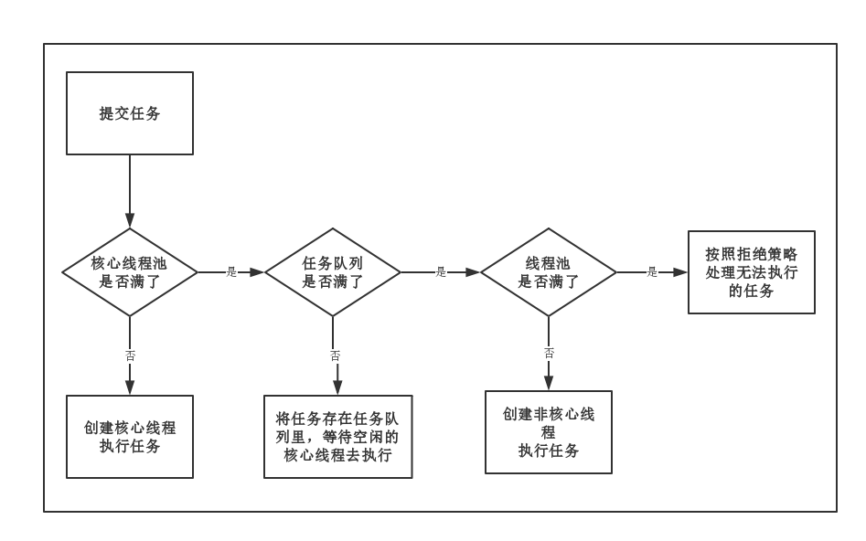

## 线程池`ThreadPoolExecutor`

### 为什么使用线程池？

> * 线程的创建和销毁，都需要从用户态进入内核态，会消耗大量时间和资源，而使用线程池后，每个线程使用完后并不会销毁，而是再次回到线程池中，等待下一个对象使用，减少线程的创建和销毁，从而提高了程序的执行效率。
> * **控制并发的数量**。并发数量过多，可能会导致资源消耗过多，避免出现内存溢出，从而造成服务器崩溃。（主要原因）。
> * **可以对线程做统一管理**。


### 线程池的7个参数

> ```java
> public ThreadPoolExecutor(int corePoolSize,											// 核心线程数
>                            int maximumPoolSize,									// 线程池中最大线程数(包含核心线程)
>                            long keepAliveTime,									// 非核心的空闲线程存活时间
>                            TimeUnit unit,					    					// 时间单位 
>                            BlockingQueue<Runnable> workQueue,	 	// 阻塞队列
>                            ThreadFactory threadFactory,					// 线程工厂(非必要)
>                            RejectedExecutionHandler handler) {	// 拒绝策略（非必要）
>      if (corePoolSize < 0 ||
>          maximumPoolSize <= 0 ||
>          maximumPoolSize < corePoolSize ||
>          keepAliveTime < 0)
>          throw new IllegalArgumentException();
>      if (workQueue == null || threadFactory == null || handler == null)
>          throw new NullPointerException();
>      this.acc = System.getSecurityManager() == null ?
>              null :
>              AccessController.getContext();
>      this.corePoolSize = corePoolSize;
>      this.maximumPoolSize = maximumPoolSize;
>      this.workQueue = workQueue;
>      this.keepAliveTime = unit.toNanos(keepAliveTime);
>      this.threadFactory = threadFactory;
>      this.handler = handler;
>  }
> ```

### 五种线程池

**注意**

> * **`FixedThreadPool` 和 `SingleThreadPool `: 允许的请求队列长度为` Integer.MAX_VALUE` ，可能会堆积大量的请求，从而导致 OOM 。**
>
> * **`CachedThreadPool` 和 `ScheduledThreadPool` : 允许的创建线程数量为 `Integer.MAX_VALUE` ，可能会创建大量的线程，从而导致 OOM 。**

> * `ExecutorService pool = Executors.newFixedThreadPool(2);`
>
> > 创建一个核心线程个数和最大线程个数都为`nThreads`的线程池，并且阻塞队列长度为`Integer.MAX_VALUE`。`keepAliveTime=0`说明只要线程个数比核心线程数多，并且当前空闲，则回收
> >
> > ```java
> > public static ExecutorService newFixedThreadPool(int nThreads) {
> >     return new ThreadPoolExecutor(nThreads, nThreads,
> >                                   0L, TimeUnit.MILLISECONDS,
> >                                   new LinkedBlockingQueue<Runnable>());
> > }
> > 
> > public LinkedBlockingQueue() {
> >     this(Integer.MAX_VALUE);
> > }
> > ```
>
> *  `ExecutorService cachedThreadPool = Executors.newCachedThreadPool();`
>
> > 创建一个按需创建线程的线程池，初始线程为0，最大线程为`Integer.MAX_VALUE`。并且阻塞队列为同步队列。
> >
> > 特殊：加入同步队列的任务会被马上执行，同步队列里面最多只有一个任务
> >
> > ```java
> > public static ExecutorService newCachedThreadPool() {
> >     return new ThreadPoolExecutor(0, Integer.MAX_VALUE,
> >                                   60L, TimeUnit.SECONDS,
> >                                   new SynchronousQueue<Runnable>());
> > }
> > ```
> >
> > 
>
> * `ExecutorService singleThreadPool = Executors.newSingleThreadExecutor();`
>
> > 创建一个单线程化的线程池，它只会用唯一的工作线程来执行任务，保证所有任务按照指定顺序(FIFO, LIFO, 优先级)执行
> >
> > 核心线程个数和最大线程个数都为1的线程池，并且阻塞队列长度为`Integer.MAX_VALUE`。`keepAliveTime=0`说明只要线程个数比核心线程数多，并且当前空闲，则回收
> >
> > ```java
> > public static ExecutorService newSingleThreadExecutor() {
> >     return new FinalizableDelegatedExecutorService
> >         (new ThreadPoolExecutor(1, 1,
> >                                 0L, TimeUnit.MILLISECONDS,
> >                                 new LinkedBlockingQueue<Runnable>()));
> > }
> > ```
> >
> > 
>
> * `ExecutorService scheduledExecutorService = Executors.newScheduledThreadPool();`
>
> > 创建一个定长线程池，支持定时及周期性任务执行。
> >
> > ```java
> > public static ScheduledExecutorService newScheduledThreadPool(int corePoolSize) {
> >     return new ScheduledThreadPoolExecutor(corePoolSize);
> > }
> > 
> > // NANOSECONDS 代表千分之一微秒的时间单位 
> > public ScheduledThreadPoolExecutor(int corePoolSize) {
> >     super(corePoolSize, Integer.MAX_VALUE, 0, NANOSECONDS,
> >           new DelayedWorkQueue());
> > }
> > ```
>
> * `ExecutorService workStealingPool = Executors.newWorkStealingPool();`
>
> > ```java
> > public static ExecutorService newWorkStealingPool() {
> >     return new ForkJoinPool
> >         (Runtime.getRuntime().availableProcessors(),
> >          ForkJoinPool.defaultForkJoinWorkerThreadFactory,
> >          null, true);
> > }
> > ```

### 阻塞队列(`workQueue`)

> * 有界队列
>
> > * 遵循FIFO原则的队列如`ArrayBlockingQueue`
> > * 优先级队列如`PriorityBlockingQueue`,优先级由任务的Comparator决定
> >
> > 使用有界队列时队列大小需和线程池大小互相配合，线程池较小有界队列较大时可减少内存消耗，降低CPU使用率和上下文切换，但是可能会限制系统吞吐量。
>
> * 无界队列 
>
> > 基于链表的`LinkedBlockingQueue`, 默认大小是`Integer.MAX_VALUE`，也可以指定大小。使用该队列做为阻塞队列时要尤其当心，当任务耗时较长时可能会导致大量新任务在队列中堆积最终导致OOM
> >
> > 当QPS很高，发送数据很大，大量的任务被添加到这个无界`LinkedBlockingQueue` 中，导致CPU和内存飙升服务器挂掉。
>
> * 同步队列
>
> > `SynchronousQueue`不是一个真正的队列，而是一种线程之间移交的机制。要将一个元素放入`SynchronousQueue`中，必须有另一个线程正在等待接收这个元素。只有在使用无界线程池或者有饱和策略时才建议使用该队列
>
> - 延迟队列
>
> > **DelayQueue：**该队列中的元素只有当其指定的延迟时间到了，才能够从队列中获取到该元素 。

### 四种拒绝策略(`RejectedExecutionHandler`)

> * `AbortPolicy`: **默认拒绝处理策略**，丢弃任务并抛出RejectedExecutionException异常。
> * `CallerRunsPolicy`：由调用线程处理该任务。
> * `DiscardOldestPolicy`：丢弃队列头部（最旧的）的任务，然后执行当前任务（如果再次失败，重复此过程）。
> * `DiscardPolicy`：丢弃新来的任务，但是不抛出异常。

### 五种生命状态

> 线程池本身有一个调度线程，这个线程就是用于管理布控整个线程池里的各种任务和事务，例如创建线程、销毁线程、任务队列管理、线程队列管理等等。
>
> 故线程池也有自己的状态。`ThreadPoolExecutor`类中定义了一个`volatile int`变量**runState**来表示线程池的状态 ，分别为
>
> * Running
>   能接受新任务以及处理已添加的任务
>
> * Shutdown
>   不接受新任务,可以处理已经添加的任务
>
> * Stop
>   不接受新任务,不处理已经添加的任务,并且中断正在处理的任务(运行到最近的安全点进行退出)
>
> * Tidying
>   所有的任务已经终止,`ctl`记录的”任务数量”为0, `ctl`负责记录线程池的运行状态与活动线程数量
>
> * Terminated
>   线程池彻底终止,则线程池转变为terminated状态
>
>   **状态流转**
>
>   线程池创建后处于**RUNNING**状态。
>
>   调用shutdown()方法后处于**SHUTDOWN**状态，线程池不能接受新的任务，清除一些空闲worker,会等待阻塞队列的任务完成。
>
>   调用shutdownNow()方法后处于**STOP**状态，线程池不能接受新的任务，中断所有线程，阻塞队列中没有被执行的任务全部丢弃。此时，poolsize=0,阻塞队列的size也为0。
>
>   当所有的任务已终止，ctl记录的”任务数量”为0，线程池会变为**TIDYING**状态。接着会执行terminated()函数。
>
>   > ThreadPoolExecutor中有一个控制状态的属性叫ctl，它是一个AtomicInteger类型的变量。
>
>   线程池处在TIDYING状态时，**执行完terminated()方法之后**，就会由 **TIDYING -> TERMINATED**， 线程池被设置为TERMINATED状态。
>
>   > `terminated()`钩子函数，自己实现，退出前做业务处理 
>

### 案例

> ```java
> /**
>  * 线程池
>  * @author 张
>  */
> public class ThreadPoolExecutorTest {
> 
>     public static void main(String[] args) {
>         ExecutorService pool = Executors.newFixedThreadPool(2);
>         ExecutorService cachedThreadPool = Executors.newCachedThreadPool();
>         ExecutorService singleThreadExecutor = Executors.newSingleThreadExecutor();
>         //        ScheduledExecutorService scheduledExecutorService = Executors.newScheduledThreadPool();
> 
>         Ticket ticket = new Ticket();
>         ThreadFactory namedThreadFactory = new ThreadFactoryBuilder().setNameFormat("窗口-%d").build();
> 
>         // 创建线程池，其中任务队列需要结合实际情况设置合理的容量
>         ThreadPoolExecutor poolExecutor = new ThreadPoolExecutor(4, 8, 0L, TimeUnit.MILLISECONDS, new LinkedBlockingQueue<Runnable>(1024), namedThreadFactory);
> 
>         // 新建 3 个任务
>         for (int i = 0; i < 3; i++) {
>             poolExecutor.execute(()->{ for (int a = 0; a <= 40 ; a++) { ticket.saleTicket();}});
>         }
> 
>         // 优雅关闭线程池
>         // 将线程池状态置为SHUTDOWN。平滑的关闭ExecutorService，当此方法被调用时，ExecutorService停止接收新的任务并且等待已经提交的任务（包含提交正在执行和提交未执行）执行完成。当所有提交任务执行完毕，线程池即被关闭。
>         poolExecutor.shutdown();
>         // 接收人timeout和TimeUnit两个参数，用于设定超时时间及单位。当等待超过设定时间时，会监测ExecutorService是否已经关闭，若关闭则返回true，否则返回false。一般情况下会和shutdown方法组合使用。
>         try {
>             poolExecutor.awaitTermination(1000L, TimeUnit.SECONDS);
>         } catch (InterruptedException e) {
>             e.printStackTrace();
>         }
>         // 任务执行完毕后打印"Done"
>         System.out.println("Done");
> 
> 
>     }
> }
> 
> /**
>  * 资源类
>  *
>  * @author 张
>  */
> class Ticket {
>     private int ticketNumber = 100;
>     Lock lock = new ReentrantLock();
> 
>     public void saleTicket(){
>         lock.lock();
>         try {
>             // 使用if会出现虚假唤醒 请使用while
>             if (ticketNumber > 0){
>                 System.out.println(Thread.currentThread().getName()+"\t正在卖出第"+ticketNumber+"张票！");
>                 ticketNumber--;
>             }
>         }catch (Exception e){
>             e.printStackTrace();
>         }finally {
>             lock.unlock();
>         }
>     }
> }
> ```

### 线程池执行流程

> 1. 判断线程池里的**核心线程**是否都在执行任务，如果不是（核心线程空闲或者还有核心线程没有被创建）则**创建一个新的工作线程**来执行任务。（让核心线程数量快速达到corePoolSize，在核心线程数量 < corePoolSize时）。**注意，这一步需要获得全局锁**。如果核心线程都在执行任务，则进入下个流程。
> 2. 线程池判断**阻塞队列**是否已满，如果阻塞队列没有满，则将新提交的任务存储在这个阻塞队列里。如果阻塞队列满了，则进入下个流程。
> 3. 判断线程池里的线程(最大线程数)是否都处于工作状态，如果没有，则创建一个新的工作线程来执行任务。如果已经满了，则交给拒绝策略来处理这个任务。
>
> ```java
> public void execute(Runnable command) {
>     if (command == null)
>         throw new NullPointerException();   
>     int c = ctl.get();
>     // 1.当前线程数小于corePoolSize,则调用addWorker创建核心线程执行任务
>     if (workerCountOf(c) < corePoolSize) {
>        if (addWorker(command, true))
>            return;
>        c = ctl.get();
>     }
>     // 2.如果不小于corePoolSize，则将任务添加到workQueue队列。
>     if (isRunning(c) && workQueue.offer(command)) {
>         int recheck = ctl.get();
>         // 2.1 如果isRunning返回false(状态检查)，则remove这个任务，然后执行拒绝策略。
>         if (! isRunning(recheck) && remove(command))
>             reject(command);
>             // 2.2 线程池处于running状态，但是没有线程，则创建线程
>         else if (workerCountOf(recheck) == 0)
>             addWorker(null, false);
>     }
>     // 3.如果放入workQueue失败，则创建非核心线程执行任务，
>     // 如果这时创建非核心线程失败(当前线程总数不小于maximumPoolSize时)，就会执行拒绝策略。
>     else if (!addWorker(command, false))
>          reject(command);
> }
> ```
>
> 

### 源码解析

> ```java
> private final AtomicInteger ctl = new AtomicInteger(ctlOf(RUNNING, 0));
> private static final int COUNT_BITS = Integer.SIZE - 3;		// 32-3 = 29
> private static final int CAPACITY   = (1 << COUNT_BITS) - 1;
> 
> // 运行状态用ctl的高三位来表示
> //	1110 0000 0000 0000 0000 0000 0000 0000 0000
> private static final int RUNNING    = -1 << COUNT_BITS;		//-1 二进制左移29位 111 (反码+1)
> // 	0000 0000 0000 0000 0000 0000 0000 0000 0000  
> private static final int SHUTDOWN   =  0 << COUNT_BITS;		// 0 左移29位	000
> // 	0010 0000 0000 0000 0000 0000 0000 0000 0000  
> private static final int STOP       =  1 << COUNT_BITS;		// 1 左移29位	001	
> // 	0100 0000 0000 0000 0000 0000 0000 0000 0000  
> private static final int TIDYING    =  2 << COUNT_BITS;		// 2 左移29位	010
> // 	0110 0000 0000 0000 0000 0000 0000 0000 0000  
> private static final int TERMINATED =  3 << COUNT_BITS;		// 3 左移29位	011
> 
> // 获取高3位(运行状态)
> private static int runStateOf(int c)     { return c & ~CAPACITY; }
> // 获取低29位(线程个数)
> private static int workerCountOf(int c)  { return c & CAPACITY; }
> // 计算ctl新值(线程状态与线程个数)
> private static int ctlOf(int rs, int wc) { return rs | wc; }
> 
> // 用户线程提交任务
> public void execute(Runnable command) {
>  // 1. 判断提交的任务是否为null，为null抛出NPE异常
>  if (command == null)
>        throw new NullPointerException();
>  // 2. 获取当前线程池的状态和线程个数变量的组合值 
>  // public final int get() {return value;} 
>  int c = ctl.get();
>  // 3. 判断当前活动线程数是否小于核心线程数
>  if (workerCountOf(c) < corePoolSize) {
>        // 3.1 小于，则创建新线程执行任务(传入true,创建核心线程)
>        if (addWorker(command, true))
>             return;
>        c = ctl.get();
>  }
>  //  大于核心线程
>  //4. 判断线程池是否处于Running 状态,正在运行的话,则添加任务到阻塞队列
>  if (isRunning(c) && workQueue.offer(command)) {
>        // 二次检查 
>        //4.1 获取组合值
>        int recheck = ctl.get();
>         //4.2 如果当前状态不是Running则从队列中删除任务，并执行拒绝策略
>        if (! isRunning(recheck) && remove(command))
>             reject(command);
>         //4.3 否则如果当前线程池为空，则添加一个线程(传入false，创建非核心线程)
>        else if (workerCountOf(recheck) == 0)
>             addWorker(null, false);
>  }
>  //  线程池不是运行状态 或者 运行状态下,阻塞队列满了	
>  // 5. 在以上两种状态下，尝试创建新线程(传入false，创建非核心线程),创建失败(大于最大线程)则执行拒绝策略
>  else if (!addWorker(command, false))
>        reject(command);
> }
> 
> // 新增线程方法
> private boolean addWorker(Runnable firstTask, boolean core) {
>  // 标记点
>  retry:
>  // 双重循环 CAS操作增加线程数
>  for (;;) {
>         // 获取 组合值
>        int c = ctl.get();
>         // 通过组合值获取线程池状态
>        int rs = runStateOf(c);
> 
>        // 6. 检查队列是否只在必要时为空
>        if (rs >= SHUTDOWN &&					// 线程池状态为SHUTDOWN，STOP，TIDYING或TERMINATED。
>             ! (rs == SHUTDOWN &&				// 上述条件满足情况下 (1) 状态为STOP，TIDYING或TERMINATED
>                firstTask == null &&			// (2) 状态为SHUTDOWN且已经有第一个任务
>                ! workQueue.isEmpty()))		// (3) 状态为SHUTDOWN且没有第一个任务且任务队列为空
>             return false;
> 
>        // 7.内循环作用: 使用CAS增加线程个数
>        for (;;) {
>             // 获取线程个数
>             int wc = workerCountOf(c);
>             // (1) 如果线程个数超限,则返回false
>             if (wc >= CAPACITY ||
>                 wc >= (core ? corePoolSize : maximumPoolSize))
>                 return false;
>             // (2) CAS设置线程个数，同时只有一个线程成功
>             if (compareAndIncrementWorkerCount(c))
>                 // CAS成功，退出双重循环
>                 break retry;
>             // (3) CAS失败,则看线程池状态是否发生改变,改变则跳到外层循环重新尝试获取线程池状态，未该变则再次进入内循环重新进行CAS尝试
>             c = ctl.get();  
>             if (runStateOf(c) != rs)
>                 continue retry;
>        }
>  }
> 
>  // 8. 到这里说明CAS成功，接下来吧并发安全的任务添加到workers里，并启动任务
>     // 启动状态
>  boolean workerStarted = false;
>     // 添加状态
>  boolean workerAdded = false;
>  Worker w = null;
>  try {
>         // (1) 创建Worker  Worker继承了AQS和Runnable接口，是具体承载任务的对象。firstTask记录该工作线程的第一个任务
>        w = new Worker(firstTask);
>         // thread是具体执行任务的线程
>        final Thread t = w.thread;
>        if (t != null) {
>             final ReentrantLock mainLock = this.mainLock;
>             // (2) 加独占锁，实现workers同步,因为可能多个线程调用了线程池的execute()方法
>             mainLock.lock();
>             try {
>                 // (3) 重新检查线程池状态，以避免在获取锁前调用了shutdown接口.
>                 int rs = runStateOf(ctl.get());
>                 if (rs < SHUTDOWN ||
>                     (rs == SHUTDOWN && firstTask == null)) {
>                     if (t.isAlive()) // precheck that t is startable
>                         throw new IllegalThreadStateException();
>                     // (4) 添加任务
>                     workers.add(w);
>                     int s = workers.size();
>                     if (s > largestPoolSize)
>                         largestPoolSize = s;
>                     workerAdded = true;
>                 }
>             } finally {
>                 mainLock.unlock();
>             }
>             // （5） 添加成功后则启动任务
>             if (workerAdded) {
>                 // 启动线程
>                 t.start();
>                 workerStarted = true;
>             }
>        }
>  } finally {
>        if (! workerStarted)
>             addWorkerFailed(w);
>  }
>  return workerStarted;
> }
> ```


