# MQ


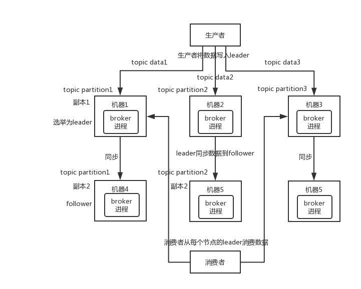

# 消息队列之RabbitMQ

## 7种模型

### 1. 一对一

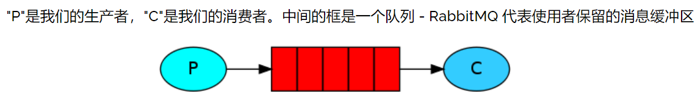


**案例:**

```java
/* 连接工具类 */
public class RabbitmqUtils {

    private static volatile ConnectionFactory factory;

    static {

        factory = new ConnectionFactory();
        factory.setHost("192.168.33.129");
        factory.setPort(5672);
        // 设置虚拟主机
        factory.setVirtualHost("mqtest");
        // 设置用户名密码
        factory.setUsername("zsq");
        factory.setPassword("123456");
    }

    private RabbitmqUtils() {
    }

    public static Connection getConnection() {
        try {
            return factory.newConnection();
        } catch (Exception e) {
            e.printStackTrace();
        }
        return null;
    }
}
```

 生产者

```java
public class Provider {

    private final static String QUEUE_NAME = "QueueTest";

    public static void main(String[] args) {
        Provider provider = new Provider();
        String message = "Hello Rabbit MQ!";
        for (int i = 1; i <= 10; i++) {
            provider.SendMessageTest(message + i);
        }
    }

    public void SendMessageTest(String message) {
        try (
            // 获取连接 使用try(){} 及时释放资源
              Connection connection = RabbitmqUtils.getConnection();
            // 获取通道 
              Channel channel = connection.createChannel()) {

            /**
            声明队列(将通道绑定到队列)  需与消费者对应 更改后需删除原队列或重新创建一个队列名
             Queue.DeclareOk queueDeclare(String queue, boolean durable, boolean exclusive, 
             		boolean autoDelete, Map<String, Object> arguments) throws IOException;
            	queue : 队列名
            	durable : 是否持久化 false 不持久化
            	exclusive : 是否独占队列 false 不独占
            	exclusive : 是否自动删除 如果我们声明一个自动删除队列，则为true（服务器将在不再使用它时将其删除)
            	arguments : other properties (construction arguments) for the queue
            */
            channel.queueDeclare(QUEUE_NAME, false, false, false, null);
            
            /**
            发送消息到队列
            void basicPublish(String exchange, String routingKey, BasicProperties props, byte[] body) throws 				IOException;
			exchange : 将消息发布到的交换机中  未设置交换机用""
			routingKey : 路由键 即队列名称
			props : 消息的属性-路由标头等
			body : 消息主体
            */
            channel.basicPublish("", QUEUE_NAME, null, message.getBytes(StandardCharsets.UTF_8));
        } catch (Exception e) {
            e.printStackTrace();
        }

    }

}
```

消费者:

```java
public class Customer {
    private final static String QUEUE_NAME = "QueueTest";

    public static void main(String[] args) {
        Customer customer = new Customer();

        Thread thread = new Thread(() -> {
            customer.receiveMessage("消费者1");
        });
        thread.start();
    }

    private void receiveMessage(String name) {
        try {
            // 获取通道 不释放资源 保持运行
            Channel channel = RabbitmqUtils.getConnection().createChannel();
            // 声明队列 需与生产者对应
            channel.queueDeclare(QUEUE_NAME, false, false, false, null);
           
           DeliverCallback deliverCallback = (consumerTag, delivery) -> {
                System.out.println(name + "消费" + new String(delivery.getBody(), StandardCharsets.UTF_8));
            };
            /**
             消费消息
              String basicConsume(String queue, boolean autoAck, DeliverCallback deliverCallback, 											CancelCallback cancelCallback) throws IOException;
              queue : 要消费的队列
              autoAck : 是否自动确认
              deliverCallback : 消费消息时的回调
              cancelCallback: 取消消费者时的回调
			
            */
            channel.basicConsume(QUEUE_NAME, false, deliverCallback,(consumerTag) ->{});


        } catch (Exception e) {
            e.printStackTrace();
        }

    }
}

```

### 2. 一对多 (通过取消自动确认机制,实现能者多劳)

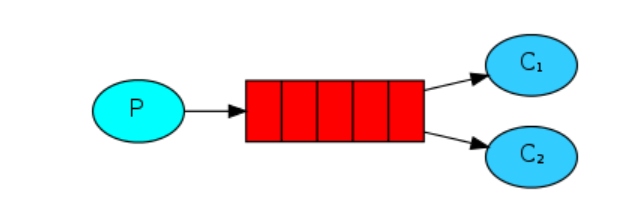

案例:

生产者:

```java
public class Provider {

    private final static String QUEUE_NAME = "QueueTest";

    public static void main(String[] args) {
        Provider provider = new Provider();
        String message = "Hello Rabbit MQ!";
        for (int i = 1; i <= 1000; i++) {
            provider.SendMessageTest(message + i);
        }
    }

    public void SendMessageTest(String message) {
        try (Connection connection = RabbitmqUtils.getConnection();
             Channel channel = connection.createChannel()) {
            channel.queueDeclare(QUEUE_NAME, false, false, true, null);
            channel.basicPublish("", QUEUE_NAME, null, message.getBytes("UTF-8"));
        } catch (Exception e) {
            e.printStackTrace();
        }

    }

}

```


消费者:

```java
public class Customer {
    private final static String QUEUE_NAME = "QueueTest";

    public static void main(String[] args) {
        Customer customer = new Customer();
        customer.receiveMessage("消费者1");

    }

    private void receiveMessage(String name) {
        try {
            Channel channel = RabbitmqUtils.getConnection().createChannel();
            channel.queueDeclare(QUEUE_NAME, false, false, true, null);

        // 每次只消费一个消息(在处理并确认前一个消息之前，不要向其发送新消息, 相反，它会将它调度给尚未忙的下一个消费者
            channel.basicQos(1);

            DeliverCallback deliverCallback = (consumerTag, delivery) -> {
                System.out.println(name + "消费" + new String(delivery.getBody(), "UTF-8"));
                channel.basicAck(delivery.getEnvelope().getDeliveryTag(), false);
            };
            CancelCallback cancelCallback = (consumerTag) -> {
            };
            channel.basicConsume(QUEUE_NAME, false, deliverCallback, cancelCallback);

        } catch (Exception e) {
            e.printStackTrace();
        }

    }
}


public class Customer2 {
    private final static String QUEUE_NAME = "QueueTest";

    public static void main(String[] args) {
        Customer2 customer = new Customer2();
        customer.receiveMessage("消费者2");
    }

    private void receiveMessage(String name) {
        try {
            Channel channel = RabbitmqUtils.getConnection().createChannel();
            channel.queueDeclare(QUEUE_NAME, false, false, true, null);

         // 每次只消费一个消息(在处理并确认前一个消息之前，不要向其发送新消息, 相反，它会将它调度给尚未忙的下一个消费者
            channel.basicQos(1);

            DeliverCallback deliverCallback = (consumerTag, delivery) -> {
                try {
                    Thread.sleep(3000);
                } catch (InterruptedException e) {
                    e.printStackTrace();
                }

                System.out.println(name + "消费" + new String(delivery.getBody(), "UTF-8"));
                channel.basicAck(delivery.getEnvelope().getDeliveryTag(), false);
            };
            CancelCallback cancelCallback = (consumerTag) -> {
            };
            channel.basicConsume(QUEUE_NAME, false, deliverCallback, cancelCallback);

        } catch (Exception e) {
            e.printStackTrace();
        }

    }
}
```

### 3. 消息/订阅模式

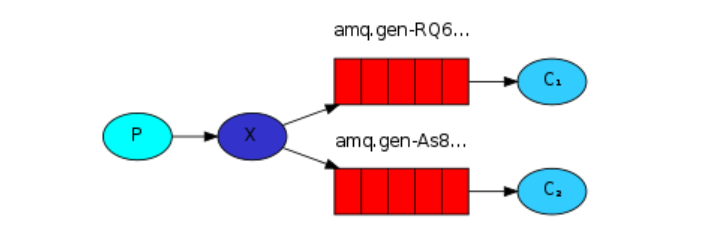


案例

  生产者

```java
public class Provider {

    public static void main(String[] args) {
        // 交换机
        String exchange = "logs";
        // 交换机类型
        String exchange_type = "fanout";
        // 消息
        String message = "fanout 广播模式";

        new Provider().sendMessage(exchange, exchange_type, message);
    }

    public void sendMessage(String exchange, String exchange_type, String message) {

        try (Connection connection = RabbitmqUtils.getConnection();
             Channel channel = connection.createChannel()) {
            // exchange 交换机名称  type 交换机类型 fanout 广播类型
            channel.exchangeDeclare(exchange, exchange_type);
            channel.basicPublish(exchange, "", null, message.getBytes());

        } catch (Exception e) {
            e.printStackTrace();
        }
    }

}
```

消费者

```java
public class Customer {

    public static void main(String[] args) {

        String exchange = "logs";
        String exchange_type = "fanout";
        new Customer().receiveMessage(exchange,exchange_type);

    }

    public void receiveMessage(String exchange, String exchange_type) {

        try {
            Channel channel = RabbitmqUtils.getConnection().createChannel();
            // 声明交换机
            channel.exchangeDeclare(exchange, exchange_type);
            // 创建临时队列 (一个非持久、独占、自动删除队列，并生成唯一名称)
            String queue = channel.queueDeclare().getQueue();
            // 绑定队列
            channel.queueBind(queue, exchange, "");

            DeliverCallback deliverCallback = (consumerTag, delivery) -> {

                System.out.println(new String(delivery.getBody(), "utf-8"));
            };
			// 进行消息处理
            channel.basicConsume(queue, deliverCallback, consumerTag -> {});

        } catch (IOException e) {
            e.printStackTrace();
        }


    }

}

```


### 4. 路由模式 Direct

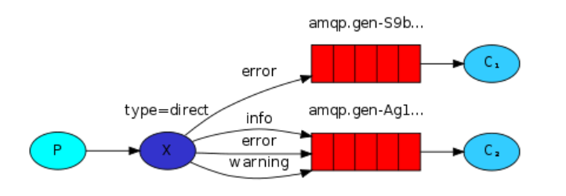

生产者 error

```java
public class ProviderError {

    public static void main(String[] args) {
        String message = "Routing-Direct error";
        String exchange = "logs";
        String exchangeType = "direct";

        ProviderError provider = new ProviderError();
        provider.SendMessageTest(exchange, exchangeType, message);
    }

    public void SendMessageTest(String exchange, String exchangeType, String message) {
        try (Connection connection = RabbitmqUtils.getConnection();
             Channel channel = connection.createChannel()) {
            channel.exchangeDeclare(exchange, exchangeType);
            channel.basicPublish(exchange, "error", null, message.getBytes(StandardCharsets.UTF_8));
        } catch (Exception e) {
            e.printStackTrace();
        }

    }

}
```


生产者 info debug warning

```java
public class ProviderInfo {

    public static void main(String[] args) {
        String message = "Routing-Direct info";
        String exchange = "logs";
        String exchangeType = "direct";

        ProviderInfo provider = new ProviderInfo();
        provider.SendMessageTest(exchange, exchangeType, message);
    }

    public void SendMessageTest(String exchange, String exchangeType, String message) {
        try (Connection connection = RabbitmqUtils.getConnection();
             Channel channel = connection.createChannel()) {
            channel.exchangeDeclare(exchange, exchangeType);
            channel.basicPublish(exchange, "info", null, message.getBytes(StandardCharsets.UTF_8));
        } catch (Exception e) {
            e.printStackTrace();
        }

    }

}

public class ProviderWarning {

    public static void main(String[] args) {
        String message = "Routing-Direct warning";
        String exchange = "logs";
        String exchangeType = "direct";

        ProviderWarning provider = new ProviderWarning();
        provider.SendMessageTest(exchange, exchangeType, message);
    }

    public void SendMessageTest(String exchange, String exchangeType, String message) {
        try (Connection connection = RabbitmqUtils.getConnection();
             Channel channel = connection.createChannel()) {
            channel.exchangeDeclare(exchange, exchangeType);
            channel.basicPublish(exchange, "warning", null, message.getBytes(StandardCharsets.UTF_8));
        } catch (Exception e) {
            e.printStackTrace();
        }

    }

}

public class ProviderDebug {

    public static void main(String[] args) {
        String message = "Routing-Direct debug";
        String exchange = "logs";
        String exchangeType = "direct";

        ProviderDebug provider = new ProviderDebug();
        provider.SendMessageTest(exchange, exchangeType, message);
    }

    public void SendMessageTest(String exchange, String exchangeType, String message) {
        try (Connection connection = RabbitmqUtils.getConnection();
             Channel channel = connection.createChannel()) {
            channel.exchangeDeclare(exchange, exchangeType);
            channel.basicPublish(exchange, "debug", null, message.getBytes(StandardCharsets.UTF_8));
        } catch (Exception e) {
            e.printStackTrace();
        }

    }

}
```

消费者 error

```java
public class CustomerError {
    public static void main(String[] args) {

        String exchange = "logs";
        String exchangeType = "direct";

        CustomerError customer = new CustomerError();
        customer.receiveMessage(exchange, exchangeType);

    }

    private void receiveMessage(String exchange, String exchangeType) {
        try {
            Channel channel = RabbitmqUtils.getConnection().createChannel();
            channel.exchangeDeclare(exchange, exchangeType);
            String queue = channel.queueDeclare().getQueue();
            channel.queueBind(queue, exchange, "error");

            DeliverCallback deliverCallback = (consumerTag, delivery) -> {
                System.out.println(new String(delivery.getBody(), StandardCharsets.UTF_8));
            };
            CancelCallback cancelCallback = (consumerTag) -> {
            };
            channel.basicConsume(queue, deliverCallback, cancelCallback);

        } catch (Exception e) {
            e.printStackTrace();
        }

    }
}

```

消费者 another

```java
public class CustomerAnohter {

    public static void main(String[] args) {

        String exchange = "logs";
        String exchangeType = "direct";

        CustomerAnohter customer = new CustomerAnohter();
        customer.receiveMessage(exchange, exchangeType);

    }

    private void receiveMessage(String exchange, String exchangeType) {
        try {
            Channel channel = RabbitmqUtils.getConnection().createChannel();
            channel.exchangeDeclare(exchange, exchangeType);
            String queue = channel.queueDeclare().getQueue();
            channel.queueBind(queue, exchange, "warning");
            channel.queueBind(queue, exchange, "info");
            channel.queueBind(queue, exchange, "debug");

            DeliverCallback deliverCallback = (consumerTag, delivery) -> {
                System.out.println(new String(delivery.getBody(), StandardCharsets.UTF_8));
            };
            CancelCallback cancelCallback = (consumerTag) -> {
            };
            channel.basicConsume(queue, deliverCallback, cancelCallback);

        } catch (Exception e) {
            e.printStackTrace();
        }

    }
}

```


###  5. 路由模式之动态路由 topic

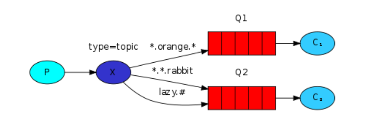


案例

生产者

```java
public class ProviderTopic1 {

    private static final String exchange = "routing_topic";
    private static final String exchangeType = "topic";

    public static void main(String[] args) {

        String routingKey = "1.routing.topic";
        String message = "routing topic1 message";
        new ProviderTopic1().sendMessage(exchange, exchangeType, routingKey, message);
    }

    private void sendMessage(String exchange, String exchangeType, String routingKey, String message) {

        try (
                Connection connection = RabbitmqUtils.getConnection();
                Channel channel = connection.createChannel()
        ) {
            channel.exchangeDeclare(exchange, exchangeType);
            channel.basicPublish(exchange, routingKey, null, message.getBytes(StandardCharsets.UTF_8));

        } catch (Exception e) {
            e.printStackTrace();
        }

    }
}


public class ProviderTopic2 {

    private static final String exchange = "routing_topic";
    private static final String exchangeType = "topic";

    public static void main(String[] args) {

        String routingKey = "1.routing.topic.1";
        String message = "routing topic2 message";
        new ProviderTopic2().sendMessage(exchange, exchangeType, routingKey, message);
    }

    private void sendMessage(String exchange, String exchangeType, String routingKey, String message) {

        try (
                Connection connection = RabbitmqUtils.getConnection();
                Channel channel = connection.createChannel()
        ) {
            channel.exchangeDeclare(exchange, exchangeType);
            channel.basicPublish(exchange, routingKey, null, message.getBytes(StandardCharsets.UTF_8));

        } catch (Exception e) {
            e.printStackTrace();
        }

    }
}
```


消费者

```java
public class ConsumerTopic1 {

    private static final String exchange = "routing_topic";
    private static final String exchangeType = "topic";

    public static void main(String[] args) {

        String routingKey = "*.routing.*";

        new ConsumerTopic1().receiveMessage(exchange, exchangeType, routingKey);
    }

    private void receiveMessage(String exchange, String exchangeType, String routingKey) {

        try {
            Channel channel = RabbitmqUtils.getConnection().createChannel();
            channel.exchangeDeclare(exchange, exchangeType);
            String queue = channel.queueDeclare().getQueue();
            channel.queueBind(queue, exchange, routingKey);

            DeliverCallback deliverCallback = (consumerTag, delivery) -> {
                System.out.println(new String(delivery.getBody(), StandardCharsets.UTF_8));
            };

            channel.basicConsume(queue, deliverCallback, consumerTag -> {});

        } catch (IOException e) {
            e.printStackTrace();
        }


    }

}


public class ConsumerTopic2 {

    private static final String exchange = "routing_topic";
    private static final String exchangeType = "topic";

    public static void main(String[] args) {

        String routingKey = "*.routing.#";

        new ConsumerTopic2().receiveMessage(exchange, exchangeType, routingKey);
    }

    private void receiveMessage(String exchange, String exchangeType, String routingKey) {

        try {
            Channel channel = RabbitmqUtils.getConnection().createChannel();
            channel.exchangeDeclare(exchange, exchangeType);
            String queue = channel.queueDeclare().getQueue();
            channel.queueBind(queue, exchange, routingKey);

            DeliverCallback deliverCallback = (consumerTag, delivery) -> {
                System.out.println(new String(delivery.getBody(), StandardCharsets.UTF_8));
            };

            channel.basicConsume(queue, deliverCallback, consumerTag -> {});

        } catch (IOException e) {
            e.printStackTrace();
        }


    }

}


```


# 如何保证消息的可靠性传输？如何处理消息丢失的问题？

> 保证消息的可靠性:  https://github.com/doocs/advanced-java/blob/main/docs/high-concurrency/how-to-ensure-the-reliable-transmission-of-messages.md


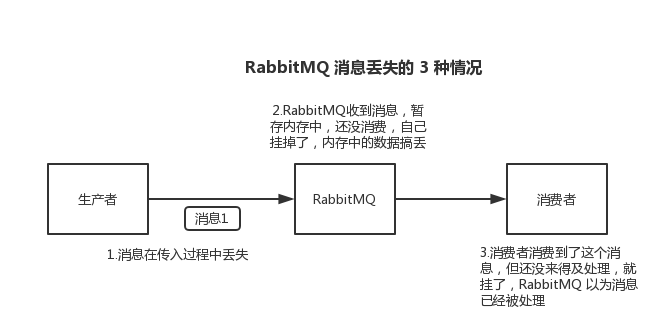

## 解决方案


### 生产者/消费者丢数据?  

采用消息确认机制

消息确认

- 启动消费返回（@ReturnList注解，生产者就可以知道哪些消息没有发出去）
- 生产者和Server（broker）之间的消息确认
- 消费者和Server（broker）之间的消息确认

### MQ自身丢消息

采用持久化机制

持久化

- exchange要持久化
- queue要持久化
- message要持久化

设置持久化有**两个步骤**：

- 创建 queue 的时候将其设置为持久化

这样就可以保证 RabbitMQ 持久化 queue 的元数据，但是它是不会持久化 queue 里的数据的。

- 第二个是发送消息的时候将消息的 `deliveryMode` 设置为 2

就是将消息设置为持久化的，此时 RabbitMQ 就会将消息持久化到磁盘上去。

必须要同时设置这两个持久化才行，RabbitMQ 哪怕是挂了，再次重启，也会从磁盘上重启恢复 queue，恢复这个 queue 里的数据。

注意，哪怕是你给 RabbitMQ 开启了持久化机制，也有一种可能，就是这个消息写到了 RabbitMQ 中，但是还没来得及持久化到磁盘上，结果不巧，此时 RabbitMQ 挂了，就会导致内存里的一点点数据丢失。

所以，持久化可以跟生产者那边的 `confirm` 机制配合起来，只有消息被持久化到磁盘之后，才会通知生产者 `ack` 了，所以哪怕是在持久化到磁盘之前，RabbitMQ 挂了，数据丢了，生产者收不到 `ack` ，你也是可以自己重发的。


### RabbitMQ：消息发送确认 与 消息接收确认（ACK）

默认情况下如果一个 Message 被消费者所正确接收则会被从 Queue 中移除

如果一个 Queue 没被任何消费者订阅，那么这个 Queue 中的消息会被 Cache（缓存），当有消费者订阅时则会立即发送，当 Message 被消费者正确接收时，就会被从 Queue 中移除

#### 消息发送确认

发送的消息怎么样才算失败或成功？如何确认？

- 当消息无法路由到队列时，确认消息路由失败。消息成功路由时，当需要发送的队列都发送成功后，进行确认消息，对于持久化队列意味着写入磁盘，对于镜像队列意味着所有镜像接收成功

#### 消息接收确认

消息消费者如何通知 RabbitMQ 消息消费成功？

- 消息**通过 ACK 确认是否被正确接收**，每个 Message 都要被确认（acknowledged），可以手动去 ACK 或自动 ACK
- 自动确认会在消息发送给消费者后立即确认，但存在丢失消息的可能，如果消费端消费逻辑抛出异常，也就是消费端没有处理成功这条消息，那么就相当于丢失了消息
- 如果消息已经被处理，但后续代码抛出异常，使用 Spring 进行管理的话消费端业务逻辑会进行回滚，这也同样造成了实际意义的消息丢失
- 如果手动确认则当消费者调用 ack、nack、reject 几种方法进行确认，手动确认可以在业务失败后进行一些操作，如果消息未被 ACK 则会发送到下一个消费者
- **如果某个服务忘记 ACK 了，则 RabbitMQ 不会再发送数据给它，因为 RabbitMQ 认为该服务的处理能力有限**
- ACK 机制还可以起到限流作用，比如在接收到某条消息时休眠几秒钟
- 消息确认模式有：
  - AcknowledgeMode.NONE：自动确认
  - AcknowledgeMode.AUTO：根据情况确认
  - AcknowledgeMode.MANUAL：手动确认

#### 确认消息（局部方法处理消息）

- 默认情况下消息消费者是自动 ack （确认）消息的，如果要手动 ack（确认）则需要修改确认模式为 manual

```java
spring:
  rabbitmq:
    listener:
      simple:
        acknowledge-mode: manual
```

- 或在 RabbitListenerContainerFactory 中进行开启手动 ack

```java
@Bean
public RabbitListenerContainerFactory<?> rabbitListenerContainerFactory(ConnectionFactory connectionFactory){
    SimpleRabbitListenerContainerFactory factory = new SimpleRabbitListenerContainerFactory();
    factory.setConnectionFactory(connectionFactory);
    factory.setMessageConverter(new Jackson2JsonMessageConverter());
    factory.setAcknowledgeMode(AcknowledgeMode.MANUAL);             //开启手动 ack
    return factory;
}
```

　　

- 确认消息

```java
@RabbitHandler
public void processMessage2(String message,Channel channel,@Header(AmqpHeaders.DELIVERY_TAG) long tag) {
    System.out.println(message);
    try {
        channel.basicAck(tag,false);            // 确认消息
    } catch (IOException e) {
        e.printStackTrace();
    }
}
```

- 需要注意的 basicAck 方法需要传递两个参数
  - **deliveryTag（唯一标识 ID）**：当一个消费者向 RabbitMQ 注册后，会建立起一个 Channel ，RabbitMQ 会用 basic.deliver 方法向消费者推送消息，这个方法携带了一个 delivery tag， **它代表了 RabbitMQ 向该 Channel 投递的这条消息的唯一标识 ID**，是一个单调递增的正整数，delivery tag 的范围仅限于 Channel
  - **multiple**：为了减少网络流量，手动确认可以被批处理，**当该参数为 true 时，则可以一次性确认 delivery_tag 小于等于传入值的所有消息**

#### 手动否认、拒绝消息

- 发送一个 header 中包含 error 属性的消息

 

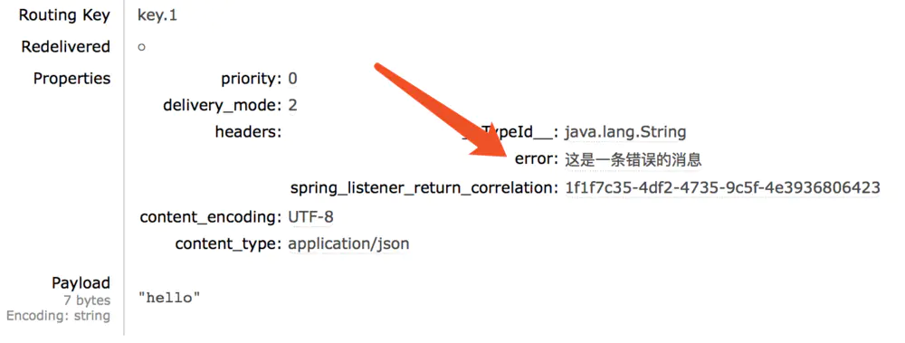

- 消费者获取消息时检查到头部包含 error 则 nack 消息

```java
@RabbitHandler
public void processMessage2(String message, Channel channel,@Headers Map<String,Object> map) {
    System.out.println(message);
    if (map.get("error")!= null){
        System.out.println("错误的消息");
        try {
            channel.basicNack((Long)map.get(AmqpHeaders.DELIVERY_TAG),false,true);      //否认消息
            return;
        } catch (IOException e) {
            e.printStackTrace();
        }
    }
    try {
        channel.basicAck((Long)map.get(AmqpHeaders.DELIVERY_TAG),false);            //确认消息
    } catch (IOException e) {
        e.printStackTrace();
    }
}
```

- 此时控制台重复打印，说明该消息被 nack 后一直重新入队列然后一直重新消费

```
hello
错误的消息
hello
错误的消息
hello
错误的消息
hello
错误的消息
```

- 也可以拒绝该消息，消息会被丢弃，不会重回队列

```java
channel.basicReject((Long)map.get(AmqpHeaders.DELIVERY_TAG),false);        //拒绝消息
```

### 确认消息 三种模式（全局处理消息）

- 自动确认 NONE（涉及到一个问题就是如果在处理消息的时候抛出异常，消息处理失败，但是因为自动确认而导致 Rabbit 将该消息删除了，造成消息丢失）

```java
@Bean
public SimpleMessageListenerContainer messageListenerContainer(ConnectionFactory connectionFactory){
    SimpleMessageListenerContainer container = new SimpleMessageListenerContainer();
    container.setConnectionFactory(connectionFactory);
    container.setQueueNames("consumer_queue");                 // 监听的队列
    container.setAcknowledgeMode(AcknowledgeMode.NONE);     // NONE 代表自动确认
    container.setMessageListener((MessageListener) message -> {         //消息监听处理
        System.out.println("====接收到消息=====");
        System.out.println(new String(message.getBody()));
        //相当于自己的一些消费逻辑抛错误
        throw new NullPointerException("consumer fail");
    });
    return container;
}
```

- 手动确认消息 MANUAL

```java
@Bean
public SimpleMessageListenerContainer messageListenerContainer(ConnectionFactory connectionFactory){
    SimpleMessageListenerContainer container = new SimpleMessageListenerContainer();
    container.setConnectionFactory(connectionFactory);
    container.setQueueNames("consumer_queue");              // 监听的队列
    container.setAcknowledgeMode(AcknowledgeMode.MANUAL);        // 手动确认
    container.setMessageListener((ChannelAwareMessageListener) (message, channel) -> {      //消息处理
        System.out.println("====接收到消息=====");
        System.out.println(new String(message.getBody()));
        if(message.getMessageProperties().getHeaders().get("error") == null){
        channel.basicAck(message.getMessageProperties().getDeliveryTag(),false);
            System.out.println("消息已经确认");
        }else {
            //channel.basicNack(message.getMessageProperties().getDeliveryTag(),false,false);
            channel.basicReject(message.getMessageProperties().getDeliveryTag(),false);
            System.out.println("消息拒绝");
        }
    });
    return container;
}
```

- 根据情况确认消息 AUTO
- AcknowledgeMode 除了 NONE 和 MANUAL 之外还有 AUTO ，它会根据方法的执行情况来决定是否确认还是拒绝（是否重新入queue）
  - 如果消息成功被消费（成功的意思是在消费的过程中没有抛出异常），则自动确认
  - 当抛出 AmqpRejectAndDontRequeueException 异常的时候，则消息会被拒绝，且 requeue = false（不重新入队列）
  - 当抛出 ImmediateAcknowledgeAmqpException 异常，则消费者会被确认
  - 其他的异常，则消息会被拒绝，且 requeue = true（如果此时只有一个消费者监听该队列，则有发生死循环的风险，多消费端也会造成资源的极大浪费，这个在开发过程中一定要避免的）。可以通过 setDefaultRequeueRejected（默认是true）去设置

```java
@Bean
public SimpleMessageListenerContainer messageListenerContainer(ConnectionFactory connectionFactory){
    SimpleMessageListenerContainer container = new SimpleMessageListenerContainer();
    container.setConnectionFactory(connectionFactory);
    container.setQueueNames("consumer_queue");              // 监听的队列
    container.setAcknowledgeMode(AcknowledgeMode.AUTO);     // 根据情况确认消息
    container.setMessageListener((MessageListener) (message) -> {
        System.out.println("====接收到消息=====");
        System.out.println(new String(message.getBody()));
        //抛出NullPointerException异常则重新入队列
        //throw new NullPointerException("消息消费失败");
        //当抛出的异常是AmqpRejectAndDontRequeueException异常的时候，则消息会被拒绝，且requeue=false
        //throw new AmqpRejectAndDontRequeueException("消息消费失败");
        //当抛出ImmediateAcknowledgeAmqpException异常，则消费者会被确认
        throw new ImmediateAcknowledgeAmqpException("消息消费失败");
    });
    return container;
}
```


# 延迟消息

### 方案一 

先存储到数据库，用定时任务扫描，登记时刻+延时时间，就是需要投递的时刻

### 方案二

利用RabbitMQ的死信队列（Dead Letter Queue）实现

**前提: 在发送消息时指定单条消息的存活时间（Time To Live，TTL）。也可以设置一个队列的消息过期时间**

#### 原理

​	当队列中的消息到达过期时间（比如30分钟）仍未被消费，就会被发送到队列的死信交换机（Dead Letter Exchange，DLX），被再次路由，此时再次路由到的队列就被称为死信队列（Dead Letter Queue）。需要注意，死信交换机和死信交换机都是基于其用途来描述的，它们实际上也是普通的交换机和普通的队列。如果队列没有指定DLX或者无法被路由到一个DLQ，则队列中过期的消息会被直接丢弃

#### 步骤

1. 创建一个交换机

2. 创建一个队列，与上述交换机绑定，并且通过属性指定队列的死信交换机。

   

3. 创建一个死信交换机

4. 创建一个死信队列

5. 将死信交换机绑定到死信队列

6. 消费者监听死信队列


#### 消息的流转流程

生产者——>原交换机——>原队列——>（超过TTL之后）——>死信交换机——>死信队列——>最终消费者

如图：

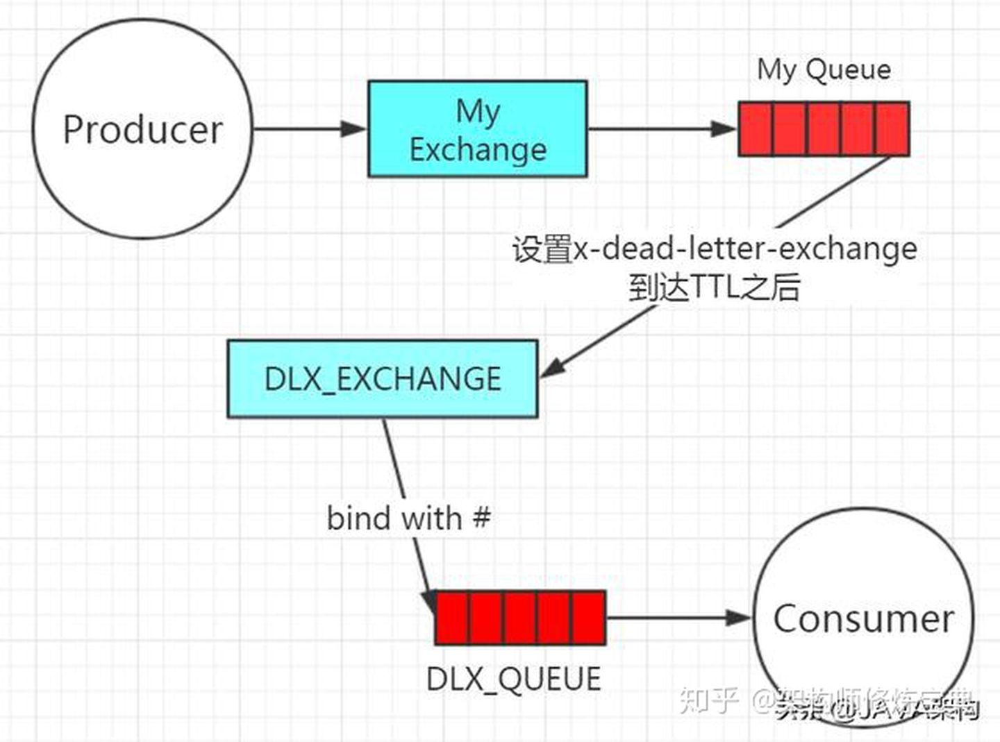

#### 缺点

1. 如果统一用队列来设置消息的TTL，当梯度非常多的情况下，比如1分钟，2分钟，5分钟，10分钟，20分钟，30分钟……需要创建很多交换机和队列来路由消息。
2. 如果单独设置消息的TTL，则可能会造成队列中的消息阻塞——前一条消息没有出队（没有被消费），后面的消息无法投递。
3. 可能存在一定的时间误差。

## 方案三

利用rabbitmq-delayed-message-exchange插件

#### 原理

消息发送到x-delayed-message的交换机中,该交换机不会立刻发送消息,而是将消息放入自带的**保存至 Mnesia**（一个分布式数据库管理系统，适合于电信和其它需要持续运行和具备软实时特性的 Erlang 应用)

这个插件将会尝试确认消息是否过期，首先要确保消息的延迟范围是 Delay > 0, Delay =< ?ERL_MAX_T（在 Erlang 中可以被设置的范围为 (2^32)-1 毫秒），如果消息过期通过 x-delayed-type 类型标记的交换机投递至目标队列，整个消息的投递过程也就完成了。

#### 步骤

1. 进入插件目录

   `whereis rabbitmq`

   `cd /usr/lib/rabbitmq/lib/rabbitmq_server-3.6.12/plugins`

2. 下载插件

3. 启用插件

   rabbitmq-plugins enable rabbitmq_delayed_message_exchange

4. 停用插件

   rabbitmq-plugins disable rabbitmq_delayed_message_exchange

5. 插件使用

   通过声明一个x-delayed-message类型的exchange来使用delayed-messaging特性。x-delayed-message是插件提供的类型，并不是rabbitmq本身的（区别于direct、topic、fanout、headers）。

> 1. 第一步新增 `delay-order-unpaid-reminder-exchange`延迟消息交换机
>
> 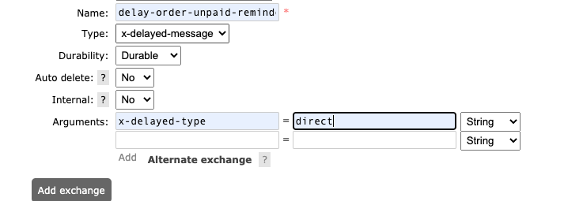
>
> 
>
> 2. 第二步新增 延迟消息队列`unpaid-reminder-delay-queue`  
>
> 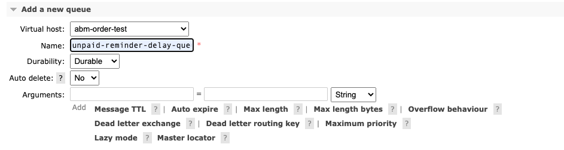
>
> > **bind**
> >
> > Exchange: `delay-order-unpaid-reminder-exchange`
> >
> > Routing key: `order-unpaid-reminder-route-key`
> >
> > 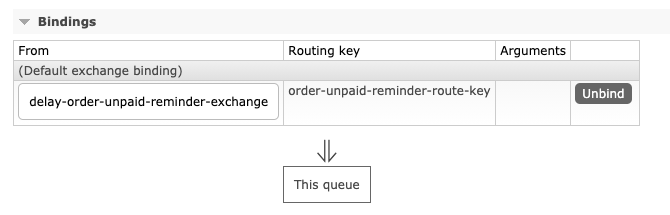
>
> 3. 第三步新增 监听生单消息队列 `unpaid-reminder-order-create-queue` 
>
> 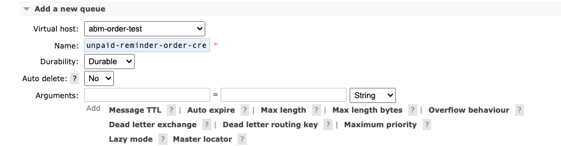
>
> > **bind**
> >
> > Exchange: `order.topic`
> >
> > Routing Key:  `order.create`
> >
> > 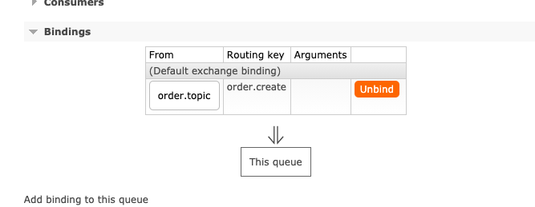
>
> 

