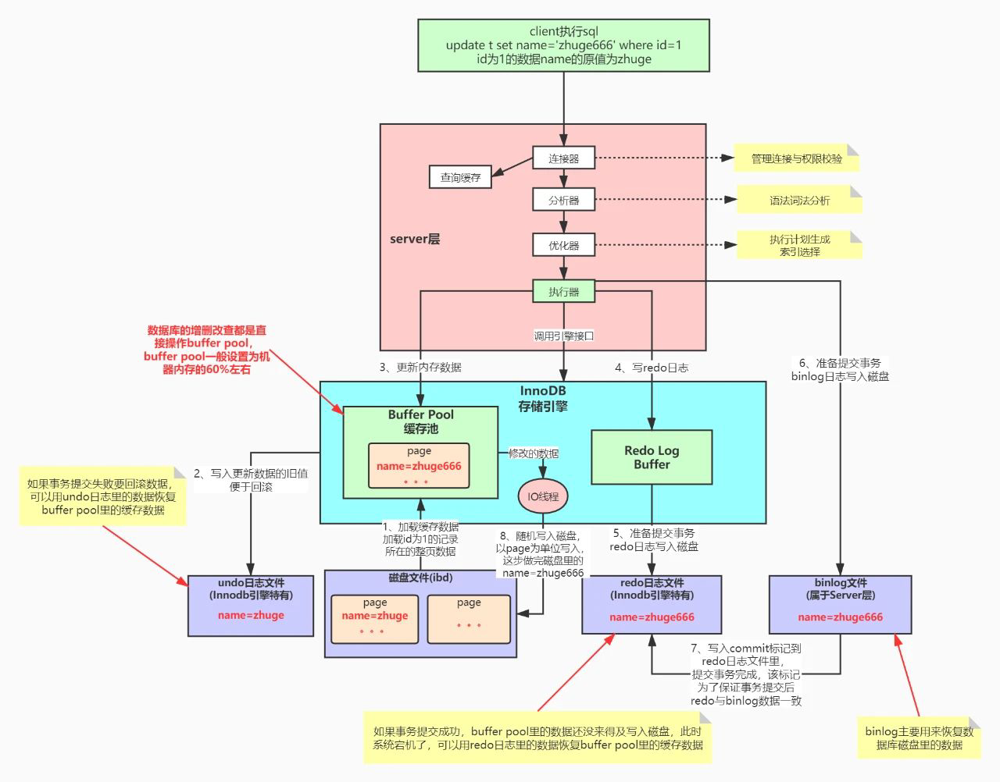

# MySQL高级

mysql逻辑架构分为三层：网络连接层、服务(sql)层、引擎层、存储层

## 目录

[TOC]


------

## SQL语句执行流程图




## 事务

事务指的是满足 ACID 特性的一组操作，可以通过 Commit 提交一个事务，也可以使用 Rollback 进行回滚。

### ACID

#### 1. 原子性（Atomicity）

事务被视为不可分割的最小单元，事务的所有操作要么全部提交成功，要么全部失败回滚。

回滚可以用回滚日志（Undo Log）来实现，回滚日志记录着事务所执行的修改操作，在回滚时反向执行这些修改操作即可。

#### 2. 一致性（Consistency）

数据库在事务执行前后都保持一致性状态。在一致性状态下，所有事务对同一个数据的读取结果都是相同的。

#### 3. 隔离性（Isolation）

一个事务所做的修改在最终提交以前，对其它事务是不可见的。

#### 4. 持久性（Durability）

一旦事务提交，则其所做的修改将会永远保存到数据库中。即使系统发生崩溃，事务执行的结果也不能丢失。

系统发生崩溃可以用重做日志（Redo Log）进行恢复，从而实现持久性。与回滚日志记录数据的逻辑修改不同，重做日志记录的是数据页的物理修改。

### AUTOCOMMIT

MySQL 默认采用自动提交模式。也就是说，如果不显式使用`START TRANSACTION`语句来开始一个事务，那么每个查询操作都会被当做一个事务并自动提交。

### 隔离级别

| 隔离级别                           | 脏读(读到未提交数据) | 可重复读(读到修改数据) | 幻读(读到插入或删除数据)  |
| :--------------------------------- | -------------------- | ---------------------- | ------------------------- |
| 读未提交Read uncommitted           | 可能发生             | 可能发生               | 可能发生                  |
| 读已提交(不可重复读)Read committed | -                    | 可能发生               | 可能发生                  |
| 可重复读Repeatable read            | -                    | -                      | 可能发生(next-key-loking) |
| 串行化Serializable                 | -                    | -                      | -                         |


## MySQL 引擎

是帮助MySQL高效获取数据的数据结构。简单理解：排好序的快速查找数据结构

| 对比项   | InnoDB引擎 | MyISAM引擎             |
| -------- | ---------- | ---------------------- |
| 外键     | 支持       | 不支持                 |
| 事务     | 支持       | 不支持                 |
| 锁的粒度 | 支持行锁   | 支持表锁               |
| 热备份   | 支持       | 不支持                 |
| 崩溃恢复 |            | 崩溃概率高。恢复慢     |
| 其他特性 |            | 支持空间索引以及表压缩 |

### InnoDB引擎

#### MVCC机制

通过MVCC机制实现MySQL的高并发, 同时实现了隔离级别中的 Read committed、Repeatable read两种隔离级别

#### insert buffer 插入缓冲

#### double write 二次写

#### adaptive hash index 自适应哈希索引

#### read ahead 预读

#### 表中数据的存储

采用聚集的方式, 所以每张表的数据存储是按照主键的顺序存储

#### 表的主键

在创建表时没有现式声明主键, InnoDB引擎会根据以下规则创建主键

(1)显式的创建主键Primary key。

(2)判断表中是否有非空唯一索引，如果有，则为主键。

(3)如果都不符合上述条件，则会生成UUID的一个隐式主键(6字节大 2 ^48) rowid 大小有限制,超过后会从1开始覆盖值。

## 索引的存储结构

B/B+树，hash存储结构

​	在等值查询中hash索引更有优势，但是在范围查询中，B/B+数更有优势。哈希索引也不支持多列联合索引的最左匹配规则，hash索引无法被用来进行数据的排序操作

## 索引分类：

	1. 单值索引：即一个索引只包含单个列，一个表可以有多个单列索引
	2. 唯一索引：索引列的值必须唯一，但允许有空值  
	3. 组合索引：即一个索引包含多个列
	4. 全文索引：对文本的内容进行分词，进行搜索。只有MyISAM引擎支持
	5. Hash索引：哈希索引基于哈希表实现
	6. 主键索引(聚集索引)：


###  是否具有主键约束：主键索引(聚集索引)与普通索引(二级索引)

具备主键约束的索引是主键索引，主键索引又称聚集索引，主键索引以外的索引是二级索引或者叫普通索引

InnoDB规定每个表都必须有聚集索引：

1. 如果定义了PK，那么PK就是聚集索引
2. 如果没有定义，第一个非空 unique列就位聚集索引
3. 如果再没有，会自动生成一个row-id作为聚集索引

**聚集索引和非聚集索引的区别**

> 聚集索引：叶子节点存储行记录
>
> 非聚集索引：叶子节点存放地址，一般为主键值

**主键索引和普通索引区别：**

> 1. 主键索引：主键索引的叶子结点存放了整行记录
> 2. 普通索引：非叶子节点存储key，叶子节点存储了PK值。**所以对于普通索引，需要二次查找（回表查询），先通过普通索引找到PK，再通过PK找到所有行记录**特殊情况：例如通过**覆盖索引**也可以只查询一次，不需要回表查询

### 是否具有唯一约束:唯一索引和普通索引

**区别**

> **查询：**
>
> + 如果查询结果全在内存上:唯一索引在数据页中查找满足查询条件的第一条记录即可返回；普通索引需要再获取下一条记录，由于索引项是有序的且内存操作，多一次判断的时间损耗可忽略不计；
>
> + 如果查询结果不在内存上：先把数据页加载到内存中，再按照查询结果全在内存的流程处理；
>
> **更新：**
>
> * 如果需要更新的记录全在内存上；直接更新内存记录并返回
>
> * 如果需要更新的记录不在内存上以及部分在内存上：
>
>     > 唯一索引：需要先将需要更新的记录从磁盘中加载到内存，更新内存记录并写redolog；
>     >
>     > 普通索引：将更新操作写入**change buffer**,通知执行器更新完成；在下次读相关记录的时候，先把原记录读取到内存，再将change buffer上的操作在内存记录上回放，并写redolog；
>     >
>     > 这里可以看到，**普通索引在更新时直接存入change buffer，节省了更新时从磁盘读取记录的时间，而唯一索引在更新时，若记录不在内存，要加载数据判断唯一性，需要从磁盘读取记录到内存**

### 按索引字段数量分：联合索引(组合索引)和单列索引

### 按存储结构划分： 

> **B/B+树索引**
>
> > **B+Tree和B-Tree的不同点在于**
> >
> > 1. B+树非叶子节点只存储键值信息
> >
> > 2. B+树所有叶子节点之间都有链指针
> >
> > 3. B+树的数据记录都存放在叶子节点中
> >
> > **B-Tree对索引列是顺序组织存储的，很适合查找范围数据**
>
> **哈希索引**
>
>   哈希索引基于哈希表实现。哈希索引将所有的哈希码存储在索引中，同时在哈希表中保存指向每个数据行的指针。在mysql中，Memory引擎显式支持哈希索引。
>
> **全文索引**
>
>   全文索引查找的是文本中的关键词，不是直接比较索引中的值。
>
> **哈希索引和B+树索引比较**
>
> > 1. Hash 索引仅仅能满足"=","IN"和"<=>"查询，不能使用范围查询。
> > 2. Hash 索引无法被用来数据的排序操作。
> > 3. Hash 索引不能利用部分索引键查询，即不适用最左前缀原则。
> > 4. Hash 索引在任何时候都不能避免表扫描，不可使用覆盖索引。
> > 5. 如果有大量重复键值的情况下，哈希索引的效率会很低，因为存在哈希碰撞问题

### 主键索引和唯一索引的区别

> 1. 主键不允许空值，唯一索引允许空值
>
> 2. 主键只允许一个，唯一索引允许多个
>
> 3. 主键产生唯一的聚集索引，唯一索引产生唯一的非聚集索引

### Index Condition Pushdown（索引下推）简称ICP

**Mysql5.6**的版本上推出，用于优化查询。

> + 不使用索引条件下推优化时存储引擎通过索引检索到数据，然后返回给MySQL服务器，服务器然后判断数据是否符合条件。
> + 当使用索引条件下推优化时，如果存在某些**建立索引的列做为判断条件时**，MySQL服务器将这一部分判断条件传递给存储引擎，然后**由存储引擎通过判断索引是否符合MySQL服务器传递的条件**，只有当索引符合条件时才会将数据检索出来返回给MySQL服务器。索引条件下推优化可以减少存储引擎查询基础表的次数，也可以减少MySQL服务器从存储引擎接收数据的次数。


## 基本语法：

```mysql
创建：	CREATE [UNIQUE ]  INDEX indexName ON tablename(columnname(length));
	        ALTER table tablename ADD [UNIQUE] INDEX indexName ON(columnname(length));
删除：	DROP INDEX indexName ON tablename;
查看：	SHOW INDEX FROM table_name(\G);
有四种方式来更改数据表的索引:
	(1)ALTER TABLE tbl_name ADD PRIMARY KEY(column_list):该语句添加一个主键，这意味着索引值必须是唯一的，且不能为NULL。
	(2)ALTER TABLE tbl_name ADD UNQUE indx_name (column_ist):这条语句创建索引的值必须是唯一的（除了NUL外，NULL可能会出现多次)
	(3)ALTERTABLE tbl_name ADD INDEX index_name(column_list):添加普通索引，索引值可出现多次。 
	(4)ALTERTABLE tbl_name ADD FULLTEXT index_name (column_list)该语句指定了索引为FULLTEXT，用于全文索引。
```

## 适合建立索引：
```mysql
1.主键自动建立唯一索引
2.频繁作为查询条件的字段应该创建索引
3.查询中与其它表关联的字段，外键关系建立索引
4.数据重复且分布平均的表字段，因此应该只为最经常查询和最经常排序的数据列建立索引。
6.单键/组合索引的选择问题，who?(在高并发下倾向创建组合索引)
7.查询中排序的字段，排序字段若通过索引去访问将大大提高排序速度
8.查询中统计或者分组字段
```
## 不适合建立索引：
	1.表记录太少
	2.经常增删改的表：频繁更新的字段不适合创建索引er因为每次更新不单单是更新了记录还会更新索引
	3.Where条件里用不到的字段不创建索引
	4.注意，如果某个数据列包含许多重复的内容，为它建立索引就没有太大的实际效果。
	
	索引的选择性是指索引列中不同值的数目与表中记录数的比。
	如果一个表中有2000条记录，表索引列有1980个不同的值，那么这个索引的选择性就是1980/2000=0.99。一个索引的选择性越接近于1，这个索引的效率就越高。
## 性能分析：

1. `MySQL` Query Optimizer:

MySQL中有专门负责优化SELECT语句的优化器模块，主要功能：通过计算分析系统中收集到的统计信息，为客户端请求的Query提供他认为最有的执行计划（他认为最优的数据检索方式）

2. MySQL常见瓶颈：

    CPU:CPU在饱和的时候一般发生在数据装入内存或从磁盘上读取数据时候
    
    MySQL常见瓶颈IO:磁盘I/o瓶颈发生在装入数据远大于内存容量的时候
    
    服务器硬件的性能瓶颈: top,free，`iostat`和`vmstat`来查看系统的性能状态

3. Explain执行计划：可以获得以下信息：

    >```java
    >（1）通过id字段，获取表的读取顺序
    >（2）通过 type字段，数据读取操作的操作类型
    >（3）possible_keys字段，哪些索引可以使用
    >（4）key字段，哪些索引被实际使用
    >（5）select_type字段，表之间的引用
    >（6）rows字段，每张表有多少行被优化器查询
    >```
    >
    >  
    >
    >explain +SQL语句
    >
    >> `使用EXPLAIN关键字可以模拟优化器执行SQL查询语句，从而知道MySQL是如何处理你的SQL语句的。分析你的查询语句或是表结构的性能瓶颈`
    >
    >explain各字段名词解释
    >
    >> **(1)  `id`：id值越大 优先级越高 值相同则按顺序由上到下执行**
    >>
    >> (2) select_type:
    >>
    >> ```java
    >> SIMPLE：简单的select查询
    >> PRIMARY	：复杂查询最外层
    >> SUBQUERY：在select或where中包含了子查询
    >> DERIUED	：在from中包含的子查询 嵌套
    >> UNION	：在union之后的查询
    >> UNION RESUL：从union表获取结果的select
    >> ```
    >>
    >> (3)table：显示这一行的数据是关于那一张表的
    >>
    >> **(4)type:访问类型  显示查询使用了何种类型**
    >>
    >> > 从最好到最差依次是:	`system>const>eq_ref>ref>range>index>ALL`（常见的)
    >> >
    >> > system:表只有一行记录（等于系统表〉，这是`const`类型的特列，平时不会出现，这个也可以忽略不计
    >> >
    >> > const`：	表示通过索引一次就找到了,`const`用于比较primary key或者unique索引。因为只匹配一行数据，所以很快。如将主键置于where列表中，MySQL就能将该查询转换为一个常量
    >> >
    >> > eq_ref`：	唯一性索引扫描，对于每个索引键，表中只有一条记录与之匹配。常见于主键或唯一索引扫描
    >> >
    >> > **ref：	非唯一性索引扫描，返回匹配某个单独值的所有行。本质上也是一种索引访问，它返回所有匹配某个单独值的行。然而，它可能会找到多个符合条件的行，所以他应该属于查找和扫描的混合体**
    >> >
    >> > **range：	只检索给定范围的行,使用一个索引来选择行。key列显示使用了哪个索引。一般是在你的where语句中出现了between、<、>、in等的查询这种范围扫描索引比全表扫描要好，因为它只需要开始于索引的某一点，而结束于另一点，不用扫描全部索引。**
    >> >
    >> > **index：	Full Index Scan(全索引扫描)，index与ALL区别为index类型只遍历索引树。这通常比ALL快，因为索引文件通常比数据文件小。(也就是说虽然all和Index都是读全表，但index是从索引中读取的，而all是从硬盘中读的)**
    >> >
    >> > ALL： 	Full Table Scan（全表扫描），将遍历全表以找到匹配的行
    >> >
    >> > **一般来说，得保证查询至少达到range级别，最好能达到ref**
    >>
    >> (5) possible_keys:	显示可能应用在这张表中的索引，一个或多个。查询涉及到的字段上若存在索引，则该索引将被列出，但不一定被查询实际使用
    >>
    >> **(6)  key:		 实际使用的索引。如果为NULL，则没有使用索引。查询中若使用了覆盖索引（所建的复合索引包含（覆盖）了查询列），则该索引仅出现在key列表中**
    >>
    >> (7) key_lens:	表示索引中使用的字节数，可通过该列计算查询中使用的索引的长度。在不损失精确性的情况下，长度越短越好
    >>    `key_lens`显示的值为索引字段的最大可能长度，并非实际使用长度，即`key_len`是根据表定义计算而得，不是通过表内检索出的
    >>
    >> (8)  ref:		显示索引被谁使用了，如果可能的话，是一个常数。哪些列或常量被用于查找索引列上的值
    >>
    >> **(9)  rows：	根据表统计信息及索引选用情况，大致估算出找到所需的记录 所需要读取的行数 (越小越好)**
    >>
    >> (10) extra：	包含不适合在其他列中显示但十分重要的额外信息（常见前五个）
    >>
    >> > * **Using filesort （有可能就优化掉）：MySQL中无法利用索引完成的排序操作称为"文件排序”，说明mysql会对数据使用一个外部的索引排序，而不是按照表内的索引顺序进行读取。**
    >> > * **Using temporary（立马优化）：使了用临时表保存中间结果,MySQL在对查询结果排序时使用临时表。常见于排序order by和分组查询group by**
    >> > * **Using index：	表示相应的select操作中使用了覆盖索引(Covering Index)，避免访问了表的数据行，效率不错!如果同时出现Using where，表明索引被用来执行索引键值的查找;如果没有同时出现using where，表明索引用来读取数据而非执行查找动作。**
    >> > * **Using where：使用了where过滤**
    >> > * **Backward index scan（8.0反向扫描）是执行查询的过程中对B树索引的扫描方式，受sql语句中（正/反向）排序方式以及（正/反向）索引的影响，正向索引扫描的在性能上，稍微优于反向索引扫描，不过，即便是反向索引扫描，也是优化器根据具体查询进行优化的结果，并非一个不好的选择**
    >> > * **Using index condition：在5.6版本后加入的新特性（Index Condition Pushdown）;Using index condition 会先条件过滤索引，过滤完索引后找到所有符合索引条件的数据行，随后用 WHERE 子句中的其他条件去过滤这些数据行；**
    >> > * **Using join buffer ：使用了连接缓存 建议：调大配置文件中缓冲区的join buffer**
    >> > * impossible where： where子句的值总是false，不能用来获取任何元组
    >> > * select tables optimized away ：在没有GROUPBY子句的情况下，基于索引优化MIN/MAX操作或者，对于`MyISAM`存储引擎优化COUNT(*)操作，不必等到执行阶段再进行计算，查询执行计划生成的阶段即完成优化。
    >> > * distinct：优化distinct操作，在找到第一匹配的元组后即停止找同样值的动作
    >
    >**覆盖索引(Covering Index） 或者叫索引覆盖。**
    >
    >* 理解方式一:就是select的数据列只用从索引中就能够取得，不必会表读取数据行，MySQL可以利用索引返回select列表中的字段，而不必根据索引再次读取数据文件,换句话说查询列要被所建的索引覆盖。
    >
    >* 理解方式二:索引是高效找到行的一个方法，但是一般数据库也能使用索引找到一个列的数据，因此它不必读取整个行。毕竟索引叶子节点存储了它们索引的数据;当能通过读取索引就可以得到想要的数据，那就不需要读取行了。一个索引包含了(或覆盖了)满足查询结果的数据就叫做覆盖索引。
    >* **注意:如果要使用覆盖索引，一定要注意select列表中只取出需要的列，不可select * 因为如果将所有字段一起做索引会导致索引文件过大，查询性能下降。**


##  索引优化

unsigned :无符号  非负数，用此类型可以增加数据长度!
		`varbinary`是二进制字符类型

**案例 1 单表优化**

>创建单表
>>```mysql
>>CREATE TABLE IF NOT EXISTS `article` (
>>`id` INT(10) UNSIGNED NOT NULL PRIMARY KEY AUTO_INCREMENT,
>>`author_id` INT(10) UNSIGNED NOT NULL,
>>`category_id` INT(10) UNSIGNED NOT NULL,
>>`views` INT(10) UNSIGNED NOT NULL,
>>`comments` INT(10) UNSIGNED NOT NULL,
>>`title` VARBINARY(255) NOT NULL,
>>`content` TEXT NOT NULL
>>);
>>```
>
>插入数据
>
>> ```mysql
>> INSERT INTO `article`  (`author_id`, `category_id`, `views`, `comments`, `title` , `content`) VALUES
>> (1,1,1,1,'1','1'),
>> (2,2,2,2,'2','2'),
>> (1,1,3,3,'3','3');
>> ```
>
>查询数据
>
>> ```mysql
>> SELECT * FROM article;
>> ```
>
>> ```mysql
>> select id , author_id from article where category_id = 1 and comments >1 order by  views desc limit 1;
>> ```
>
>查看执行explain
>
>> ```mysql
>> explain select id , author_id from article where category_id = 1 and comments >1 order by  views desc limit 1;
>> ```
>
>**explain分析结果:很显然,type是ALL,即最坏的情况。Extra里还出现了`Using filesort`,也是最坏的情况。优化是必须的**
>
>------
>
>开始优化:
>
>​	调试一:
>
>> 创建复合索引：
>
>> > ```mysql
>> > create index idx_article_ccv on article (category_id,comments,views);
>> > ```
>
>> 查看索引：`show index from article;`
>
>> `expain`分析：
>
>> > ```mysql
>> > explain select id , author_id from article where category_id = 1 and comments >1 order by  views desc limit 1;
>> > ```
>> >
>> > 
>
>> **结论：解决了ALL全表扫描，依旧出现Using filesort 原因：范围条件会导致后面views索引失效**
>
>> 删除索引：drop index idx_article_ccv on article;
>
>​	调试二:
>
>> 创建索引:
>
>> > ```mysql
>> > create index idx_article_cv on article(category_id,views);
>> > ```
>
>> `expain`分析
>
>> > ```mysql
>> > explain select id , author_id from article where category_id = 1 and comments >1 order by  views desc limit 1;
>> > ```
>
>> **测试结果:type由ALL->range->ref using filesort消失,优化成功**
>
>**优化总结：单表优化 注意范围条件会导致后面的views索引失效。建立索引时，按字段顺序建立索引，但是注意跳过范围条件的字段。**

**案例二： 两表优化**  

> 创建两个表
>
> > ```mysql
> > CREATE TABLE IF NOT EXISTS `class` (
> > id INT(10) UNSIGNED NOT NULL AUTO_INCREMENT,
> >     `card` INT(10) UNSIGNED NOT NULL,
> >     PRIMARY KEY (id)
> >     );
> > 
> > CREATE TABLE IF NOT EXISTS `book` (
> > `book_id` INT(10) UNSIGNED NOT NULL AUTO_INCREMENT,
> >     `card` INT(10) UNSIGNED NOT NULL,
> >     PRIMARY KEY (`book_id`)
> > );
> > ```
>
> 插入随机数:
>
> > ```mysql
> > insert into class(card) values(floor(1+rand()*20));  insert into book(card) values(floor(1+rand()*20));
> > ```
>
> explain分析
>
> > ```mysql
> > explain select * from class left join book on class.card = book.card;
> > ```
>
> **explain分析结果：type为ALL**
>
> ------
>
> 开始优化

>> 调试一
>>
>> > 添加索引 ：`alter table class add index idx_c(card);`
>> >
>> > explain分析结论：**class表type由all变为index ，两表rows不变**
>> >
>> > 删除索引：`drop index idx_c on class;`
>>
>> 调试二
>>
>> > 添加索引：`create index idx_c on book(card);`
>> >
>> > explain分析结论：book表type变为ref，book表rows骤减
>
>**总结：两表左/右外连接时，建立索引建在相反的表上，即左外链接建右表，右外连接建左表**

**案例三:三表优化**

>建立phone表:
>
>> ```mysql
>> create table if not exists `phone`(
>> `phone_id` int(10) unsigned  not null auto_increment,
>> `card` int(10) unsigned not null,
>> primary key(`phone_id`)
>> )engine = innodb;
>> ```
>
>插入随机数据`insert into phone(card) values(floor(1+(rand()*20)));`
>
>**执行explain分析结论：ALL**
>
>建立索引: 
>
>> ```mysql
>> alter table class add index idx_c(card);alter table phone add index idx_c(card);
>> ```
>>
>> 
>
>分析结论：`后2行的type都是ref且总rows优化很好,效果不错。因此索引最好设置在需要经常查询的字段中。`
>
>**总结:join语句优化 优化尽可能减少Join语句中的`NestedLoop`的循环总次数;“永远用小结果集驱动大的结果集”。**

## 索引失效常见原因：
1. 全值匹配我最爱 即查询字段与复合索引全匹配

2. 最佳左前缀法则：如果索引了多列，要遵守最左前缀法则。指的是查询从索引的最左前列开始并且不跳过索引中的列。

3. **不在索引列上做任何操作**（计算、函数、(自动or手动)类型转换），会导致索引失效而转向全表扫描

4. 存储引擎不能使用索引中**范围条件右边的列**

5. 尽量使用覆盖索引(只访问索引的查询(索引列和查询列一致))，减少select *

6. **mysql在使用不等于**(!=或者<>)的时候无法使用索引会导致全表扫描

7. **is null ,is not null 也无法使用索引**

8. **like以通配符开头**('%abc...')mysql索引失效会变成全表扫描的操作  解决方法:1.通配符写右边2.覆盖索引 

   注意：like %在前属于范围查询，会是自己索引失效，也会导致后边的索引失效。但是%在右边的（即左边为定值的）不会导致自己和后边的索引失效。

9. **字符串不加单引号索引失效**  原因：底层发生了隐式的类型转换导致的索引失效，引起全表扫描

10. **少用or,**用它来连接时会索引失效 or连接同一字段不会失效,否则失效

## order by （group by）优化

ORDER BY子句，尽量使用Index方式排序,避免使用`FileSort`方式排序
尽可能在索引列上完成排序操作，遵照索引建的最佳左前缀
如果不在索引列上，`filesort`有两种算法:双路排序和单路排序

**优化策略:**

> * 增大sort_buffer_size参数的设置，增大max_length_for_sort_data参数的设置
>
> * 为排序使用索引
>     			`MySQL`两种排序方式∶文件排序或扫描有序索引排序，`MySQL`能为排序与查询使用相同的索引
>
>     案例
>
>     KEY a_b_c(a,b,c)
>
> * order by能使用索引(最左前缀)
>
>     > - ORDER BY a
>     > - ORDER BY a,b
>     > - ORDER BY a,b,c
>     > - ORDER BY a DESC, b DESC,c DESC    *//如果WHERE使用索引的最左前缀定义为常量，则order by能使用索引*
>     > - WHERE a = `const` ORDER BY b,c
>     > - WHERE a = `const` AND b = `const` ORDER BY c
>     > - WHERE a = `const` ORDER BY b,c
>     > - WHERE a = `const `AND b > `const` ORDER BY b,c
>
>     不能使用索引进行排序
>
>     >- ORDER BY a And C,b DESC,c DESC	*//排序不—致*
>     >- WHERE a =`const` ORDER BY b,c	*//严丢失a索引*
>     >- WHERE a =` const` ORDER BY c		*//丢失b索引*
>     >- WHERE a =`const` ORDER BY a,d	*//d不是索引的一部分*
>     >- WHERE a in(...) ORDER BY b,c		*//对于排序来说,多个相等条件也是范围查询*
>     >
>     >
>
 ## 面试：
>
>    1. 使用覆盖索引时 and顺序不重要
>    2. 使用order by时 不遵守顺序，会出现`using filesort` 。特例：当order by的字段为常量时，将不会出现。
>    3. 分组group by  先排序再分组，会有临时表产生，即出现using temporary；
>1. **索引是什么？**
>     索引是一种特殊的文件(InnoDB数据表上的索引是表空间的一个组成部分)，它们包含着对数据表里所有记录的引用指针。
>
>   索引是一种数据结构。数据库索引，是数据库管理系统中一个 排序 的数据结构，以协助快速查询、更新数据库表中数据。索引的实现通常使用B树及其变种B+树。更通俗的说，索引就相当于目录。为了方便查找书中的内容，通过对内容建立索引形成目录。而且索引是一个文件，它是要占据物理空间的。
>
>   MySQL索引的建立对于MySQL的高效运行是很重要的，索引可以大大提高MySQL的检索速度。比如我们在查字典的时候，前面都有检索的拼音和偏旁、笔画等，然后找到对应字典页码，这样然后就打开字典的页数就可以知道我们要搜索的某一个key的全部值的信息了。
>
>2. **索引有哪些优缺点？**
>
>   可以大大加快数据的检索速度，这也是创建索引的最主要的原因。
>   通过使用索引，可以在查询的过程中，使用优化隐藏器，提高系统的性能。
>   索引的缺点
>
>   时间方面：创建索引和维护索引要耗费时间，具体地，当对表中的数据进行增加、删除和修改的时候，索引也要动态的维护，会降低增/改/删的执行效率；
>   空间方面：索引需要占物理空间。
>
>3. **MySQL有哪几种索引类型？**
>
>   从存储结构上来划分：BTree索引（B-Tree或B+Tree索引），Hash索引，full-index全文索引，R-Tree索引。这里所描述的是索引存储时保存的形式
>
>* 从应用层次来分：普通索引，唯一索引，复合索引。
>
>  普通索引：即一个索引只包含单个列，一个表可以有多个单列索引
>
>  唯一索引：索引列的值必须唯一，但允许有空值
>
>  复合索引：多列值组成一个索引，专门用于组合搜索，其效率大于索引合并
>
>  聚簇索引(聚集索引)：并不是一种单独的索引类型，而是一种数据存储方式。具体细节取决于不同的实现，InnoDB的聚簇索引其实就是在同一个结构中保存了B-Tree索引(技术上来说是B+Tree)和数据行。
>
>  非聚簇索引： 除了聚簇索引的其他索引
>
>* 根据中数据的物理顺序与键值的逻辑（索引）顺序关系： 聚集索引，非聚集索引。
>
>* 说一说索引的底层实现？
>
>  * Hash索引
>
>    基于 哈希表 实现，只有精确匹配索引所有列的查询才有效，对于每一行数据，存储引擎都会对所有的索引列计算一个哈希码（hash code），并且Hash索引将所有的哈希码存储在索引中，同时在索引表中保存指向每个数据行的指针。
>
>  * B-Tree索引（MySQL使用B+Tree）
>
>​				B-Tree能加快数据的访问速度，因为存储引擎不再需要进行全表扫描来获取数据，数据分布在各个节点之中。
>
>​				B+Tree索引
>
>​						是B-Tree的改进版本，同时也是数据库索引索引所采用的存储结构。数据都在叶子节点上，并且增加了顺序访问指针，每个叶子节点都指向相邻的叶子节点的地址。相比B-Tree来说，进行范围查找时只需要查找两个节点，进行遍历即可。而B-Tree需要获取所有节点，相比之下B+Tree效率更高。
>
>4. **B+tree性质**：
>
>n棵子tree的节点包含n个关键字，不用来保存数据而是保存数据的索引。
>
>所有的叶子结点中包含了全部关键字的信息，及指向含这些关键字记录的指针，且叶子结点本身依关键字的大小自小而大顺序链接。
>
>所有的非终端结点可以看成是索引部分，结点中仅含其子树中的最大（或最小）关键字。
>
>B+ 树中，数据对象的插入和删除仅在叶节点上进行。
>
>B+树有2个头指针，一个是树的根节点，一个是最小关键码的叶节点。
>
>
>
>5. 为什么索引结构默认使用B+Tree，而不是B-Tree，Hash， 二叉树 ， 红黑树 ？
>     **B-tree**： 从两个方面来回答
>
>   * B+树的磁盘读写代价更低：B+树的内部节点并没有指向关键字具体信息的指针，因此其内部节点相对B(B-)树更小，如果把所有同一内部节点的关键字存放在同一盘块中，那么盘块所能容纳的关键字数量也越多，一次性读入内存的需要查找的关键字也就越多，相对IO读写次数就降低了。
>
>   * 由于B+树的数据都存储在叶子结点中，分支结点均为索引，方便扫库，只需要扫一遍叶子结点即可，但是B树因为其分支结点同样存储着数据，我们要找到具体的数据，需要进行一次中序遍历按序来扫，所以B+树更加适合在区间查询的情况，所以通常B+树用于数据库索引。
>
>   **Hash**：
>
>   ```java
>   虽然可以快速定位，但是没有顺序，IO复杂度高；
>   
>   基于Hash表实现，只有Memory存储引擎显式支持哈希索引 ；
>   
>   适合等值查询，如=、in()、<=>，不支持范围查询 ；
>   
>   因为不是按照索引值顺序存储的，就不能像B+Tree索引一样利用索引完成 ；
>   
>   Hash索引在查询等值时非常快 ；
>   
>   因为Hash索引始终索引的所有列的全部内容，所以不支持部分索引列的匹配查找 ；
>   
>   如果有大量重复键值得情况下，哈希索引的效率会很低，因为存在哈希碰撞问题 。
>   ```
>
>   **二叉树** ： 树的高度不均匀，不能自平衡，查找效率跟数据有关（树的高度），并且IO代价高。
>
>   **红黑树** ： 树的高度随着数据量增加而增加，IO代价高。
>
>6. 讲一讲聚簇索引与非聚簇索引？
>     在 InnoDB 里，索引B+ Tree的叶子节点存储了整行数据的是主键索引，也被称之为聚簇索引，即将数据存储与索引放到了一块，找到索引也就找到了数据。
>
>   而索引B+ Tree的非叶子节点存储了主键的值的是非主键索引，也被称之为非聚簇索引、二级索引。
>
>聚簇索引与非聚簇索引的区别：
>
>```java
>非聚集索引与聚集索引的区别在于非聚集索引的叶子节点不存储表中的数据，而是存储该列对应的主键（行号）
>
>​	对于InnoDB来说，想要查找数据我们还需要根据主键再去聚集索引中进行查找，这个再根据聚集索引查找数据的过程，我们称为回表。第一次索引一般是顺序IO，回表的操作属于随机IO。需要回表的次数越多，即随机IO次数越多，我们就越倾向于使用全表扫描 。
>
>通常情况下， 主键索引（聚簇索引）查询只会查一次，而非主键索引（非聚簇索引）需要回表查询多次。当然，如果是覆盖索引的话，查一次即可	
>```
>
>​	**注意**：MyISAM无论主键索引还是二级索引都是非聚簇索引，而InnoDB的主键索引是聚簇索引，二级索引是非聚簇索引。我				们自己建的索引基本都是非聚簇索引。
>
>7. 非聚簇索引一定会回表查询吗？
>     不一定，这涉及到查询语句所要求的字段是否全部命中了索引，如果全部命中了索引，那么就不必再进行回表查询。一个索引包含（覆盖）所有需要查询字段的值，被称之为"覆盖索引"。
>
>   举个简单的例子，假设我们在员工表的年龄上建立了索引，那么当进行select score from student where score > 90的查询时，在索引的叶子节点上，已经包含了score 信息，不会再次进行回表查询。
>
>8. 联合索引是什么？为什么需要注意联合索引中的顺序？
>     MySQL可以使用多个字段同时建立一个索引，叫做联合索引。在联合索引中，如果想要命中索引，需要按照建立索引时的字段顺序挨个使用，否则无法命中索引。
>
>具体原因为:
>
>​	MySQL使用索引时需要索引有序，假设现在建立了"name，age，school"的联合索引，那么索引的 排序 为: 先按照name 排序 ，如果name相同，则按照age 排序 ，如果age的值也相等，则按照school进行 排序 。
>
>​	当进行查询时，此时索引仅仅按照name严格有序，因此必须首先使用name字段进行等值查询，之后对于匹配到的列而言，其按照age字段严格有序，此时可以使用age字段用做索引查找，以此类推。因此在建立联合索引的时候应该注意索引列的顺序，一般情况下，将查询需求频繁或者字段选择性高的列放在前面。此外可以根据特例的查询或者表结构进行单独的调整。
>
>9. 讲一讲MySQL的最左前缀原则?
>     最左前缀原则就是最左优先，在创建多列索引时，要根据业务需求，where子句中使用最频繁的一列放在最左边。
>     mysql会一直向右匹配直到遇到范围查询(>、<、between、like)就停止匹配，比如a = 1 and b = 2 and c > 3 and d = 4 如果建立(a,b,c,d)顺序的索引，d是用不到索引的，如果建立(a,b,d,c)的索引则都可以用到，a,b,d的顺序可以任意调整。
>
>   **=和in可以乱序,依旧会走索引，比如a = 1 and b = 2 and c = 3 建立(a,b,c)索引可以任意顺序，mysql的查询优化器会帮你优化成索引可以识别的形式。**
>
>10. 讲一讲前缀索引？
>       因为可能我们索引的字段非常长，这既占内存空间，也不利于维护。所以我们就想，如果只把很长字段的前面的公共部分作为一个索引，就会产生超级加倍的效果。但是，我们需要注意，**order by不支持前缀索引** 。
>
>    流程是：
>
>    先计算完整列的选择性 :select count(distinct col_1)/count(1) from table_1
>
>    再计算不同前缀长度的选择性 :select count(distinct left(col_1,4))/count(1) from table_1
>
>    找到最优长度之后，创建前缀索引 :create index idx_front on table_1 (col_1(4))
>
>11. 了解索引下推吗？
>       MySQL 5.6引入了索引下推优化。默认开启，使用SET optimizer_switch = ‘index_condition_pushdown=off’;可以将其关闭。
>
>    有了索引下推优化，可以在减少回表次数
>
>    在InnoDB中只针对二级索引有效
>
>    官方文档中给的例子和解释如下：
>
>    ```mysql
>    在 people_table中有一个二级索引(zipcode，lastname，firstname)，查询是
>      SELECT * FROM people WHERE zipcode=’95054′ AND lastname LIKE ‘%etrunia%’ AND address LIKE ‘%Main Street%’;
>    
>    如果没有使用索引下推技术，则MySQL会通过zipcode=’95054’从存储引擎中查询对应的数据，返回到MySQL服务端，然后MySQL服务端基于lastname LIKE ‘%etrunia%’ and address LIKE ‘%Main Street%’来判断数据是否符合条件
>    
>    如果使用了索引下推技术，则MYSQL首先会返回符合zipcode=’95054’的索引，然后根据lastname LIKE ‘%etrunia%’ and address LIKE ‘%Main Street%’来判断索引是否符合条件。如果符合条件，则根据该索引来定位对应的数据，如果不符合，则直接reject掉。
>    ```
>
>12. 怎么查看MySQL语句有没有用到索引？
>       通过explain
>
>13. 为什么官方建议使用自增长主键作为索引？
>       结合B+Tree的特点，自增主键是连续的，在插入过程中尽量减少页分裂，即使要进行页分裂，也只会分裂很少一部分。并且能减少数据的移动，每次插入都是插入到最后。**总之就是减少分裂和移动的频率**。
>
>14. 如何创建索引？
>       创建索引有三种方式。
>
>    1. 在执行CREATE TABLE时创建索引
>
>       ```mysql
>       CREATE TABLE user_index2 (
>       id INT auto_increment PRIMARY KEY,
>       first_name VARCHAR (16),
>       last_name VARCHAR (16),
>       id_card VARCHAR (18),
>       information text,
>       KEY name (first_name, last_name),
>       FULLTEXT KEY (information),
>       UNIQUE KEY (id_card)
>       );
>       ```
>
>       
>
>    2.  使用ALTER TABLE命令去增加索引。
>
>       ````mysql
>       ALTER TABLE table_name ADD INDEX index_name (column_list);
>       ````
>
>       ALTER TABLE用来创建普通索引、UNIQUE索引或PRIMARY KEY索引。
>
>       其中table_name是要增加索引的表名，column_list指出对哪些列进行索引，多列时各列之间用逗号分隔。
>
>       索引名index_name可自己命名，缺省时，MySQL将根据第一个索引列赋一个名称。另外，ALTER TABLE允许在单个语句中更改多个表，因此可以在同时创建多个索引。
>
>    3. 使用CREATE INDEX命令创建。
>
>       ```mysql
>       CREATE INDEX index_name ON table_name (column_list);
>       ```
>
>15. **创建索引时需要注意什么？**
>       非空字段：应该指定列为NOT NULL，除非你想存储NULL。在mysql中，含有空值的列很难进行查询优化，因为它们使得索引、索引的统计信息以及比较运算更加复杂。你应该用0、一个特殊的值或者一个空串代替空值；
>       取值离散大的字段：（变量各个取值之间的差异程度）的列放到联合索引的前面，可以通过count()函数查看字段的差异值，返回值越大说明字段的唯一值越多字段的离散程度高；
>       索引字段越小越好：数据库的数据存储以页为单位一页存储的数据越多一次IO操作获取的数据越大效率越高。
>16. **建索引的原则有哪些？**
>    1. 最左前缀匹配原则，非常重要的原则，mysql会一直向右匹配直到遇到范围查询(>、<、between、like)就停止匹配，比如a = 1 and b = 2 and c > 3 and d = 4 如果建立(a,b,c,d)顺序的索引，d是用不到索引的，如果建立(a,b,d,c)的索引则都可以用到，a,b,d的顺序可以任意调整。
>    2. =和in可以乱序，比如a = 1 and b = 2 and c = 3 建立(a,b,c)索引可以任意顺序，mysql的查询优化器会帮你优化成索引可以识别的形式。
>    3. 尽量选择区分度高的列作为索引，区分度的公式是count(distinct col)/count(*)，表示字段不重复的比例，比例越大我们扫描的记录数越少，唯一键的区分度是1，而一些状态、性别字段可能在大数据面前区分度就是0，那可能有人会问，这个比例有什么经验值吗？使用场景不同，这个值也很难确定，一般需要join的字段我们都要求是0.1以上，即平均1条扫描10条记录。
>    4. 索引列不能参与计算，保持列“干净”，比如from_unixtime(create_time) = ’2014-05-29’就不能使用到索引，原因很简单，b+树中存的都是数据表中的字段值，但进行检索时，需要把所有元素都应用函数才能比较，显然成本太大。所以语句应该写成create_time = unix_timestamp(’2014-05-29’)。
>    5. 尽量的扩展索引，不要新建索引。比如表中已经有a的索引，现在要加(a,b)的索引，那么只需要修改原来的索引即可。
>
>17. **使用索引查询一定能提高查询的性能吗？(缺点)**
>       通常通过索引查询数据比全表扫描要快。但是我们也必须注意到它的代价。
>
>    索引需要空间来存储，也需要定期维护， 每当有记录在表中增减或索引列被修改时，索引本身也会被修改。 这意味着每条记录的INSERT，DELETE，UPDATE将为此多付出4，5 次的磁盘I/O。 因为索引需要额外的存储空间和处理，那些不必要的索引反而会使查询反应时间变慢。使用索引查询不一定能提高查询性能
>
>    索引范围查询(INDEX RANGE SCAN)适用于两种情况:
>
>    1. 基于一个范围的检索，一般查询返回结果集小于表中记录数的30%。
>    2. 基于非唯一性索引的检索。
>
>18. 什么情况下不走索引（索引失效）？
>
>    1. 使用!= 或者 <> 导致索引失效
>    2. 类型不一致导致的索引失效
>    3. 函数导致的索引失效
>       如：`SELECT * FROM user WHERE DATE(create_time) = '2020-09-03';`
>       如果你的索引字段使用了索引，对不起，他是真的不走索引的。
>    4. 运算符导致的索引失效
>       `SELECT * FROM user WHERE age - 1 = 20;`
>       如果你对列进行了（+，-，*，/，!）, 那么都将不会走索引。
>    5. OR引起的索引失效
>       `SELECT * FROM user WHERE name = '张三' OR height = '175';`
>       **OR导致索引是在特定情况下的，并不是所有的OR都是使索引失效，如果OR连接的是同一个字段，那么索引不会失效，反之索引失效。**
>    6. 模糊搜索导致的索引失效
>       `SELECT * FROM user WHERE name LIKE '%冰';`
>       当%放在匹配字段前是不走索引的，放在后面才会走索引。
>    7. NOT IN、NOT EXISTS导致索引失效

## **建议：**

> ```
> 对于单键索引，尽量选择针对当前query过滤性更好的索引
> 尽可能通过分析统计信息和调整query的写法来达到选择合适索引的目的
> 在选择组合索引的时候，当前Query中过滤性最好的字段在索引字段顺序中，位置越靠前越好。
> 在选择组合索引的时候，尽量选择可以能够包含当前query中的where字句中更多字段的索引
> ```
>

# 生产环境中优化数据库流程：

1. 观察，至少跑1天，看看生产的慢SQL情况。

2. 开启慢查询日志，设置阙值，比如超过5秒钟的就是慢SQL，并将它抓取出来。

3. explain+慢SQL分析

4. show profile

5. 运维经理or DBA，进行SQL数据库服务器的参数调优。

**总结**

1. 慢查询的开启并捕获
2. explain+慢SQL分析
3. show profile查询SQL在Mysql服务器里面的执行细节和生命周期情况
4. SQL数据库服务器的参数调优。

## in和exists比较结论：

    in查询：查询出B中的所有的id并缓存起来，然后检查A表中查询出的id在缓存中是否存在，如果存在则将A的查询数据加入到结果集中，直到遍历完A表中所有的结果集为止。
    
    exists查询：EXISTS()查询是将主查询的结果集放到子查询中做验证，根据验证结果是true或false来决定主查询数据结果是否得以保存。
    
    在MYSQL的连表查询中，最好是遵循‘小表驱动大表的原则’
    
    IN()查询适合B表数据比A表数据小的情况，IN()查询是从缓存中取数据exists()适合B表比A表数据大的情况：当A表数据与B表数据一样大时,in与exists效率差不多,可任选一个使用

# 慢查询日志：

    MySQL的慢查询日志是MySQL提供的一种日志记录，它用来记录在MySQL中响应时间超过阀值的语句，具体指运行时间超过long_query_time值的SQL，则会被记录到慢查询日志中。
    
    long_query_time的默认值为10，意思是运行10秒以上的语句。
    
    由他来查看哪些SQL超出了我们的最大忍耐时间值，比如一条sql执行超过5秒钟，我们就算慢SQL，希望能收集超过5秒的sql，结合之前explain进行全面分析。

**查看慢查询日志时候开启： show variables like '%slow_query_log%';**

**临时开启慢查询日志： set global slow_query_log=1;**

永久开启（不建议）：

    修改my.cnf文件，[mysqld]下增加或修改参数slow_query_log 和slow_query_log_file后，然后重启MySQL服务器。
    
    即 将如下两行配置进my.cnf文件
    slow_query_log =1
    slow query_log_file=/var/lib/mysql/atguigu-slow.log

**查看慢查询设置的语句时间：show variables like '%long_query_time%';**

**设置阈值：set global long_query_time=3; 重新开启一个会话后才会变化；**

模拟慢查询语句：select sleep(4);

**查询慢查询语句日志:cat /var/lib/mysql/zsq-slow.log**

**查询当前系统中有多少条慢查询语句：show global status like '%slow_queries%';**

日志分析工具：`mysqldumpslow`

    s:是表示按照何种方式排序;
    c:访问次数
    l:锁定时间
    r:返回记录
    t:查询时间
    al:平均锁定时间
    ar:平均返回记录数
    at:平均查询时间
    t:即为返回前面多少条的数据;
    g:后边搭配一个正则匹配模式，大小写不敏感的;

工作参考：

得到返回记录集最多的10个SQL
    mysqldumpslow -s r-t 10 /var/lib/mysql/zsq-slow.log

得到访问次数最多的10个SQL

    mysqldumpslow -s c-t 10 /var/lib/mysql/zsq-slow.log

得到按照时间排序的前10条里面含有左连接的查询语句

    mysqldumpslow -s t -t 10-g "left join" /var/lib/mysql/zsq-slow.log

另外建议在使用这些命令时结合│和more使用，否则有可能出现爆屏情况

    mysqldumpslow -s r-t 10 /var/lib/mysql/zsq-slow.log | more


# 批量插入1000w条数据

## 函数插入

1. 建表`dept`

    ```mysql
    create table dept( 
        id int unsigned primary key auto_increment, 
        dept_no mediumint unsigned not null default 0, 
        dept_name varchar(20) not null default '', 
        loc varchar(13) not null default ''
    )engine=innodb default charset=gbk;
    ```

    建表`emp`

    ```mysql
    create table emp( 
        id int unsigned primary key auto_increment, 
        emp_no mediumint unsigned not null default 0, 
        ename varchar(20) not null default '', 
        job varchar(9) not null default '',
        mgr mediumint unsigned not null default 0,
        hiredate date not null,
        sal decimal(7,2) not null,
        comm decimal(7,2) not null,
        dept_no mediumint unsigned not null default 0
    )enginne=innodb default charset=gbk;
    ```

    

2. 设置参数 `log_bin_trust_function_creators`

    创建函数，假如报错:This function has none of DETERMINISTIC......

    原因：#由于开启过慢查询日志，因为我们开启了bin-log,我们就必须为我们的function指定一个参数。

    ```mysql
    show variables like 'log_bin_trust_function_creators';
    
    set global log_bin_trust_function_creators=1;
    ```

    这样添加了参数以后，如果`mysqld`重启，上述参数又会消失，永久方法:

    ```linux
    windows下my.ini[mysqld]加上log_bin_trust_function_creators=1
    
    linux下/etc/my.cnf下my.cnf[mysqld]加上log_bin_trust_function_creators=1
    ```

3. 创建函数，保证每条数据都不同

    **用于生成随机数**

    ```mysql
    DELIMITER $$
    CREATE FUNCTION rand_string(n INT)RETURNS VARCHAR(255)
    BEGIN
    DECLARE chars_str VARCHAR(100) DEFAULT 'abcdefghijklmnopgrstuvwxyzABCDEFJHIJKLMNOPQRSTUVWXYZ';
    DECLARE return_str VARCHAR(255) DEFAULT '';
    DECLARE i INT DEFAULT 0;
    WHILE i < n DO
    SET return_str =CONCAT(return_str,SUBSTRING(chars_str,FLOOR(1+RAND()*52),1));
    SET i = i +1;
    END WHILE;
    RETURN return_str;
    END $$
    ```

    **用于随机产生部门编号**

    ```mysql
    DELIMITER $$
    CREATE FUNCTION rand_num( )
    RETURNS INT(5)
    BEGIN
    DECLARE i INT DEFAULT 0;
    SET i = FLOOR(100+RAND()*10);
    RETURN i;
    END $$
    ```

    **删除函数**

    `drop function rand_num;`

4. 创建存储过程

    **创建往`emp`表中插入数据的存储过程**

    ```mysql
    DELIMITER $$
    CREATE PROCEDURE insert_emp(IN START INT(10),IN max_num INT(10))
    BEGIN
    DECLARE i INT DEFAULT 0;
    SET autocommit= 0;
    REPEAT
    SET i=i+ 1;
    INSERT INTO emp (emp_no, ename ,job ,mgr ,hiredate ,sal ,comm ,dept_no ) VALUES((START+i),rand_string(6),'SALESMAN',0001,CURDATE(),2000,400,rand_num());
    UNTIL i = max_num
    END REPEAT;
    COMMIT;
    END $$
    
    ```
    **创建往`dept`表中插入数据的存储过程**
    
    ```mysql
     DELIMITER $$
        CREATE PROCEDURE insert_dept(IN START INT(10),IN max_num INT(10))
        BEGIN
        DECLARE i INT DEFAULT 0;
        SET autocommit= 0;
        REPEAT
        INSERT INTO dept (dept_no ,dept_name,loc) VALUES ((START+i),rand_string(10),rand_string(8));
        SET i=i+1;
        UNTIL i = max_num
        END REPEAT;
        COMMIT;
        END $$
    ```

5. 调用存储过程

    `delimiter ; `*//更换为以;结束*

    `call insert_dept(100,10);`

# Show ProFile：
    是mysql提供可以用来分析当前会话中语句执行的资源消耗情况。可以用于SQL的调优的测量默认情况下，参数处于关闭状态，并保存最近15次的运行结果

## 分析步骤：

        1 是否支持：show variables like '%profiling%';
        2 开启功能 set profiling=1;
        3 运行sql
        4 查看结果 show profiles;
        5 诊断SQL：show profile cpu,block io for query (上一步前面的问题SQL数字号码Query_ID);
    
            type:(参数类型)
            |ALL		--显示所有的开销信息
            |BLOCK IO		--显示块IO相关开销
            |CONTEXT SWITCHES --上下文切换相关开销
            |CPU		--显示CPU相关开销信息
            |IPC		--显示发送和接收相关开销信息	
            |MEMORY		--显示内存相关开销信息
            |PAGE FAULTS	--显示页面错误相关开销信息
            |SOURCE		--显示交换次数相关开销的信息
            |SWAPS		--显示和Source_function，Source_file，Source_line相关的开销信息
    
    日常开发需要注意的结论：
        converting HEAP to MyISAM查询结果太大，内存都不够用了往磁盘上搬了。
        Creating tmp table创建临时表	拷贝数据到临时表	用完再删除
        Copying to tmp table on disk把内存中临时表复制到磁盘，危险!! !
        locked
    全局查询日志：永远不要在生产环境开启这个功能。
        set global general_log=1;
        set global log_output='TABLE';
        此后，你所编写的sql语句，将会记录到mysql库里的general_log表，可以用下面的命令查看
        select * from mysql.general_log;

#  数据库锁 

## 按对数据操作的类型(读/写)分
读锁(共享锁):针对同一份数据，多个读操作可以同时进行而不会互相影响

写锁（排它锁）:当前写操作没有完成前，它会阻断其他写锁和读锁

## 按对数据操作的粒度分：
表锁(偏读)：
开销小，加锁快；不会出现死锁；锁定粒度大，发生锁冲突的概率最高，并发度最低。

行锁(偏写)：
开销大，加锁慢；会出现死锁；锁定粒度最小，发生锁冲突的概率最低，并发度也最高。

页面锁：
开销和加锁时间界于表锁和行锁之间；会出现死锁；锁定粒度界于表锁和行锁之间，并发度一般

## 表锁操作
### 【手动增加表锁】
lock table表名字 read(write)，表名字2 read(write)，其它;
### 【查看表上加过的锁】
 show open tables;
### 解锁：
unlock tables;

## 表锁
### 表锁分为
1）共享读锁 自己可读不可干其他的 别人可读不可阻塞其他

2）独占写锁 自己可写不可干其他，别人啥也得阻塞

 **简而言之：读锁会阻塞写，不会阻塞读，写锁会阻塞读和写**

### 分析表锁定：show status like 'table_locks%';
#### 主要参数：
**Table_locks_immediate:产生表级锁定的次数，表示可以立即获取锁的查询次数，每立即获取锁值加1;**

**Table_locks_waited:出现表级锁定争用而发生等待的次数(不能立即获取锁的次数，每等待一次锁值加1)，此值高则说明存在着较严重的表级锁争用情况;**

## 行锁：	
**注意:**
1.sql索引失效会引起行锁升级为表锁  2. 间隙锁

### 【什么是间隙锁】
当我们用范围条件而不是相等条件检索数据，并请求共享或排他锁时，InnoDB会给符合条件的已有数据记录的索引项加锁;对于键值在条件范围内但并不存在的记录，叫做“间隙（GAP)”，InnoDB也会对这个“间隙”加锁，这种锁机制就是所谓的间隙锁（Next-Key锁)
### 【间隙锁危害】
因为Query执行过程中通过过范围查找的话，他会锁定整个范围内所有的索引键值，即使这个键值并不存在。
间隙锁有一个比较致命的弱点，就是当锁定一个范围键值之后，即使某些不存在的键值也会被无辜的锁定，而造成在锁定的时候无法插入锁定键值范围内的任何数据。在某些场景下这可能会对性能造成很大的危害

### 如何锁定一行
**select ........ for update 锁定某一行后，其它的操作会被阻塞，直到锁定行的会话提交commit**

## 分析行锁定：show status like 'innodb_row_lock%';
### 参数
Innodb_row_lock_current_waits:	当前正在等待锁定的数量;

*** Innodb_row_lock_time:	从系统启动到现在锁定总时间长度;**

*** Innodb_row_lock_time_avg:	每次等待所花平均时间;**

Innodb_row_lock_time_max:	从系统启动到现在等待最常的一次所花的时间;

*** Innodb_row_lock_waits:	系统启动后到现在总共等待的次数;**

## 行锁优化建议：
 尽可能让所有数据检索都通过索引来完成，当未使用上索引会引起全表扫描，从而导致行锁升级为表锁，避免无索引行锁升级为表锁。合理设计索引，尽量缩小锁的范围。尽可能较少检索条件，避免间隙锁。尽量控制事务大小，减少锁定资源量和时间长度。尽可能低级别事务隔离


# 主从复制
## MySQL复制过程分成三步
1. master将改变记录到二进制日志(binary log）。这些记录过程叫做二进制日志事件，binary log events;

2. slave将master的binary log events拷贝到它的中继日志（relay log) ;

3. slave重做中继日志中的事件，将改变应用到自己的数据库中。MySQL复制是异步的且串行化的

##  复制的基本原则：每个slave只有一个master。每个slave只能有一个唯一的服务器ID。每个master可以有多个salve
## 复制最大问题：延时
## 一主一从常见配置：
### 要求
1. mysql一致且后台以服务运行 
2. 同一网段下
3. 主从都配置在[mysqld]结点下，都是小写
### 1. 配置主机:主机(linux)修改my.cnf配置文件

**(必选）1. server-id=1					 *//主服务器唯一ID***
	   **(必选)	2. log-bin=自己本地的路径/mysql-bin 			*//启用二进制日志***

(可选)  3. log-err=自己本地路径/自定义错误日志名			*//启用错误日志*

(可选) 4. basedir="自己本地路径"		 *//根目录*

(可选) 5. tmpdir="自己本地路径"		*//临时目录*

(可选) 6. datadir="自己本地路径/data"		*//数据目录*

(可选) 7. read-only=0		*//主机，读写都可以*

(可选) 8. binlog-ignore-db=mysql	*//设置不需要复制的数据库*

(可选) 9. binlog-do-db=需要复制的主数据库名字	*//设置需要复制的数据库*

### 2.配置从机:从机(windows)修改my.ini配置文件
**(必选) 1. server-id=2	*//从服务器唯一ID***

(可选) 2. log-bin=自己本地的路径/mysql-bin    *启用二进制日志*
### 3.  主从都重启mysql服务
### 4.  主从都关闭防火墙
### 5.  主机上建立账户并授权slave
 (1) 建立用户

```mysql
 create user 'zhangsan'@'192.168.33.1' identified by 'Zsq0606.';
```

 (2) 分发权限

```mysql
 grant REPLICATION SLAVE on *.* to 'zhangsan'@'192.168.33.1';
```

(3) 修改密码策略：

```mysql
 use mysql; alter user 'zhangsan'@'192.168.33.1' identified with mysql_native_password by 'Zsq0606.';
```

### 6.  从机上配置需要复制的主机

```mysql
change master to master_host='192.168.33.129',master_user='zhangsan',master_password='Zsq0606.',master_log_file='mysql-bin.000014',master_log_pos=156;
```

### 7.启动从服务器复制功能：start slave;
查询是否启动成功：`show slave status\G; `

启动成功标志：
参数 `Slave_IO_Running: Yes Slave_SQL_Running: Yes `

启动失败解决方案：

`slave_io_ruing:connecting`  注意linux服务器上mysql高版本的密码策略  

`slave_sql_running:no `

解决办法：

```mysql
stop slave;
SET GLOBAL SQL_SLAVE_SKIP_COUNTER=1; 
start slave; 
show slave status\G;
```
