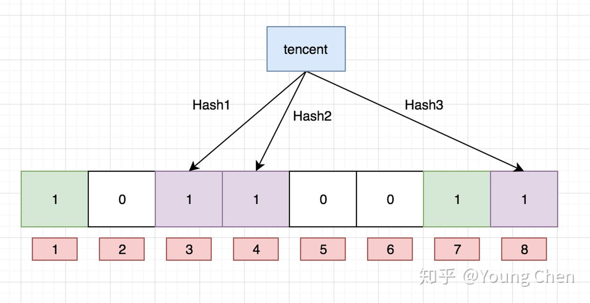

# 布隆过滤器

布隆过滤器：一种数据结构，是一个 bit 向量或者说 bit 数组, 是由一串很长的二进制向量组成，可以将其看成一个二进制数组。既然是二进制，那么里面存放的不是0，就是1，但是初始默认值都是0。

　　如下所示：

## 添加数据

　　介绍概念的时候，我们说可以将布隆过滤器看成一个容器，那么如何向布隆过滤器中添加一个数据呢？

　　如下图所示：当要向布隆过滤器中添加一个元素key= baidu时，我们通过多个hash函数，算出一个值，然后将这个值所在的方格置为1。比如，下图hash1(baidu)=1，那么在第2个格子将0变为1（数组是从0开始计数的），hash2(baidu)=7，那么将第8个格子置位1，依次类推。

　　我们现在再存一个值 “tencent”，如果哈希函数返回 3、4、8 的话，图继续变为：

## 判断数据是否存在

　　知道了如何向布隆过滤器中添加一个数据，那么新来一个数据，我们如何判断其是否存在于这个布隆过滤器中呢？

　　很简单，我们只需要将这个新的数据通过上面自定义的几个哈希函数，分别算出各个值，然后看其对应的地方是否都是1，如果存在一个不是1的情况，那么我们可以说，该新数据一定不存在于这个布隆过滤器中。

　　反过来说，如果通过哈希函数算出来的值，对应的地方都是1，那么我们能够肯定的得出：这个数据一定存在于这个布隆过滤器中吗？

　　答案是否定的，因为多个不同的数据通过hash函数算出来的结果是会有重复的，所以会存在某个位置是别的数据通过hash函数置为的1。

　　我们可以得到一个结论：**布隆过滤器可以判断某个数据一定不存在(有一个值为0)，但是无法判断一定存在(值覆盖)**

## 布隆过滤器优缺点

　　优点：优点很明显，二进制组成的数组，占用内存极少，并且插入和查询速度都足够快。

　　缺点：随着数据的增加，误判率会增加；还有无法判断数据一定存在；另外还有一个重要缺点，无法删除数据。

​	

## 应用场景

* Redis缓存穿透问题

主要解决: 大量数据中快速判断某个值是否存在