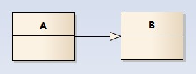
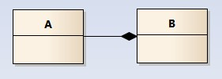

# 设计模式

[创建型模式 — Graphic Design Patterns (design-patterns.readthedocs.io)](https://design-patterns.readthedocs.io/zh_CN/latest/creational_patterns/creational.html)

## UML类图

### 类之间的关系

**记忆方法**

​	箭头   子类指向父类  

​	依赖强度高的用实线、实心，依赖强度不高的 用虚线、空心

​	三角型：继承/实现  菱形：聚合/组合  箭头：关联/依赖

- 泛化(继承)关系 空心箭头实线    继承只可以单继承  所以是实线

  

- 实现关系 空心箭头虚线    实现可以多实现  用虚线表示

  

- 聚合关系 空心菱形  整体和部分之间依赖度不高 采用空心

  

- 组合关系 实心菱形  整体和部分之间依赖度高  用实心

  

- 关联关系(强关联 身份证和人) 箭头实线   关系稳定实在  用实线

  

- 依赖关系  虚线箭头  依赖关系  可以不依赖  不稳定  用虚线

  

## 七大原则

* 单一职责原则

    ​	类的职责要单一，不能将太多的职能放在一个类中。

* 接口隔离原则

    ​	不应该依赖那些它不需要的接口，使用多个专门的接口来取代一个统一的接口。

* 依赖倒置原则

    ​	要针对抽象层编程，而不要针对具体类编程。

* 里氏替换原则

    ​	一个可以接受基类对象的地方必然可以接受一个子类对象。在程序中尽量使用基类类型来对对象进行定义，而在运行时再确定其子类类型，使用子类来替换父类对象

* 开闭原则 OCP

    ​	软件实体对扩展是开放的，但对修改是关闭的，即在不修改一个软件的基础上去扩展其功能。实现开闭原则的关键是抽象化，找到系统的可变因素，将它封装起来。

* 迪米特法则

    ​	一个软件实体对其他实体的引用越少越好，或者说如果两个类不必彼此直接通信，那么这两个类就不应当发生直接的相互作用，减少类之间的耦合度。

* 合成复用原则

    系统中应该尽量多使用组合/聚合关系，少用甚至不用继承关系。

    > 在面向对象设计中，可以通过两种基本方法来**复用已有的设计和实现**，即通过组合/聚合关系或者通过继承。
    >
    > **继承复用**：实现简单，易于扩展。但是破坏系统的封装性。从基类继承而来的实现是静态的，不可能在运行时发生改变，没有足够的灵活性，只能在有限的环境中使用。（“白箱”复用）
    >
    > **组合/聚合复用**：耦合度相对较低，选择性地调用成员对象的操作，可以在运行时动态进行。（“黑箱”复用）

# 常见设计模式

## 创建型模式

### 单例模式

#### 要点

1. 某个类只能有一个实例   

   解决方案: 构造器私有化  
2. 它必须自行创建这个实例  

    对外提供获取该实例对象的方式:含有一个该类的静态变量来保存这个唯一的实例

3. 它必须自行向整个系统提供这个实例  

    (1）直接暴露（2）用静态变量的get方法获取

#### 几种常见使用形式  

> **饿汉式:	直接创建对象，不存在线程安全问题 (类加载器避免了线程安全问题)**
>
> > * 直接实例化饿汉式(简洁直观)  
> > 
> >    ```java
> >    /**
> >    	(1）构造器私有化
> >    	(2）自行创建，并且用静态变量保存
> >    	(3）向外提供这个实例
> >    	(4）强调这是一个单例，我们可以用final修改
> >    */
> >    public class Singleton{
> >        public static final Singleton INSTANCE = new Singleton(); //静态变量  
> >        private Singleton(){} //构造器私有化   
> >    } 
> >    ```
> > 
> > 
> >
> > * 枚举式(最简洁)  
> >
> >   ```java
> >   public enum Singleton{
> >       INSTANCE
> >   }
> >   ```
> >
> >
> >
> >* 静态代码块饿汉式（适合复杂实例化)
> >
> >   ```java
> >   public class Singleton{
> >      public static final Singleton INSTANCE ;
> >  
> >      static {
> >          try{
> >              //进行复杂操作后再创建对象
> >              INSTANCE = new Singleton();
> >          }catch(Exception e){
> >              throw new RuntimeException(e);
> >          }
> >      }
> >  
> >      private Singleton(){}  
> >  }
> > 
> >
>
> **懒汉式:	延迟创建对象**
>
> >- 静态方法创建 -线程不安全(适用于单线程) 
> >
> >  ```java
> >  /**懒汉式:
> >  * 延迟创建这个实例对象
> >  * (1)构造器私有化
> >  * (2)用一个静态变量保存这个唯一的实例
> >  * (3)提供一个静态方法，获取这个实例对象
> >  */
> >  public class Singleton{
> >     private static Singleton instance;
> >     private Singleton(){}
> >     public static Singleton getInstance(){
> >         if(instance == nul1){
> >             instance = new Singleton();
> >         }
> >         return instance;
> >     }
> >  }
> >  ```
> >
> >- 双重校验锁-线程安全(适用于多线程)  
> >
> >  ```java
> >  public class Singleton{
> >      private static volatile Singleton instance;
> >      private Singleton(){}
> >      public static Singleton getInstance(){			 //1
> >        if(instance == null){					    //2
> >          synchronized(Sigleton.class){			 //3
> >            if(instance == null){				//4
> >              instance = new Singleton();		 //5
> >            }
> >          }
> >        }
> >        return instance;
> >      }
> >  }
> >  ```
> >
> >  **为什么需要两次判断if(instance == null)?**
> >
> >  第一次校验：由于单例模式只需要创建一次实例，如果后面再次调用`getInstance()`方法时，则直接返回之前创建的实例，因此大部分时间不需要执行同步方法里面的代码，大大提高了性能。如果不加第一次校验的话，那跟上面的懒汉模式没什么区别，每次都要去竞争锁。
> >  　第二次校验：如果没有第二次校验，假设线程t1执行了第一次校验后，判断为null，这时t2也获取了CPU执行权，也执行了第一次校验，判断也为null。接下来t2获得锁，创建实例。这时t1又获得CPU执行权，由于之前已经进行了第一次校验，结果为null（不会再次判断），获得锁后，直接创建实例。结果就会导致创建多个实例。所以需要在同步代码里面进行第二次校验，如果实例为空，则进行创建。
> >  **需要注意的是private static volatile Singleton instance;需要加volatile关键字，否则会出现错误**。　
> >
> >  问题的原因在于 JVM指令重排优化的存在。
> >
> >  
> >
> >  在某个线程创建单例对象时，在构造方法被调用之前(`4 invokespecial`)，就为该对象分配了内存空间并将对象的字段设置为默认值(`7 astore_1` 发生了指令重排序，与半初始化对象建立连接)。此时就可以将分配的内存地址赋值给instance字段了，然而该对象可能还没有初始化。若紧接着另外一个线程来调用`getInstance()`，取到的就是半初始化的对象，值为默认值，程序就会出错。
> >
> >  >/*instance = new Singleton();伪代码分为以下三个操作*/
> >  >a. memory = allocate() //分配内存
> >  >b. ctorInstanc(memory) //初始化对象
> >  >c. instance = memory //设置instance指向刚分配的地址
> >  >
> >  >​	双重校验锁在编译运行时，可能会出现重排序从a-b-c排序为a-c-b。在多线程的情况下会出现以下问题。当线程A在执行第5行代码时，B线程进来执行到第2行代码。假设此时A执行的过程中发生了指令重排序，即先执行了a和c，没有执行b。那么由于A线程执行了c导致instance指向了一段地址，所以B线程判断instance不为null，会直接跳到第6行并返回一个未初始化的对象。
> >
> >- 静态内部类（线程安全）
> >
> >  ```java
> >  /*
> >   *	在内部类被加载和初始化时，才创建INSTANCE实例对象
> >   *	静态内部类不会自动随着外部类的加载和初始化而初始化，它是要单独去加载和初始化的。
> >   *	因为是在内部类加载和初始化时，创建的，因此是线程安全的
> >   */
> >  public class Singleton{
> >  		private static class Inner(){
> >     			private static final Singleton INSTANCE = new Singleton();
> >  		} 
> >      public Singleton getInstance(){
> >          return Inner.INSTANCE;
> >      }
> >  }
> >  ```
> >
>

### 建造者模式

### 工厂模式

### 原形模式


## 结构型模式

### 适配器

#### 分类

* 类适配器

    继承被适配者,实现目标类

* 对象适配器

    根据合成复用原则，使用组合替代继承(通过构造器创建被适配的对象,通过对象调用，成本更低，更灵活)

* 接口(缺省)适配器

    当不需要全部实现接口提供的方法时，可先设计一个抽象类实现接口，并为该接口中每个方法提供一个默认实现（空方法），那么该抽象类的子类可有选择地覆盖父类的某些方法来实现需求。

#### 源码使用

`SpringMVC`  的 `HandlerAdapter`

#### 工作原理

> 1. 将一个类的接口转换成另一种接口,让原本接口不兼容的类可以兼容
>
> 2. 从用户的角度看不到被适配者，是解耦的
>
> 3. 用户调用适配器转化出来的目标接口方法，适配器再调用被适配者的相关接口方法
>
> 4. 用户收到反馈结果，感觉只是和目标接口交互，如图
>
>     

### 装饰器

### 外观模式 (门面模式)


### 享元模式

### 代理模式
